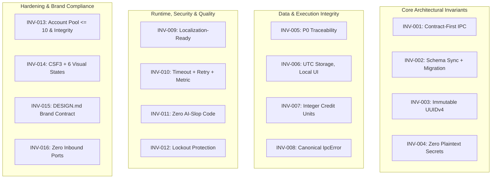
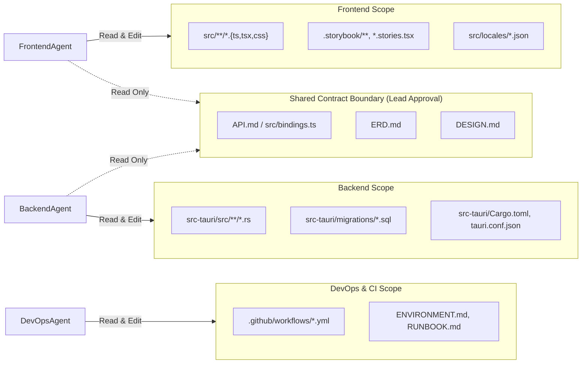
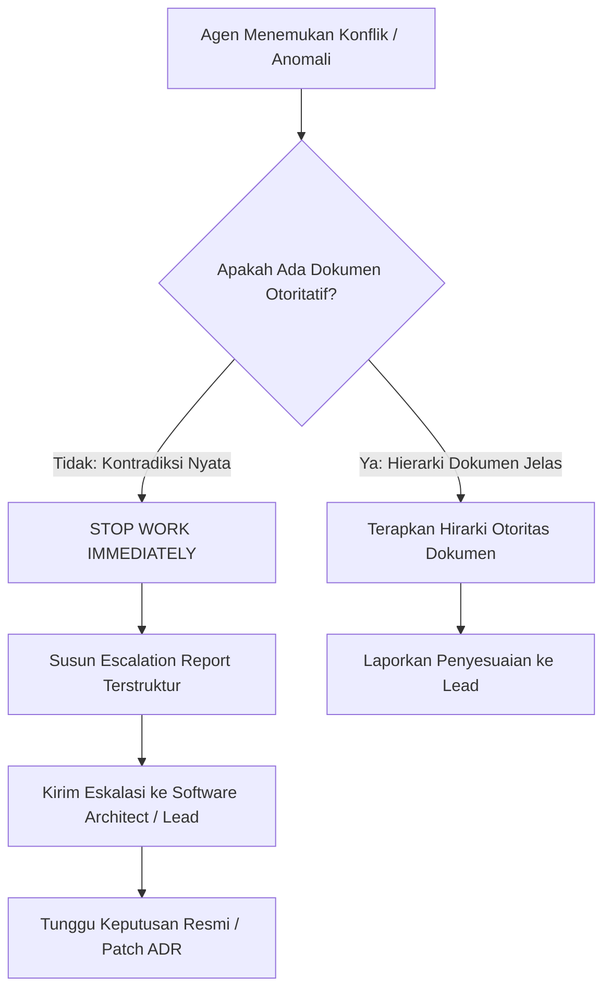

# AGENTS.md: Flow Studio Multi-Agent Orchestration & Execution Blueprint

> **Project:** Flow Studio  
> **Document ID:** DOC-AGT-001  
> **Version:** 1.0.0  
> **Status:** Draft  
> **Owner:** Software Architect & Planning Lead  
> **Last Updated:** 2026-09-24  
> **Depends On:** DOC-TASK-001, DOC-ARCH-001  
> **Supersedes:** None  

---

## 1. Pendahuluan & Filosofi Eksekusi Multi-Agen

Dokumen ini mendefinisikan tata kelola eksekusi, protokol koordinasi, batasan ruang lingkup (*file boundaries*), dan paket konteks (*context packs*) untuk seluruh agen rekayasa otonom (*autonomous AI agents*) dan kontributor pengembang yang bekerja pada repositori **Flow Studio**.

Flow Studio mengombinasikan *desktop frontend workstation* (React 19, `@xyflow/react`, Tailwind CSS, Zustand) dengan *native backend engine* (Rust 2021, Tauri 2.x, SQLite/SQLx, subproses FFmpeg terisolasi, enkripsi Argon2id + AES-256-GCM). Aplikasi ini beroperasi sebagai workstation personal (*single-user creative workstation*) dengan paradigma *local-first*, kedaulatan data penuh (*zero cloud telemetry*), dan *zero inbound listening ports*.

Setiap agen yang beroperasi di repositori ini terikat secara mutlak oleh aturan ketat:
1. **Zero-Stub & Production-Grade Reality:** Dilarang menghasilkan kode tiruan (*mocks* palsu di jalur produksi), stub kosong, atau penanda tunda (`TODO`, `FIXME`, `todo!()`, `unimplemented!()`). Kode yang di-commit harus langsung *runnable* dan dapat diverifikasi.
2. **Contract-First Rigor:** Komunikasi antar-proses (IPC) dikunci melalui Rust structs dan bindings TypeScript `tauri-specta`. Tidak ada perubahan implementasi tanpa sinkronisasi spesifikasi kontrak di `API.md`.
3. **Strict Context Boundaries:** Agen hanya diperbolehkan membaca berkas yang relevan dengan domain perannya dan dilarang memodifikasi berkas di luar ruang lingkup modifikasinya.
4. **Escalation Over Improvisation:** Saat menemukan ambiguitas arsitektural, ketidaksesuaian kontrak, atau kegagalan invariants, agen **wajib berhenti dan melaporkan eskalasi** alih-alih membuat keputusan arsitektur secara diam-diam.

---

## 2. Document Reading Order per Agent Role

Setiap agen AI memiliki kapasitas jendela konteks (*context window budget*) terbatas. Memuat seluruh dokumen blueprint secara membabi-buta menyebabkan degradasi penalaran (*reasoning degradation*) dan halusinasi. Tabel di bawah menetapkan hierarki dokumen wajib baca, dokumen opsional/on-demand, dan dokumen yang **wajib dilewati** (*skip*) untuk masing-masing peran.

### 2.1 Matriks Urutan Bacaan Dokumen

| Agent Role | 1st Read (Mandatory Baseline) | 2nd Read (Domain Specific) | 3rd Read (Contracts & Specs) | Can Skip (Do Not Load by Default) |
|---|---|---|---|---|
| **Frontend Agent** | `AGENTS.md`<br>`DESIGN.md`<br>`CODE_QUALITY.md` | `PRD/NODE_EDITOR.md`<br>`PRD/CONTINUITY_ENGINE.md`<br>`PRD/VIDEO_EXPORT.md` | `API.md` (IPC section)<br>`DSD.md`<br>`src/bindings.ts` | `RUNBOOK.md`, `MIGRATION.md`, `ERD.md` (SQL details), `ADR/` |
| **Backend Agent** | `AGENTS.md`<br>`ARCHITECTURE.md`<br>`CODE_QUALITY.md` | `API.md`<br>`SECURITY.md`<br>`ERD.md` | `MIGRATION.md`<br>`PRD/ACCOUNT_POOL.md`<br>`ENVIRONMENT.md` | `DESIGN.md`, `DSD.md`, CSS/Tailwind specs, Storybook specs |
| **QA / Test Agent** | `AGENTS.md`<br>`TESTING.md`<br>`CODE_QUALITY.md` | `SRS.md`<br>`API.md`<br>`PRD/_INDEX.md` | `TASKS.md`<br>`DSD.md` (visual states)<br>`SECURITY.md` (§18 OWASP) | `ENVIRONMENT.md` (internal variables), `ADR/` |
| **DevOps / Release Agent** | `AGENTS.md`<br>`ENVIRONMENT.md`<br>`RUNBOOK.md` | `ARCHITECTURE.md`<br>`CODE_QUALITY.md` (§7 CI) | `TESTING.md` (Quality Gates)<br>`MIGRATION.md`<br>`Cargo.toml` / `package.json` | `DESIGN.md`, `DSD.md`, `PRD/NODE_EDITOR.md`, UI story files |
| **Security Reviewer** | `AGENTS.md`<br>`SECURITY.md`<br>`PERMISSION.md` | `ARCHITECTURE.md` (§3 Boundaries)<br>`API.md` (§3 Auth/Vault) | `ERD.md` (PII tags)<br>`CODE_QUALITY.md` (HARD-004)<br>`RUNBOOK.md` (§5 Incident) | `DESIGN.md`, `DSD.md`, UI animations, `@xyflow/react` rendering details |

### 2.2 Aturan Pemuatan Konteks (Context Injection Rules)
- **Aturan 1 (Pre-Coding Verification):** Sebelum menghasilkan baris kode pertama, agen wajib mereferensikan nomor requirement (`FR-xxx` / `NFR-xxx`) dan task ID (`TASK-P*-xxx`) yang sedang diselesaikan.
- **Aturan 2 (Minimal Slicing):** Jangan membaca `API.md` (1400+ baris) secara utuh jika hanya mengerjakan modul vault; baca hanya Bab 3 dan 5 terkait `API-VAULT-xxx`. Gunakan tool pembaca berkas parsial (`offset` dan `limit`).
- **Aturan 3 (Pruned Context Recovery):** Jika konteks percakapan memicu pemangkasan memori (*context compaction*), dokumen `AGENTS.md` harus menjadi dokumen pertama yang dimuat ulang ke memori kerja agen.

---

## 3. Global Invariants (INV-001 s/d INV-016)

Seluruh agen tanpa kecuali terikat secara absolut pada 16 Invarian Global berikut. Pelanggaran terhadap salah satu invarian akan membatalkan verifikasi tugas secara instan.



### INV-001: Contract-First (IPC Contract Changes Start in API.md)
Setiap penambahan, pengubahan, atau penghapusan antarmuka IPC antara React Frontend dan Rust Backend wajib dimulai dari pembaruan dokumen `API.md`. Definisi Rust structs dan TypeScript types via `tauri-specta` (`src/bindings.ts`) diturunkan langsung dari spesifikasi kontrak tersebut. Dilarang mengubah signature command di kode tanpa memperbarui `API.md`.

### INV-002: Schema Change = Migration + ERD Update
Setiap modifikasi tabel, kolom, tipe data, atau indeks pada database SQLite lokal wajib disertai file migrasi SQL bertahap di folder `src-tauri/migrations/` dan pembaruan diagram relasional di `ERD.md` dalam commit atau pull request yang sama. Dilarang melakukan skema *ad-hoc* di luar migration runner.

### INV-003: Document IDs Immutable
Seluruh identifier entitas primer (`accounts`, `projects`, `segments`, `generation_log`, `security_audit_log`) menggunakan format string UUIDv4 canonical yang bersifat immutable. ID tidak boleh di-generate ulang saat entitas di-update, tidak boleh dinomori ulang, dan dilarang menggunakan autoincrement integer yang rentan tabrakan data lokal.

### INV-004: Zero Plaintext Secrets in Code, Docs, Logs, or Tests
Dilarang keras mengekspos Master Password, Google Flow session cookies (`__Secure-*`, `SID`, `HSID`, `SSID`), Bearer tokens, atau derived encryption keys ke dalam:
- Kode sumber frontend maupun backend.
- Komentar kode atau commit messages.
- Berkas log diagnostik (`tracing` logs wajib menggunakan sanitizing filter).
- Payload error yang dikirim ke UI.
- Unit test fixtures atau E2E test snapshots.

### INV-005: P0 Traceability Unbroken
Traceability dari Functional Requirements P0 pada `SRS.md` dan `PRD/` menuju implementasi di `TASKS.md` serta pengujian di `TESTING.md` tidak boleh terputus. Setiap PR wajib mencantumkan task ID yang valid (misalnya `TASK-P1-003`) dan requirement ID terkait (misalnya `FR-040`).

### INV-006: Timestamps Stored in UTC, Formatted Locally
Seluruh data waktu disimpan pada database SQLite dalam format ISO-8601 UTC string (`YYYY-MM-DDTHH:MM:SSZ`). Manipulasi dan perbandingan waktu di backend Rust dilakukan secara eksklusif dalam basis UTC (`chrono::Utc`). Konversi ke waktu lokal pengguna (*timezone formatting*) hanya diizinkan pada layer presentasi React.

### INV-007: Credits Tracked as Integer Units
Nilai kredit akun Google Flow (baik kuota harian free 50 kredit maupun kuota subscription berbayar) wajib direpresentasikan dan dihitung sebagai bilangan bulat non-negatif (*non-negative integers / u32*). Dilarang keras menggunakan tipe data *floating-point* (`f32`, `f64`, `number` desimal) untuk kalkulasi saldo atau pengurangan kredit guna mencegah pembulatan presisi yang korup.

### INV-008: Canonical Error Envelope (IpcError)
Seluruh Tauri IPC Commands wajib mengembalikan tipe result seragam `Result<T, IpcError>`. Tipe `IpcError` diserialisasi ke dalam skema canonical:
```typescript
interface IpcError {
  code: string;       // E.g., 'E_VAULT_LOCKED', 'E_INSUFFICIENT_CREDITS'
  message: string;    // Human-readable, localized message
  details?: Record<string, unknown>;
  retryable: boolean;
  category: 'SECURITY' | 'VALIDATION' | 'UPSTREAM_API' | 'FFMPEG' | 'STORAGE' | 'INTERNAL';
}
```
Dilarang melempar error *ad-hoc* seperti string mentah atau exception yang tidak terstruktur.

### INV-009: Localization-Ready Strings (No Hardcoded User-Facing Strings)
Dilarang keras meletakkan string antarmuka pengguna (*user-facing text*) langsung di dalam komponen JSX/TSX. Seluruh label tombol, pesan validasi, judul modal, tooltip, dan pesan error wajib menggunakan kunci lokalisasi terpusat via kamus i18n (`src/locales/id.json` dan `src/locales/en.json`).

### INV-010: External Google Flow Calls: Timeout + Retry + Metric
Setiap pemanggilan jaringan ke upstream Google Flow API wajib membungkus HTTP request dengan:
1. **Timeout deterministik:** Connect timeout 10s, read timeout 30s, overall generation poll timeout 300s.
2. **Retry Policy terukur:** Maksimal 3 percobaan dengan exponential backoff dan jitter untuk status code transient (429, 502, 503, 504).
3. **Telemetry & Metric:** Mencatat durasi latency, HTTP status code, dan ukuran payload ke dalam tabel `generation_log` lokal.

### INV-011: Code Production-Grade, Zero AI-Slop (Link CODE_QUALITY.md)
Seluruh kode yang ditulis wajib memenuhi ketentuan `CODE_QUALITY.md`:
- Kategori **Hard Rules** dipatuhi mutlak: No swallowed exceptions (`HARD-001`), No hallucinated imports (`HARD-002`), Zero stubs/TODOs (`HARD-003`), Zero hardcoded secrets (`HARD-004`), No silent fallbacks (`HARD-005`), No infinite loops without exit (`HARD-006`).
- Standard & Quality limits: Maksimal fungsi 80 baris (`QUAL-001`), maksimal berkas 400 baris (`QUAL-002`), maksimal nesting depth 5 tingkat (`QUAL-003`), tanpa dead code (`QUAL-004`), dan penamaan variabel deskriptif (`QUAL-005`).

### INV-012: Master Password Brute-Force Lockout Active
Mekanisme proteksi brute-force pada brankas lokal wajib aktif di level engine Rust:
- Verifikasi password diturunkan via Argon2id (m_cost=65536 KB, t_cost=3, p_cost=1).
- Jika terjadi 3 kali kegagalan input password secara berturut-turut, sistem backend mengunci akses verifikasi secara paksa (*penalty lockout*) selama **30 detik**.
- Brankas otomatis mengunci diri (*auto-lock*) setelah inaktivitas selama **15 menit**, menghapus kunci enkripsi dari memori kerja.

### INV-013: Account Pool Max 10 Accounts, Session Integrity Check
Modul `flow-router` membatasi kapasitas *pool* maksimal **10 akun Google Flow** per instalasi workstation lokal. Sebelum sebuah akun dialokasikan untuk mengeksekusi generasi segmen, sistem wajib melakukan *session integrity check* ringan (verifikasi masa berlaku cookie dan ketersediaan kuota minimal 1 kredit). Akun dengan sesi invalid/expired ditandai `AUTH_EXPIRED` dan dikecualikan dari antrean rotasi otomatis.

### INV-014: UI Components: CSF3 Story File + 6 Mandatory Visual States
Setiap komponen antarmuka mandiri (terutama elemen node canvas, tombol kontrol, form input, dan panel modal) wajib disertai berkas Storybook berformat **Component Story Format 3 (CSF3)** (`*.stories.tsx`). Komponen wajib mengimplementasikan dan menampilkan 6 status visual kanonikal:
1. `default` (kondisi istirahat normal)
2. `hover` (kursor melayang di atas elemen)
3. `active / focused` (interaksi keyboard atau klik mouse aktif)
4. `loading` (indikator asinkron/proses berjalan)
5. `disabled` (status nonaktif/tidak dapat diklik)
6. `error` (status kegagalan validasi atau kegagalan proses)

### INV-015: DESIGN.md Brand Contract Read Before Writing CSS/Components
Sebelum menulis atau memodifikasi styling CSS, utility class Tailwind, atau komponen antarmuka, Frontend Agent wajib membaca spesifikasi warna, elevasi, dan spasi pada `DESIGN.md`. Seluruh warna tema gelap wajib memanfaatkan token semantik resmi (`bg-canvas`, `bg-surface`, `border-subtle`, `accent-prompt`, `accent-video`, dll.). Dilarang menggunakan nilai warna *arbitrary hex* di luar Brand Contract YAML.

### INV-016: Zero Inbound Listening Ports
Aplikasi Flow Studio dilarang keras membuka port jaringan server lokal (*listening socket*, REST daemon lokal, WebSocket server lokal, atau HTTP listener lokal) pada sistem operasi host. Inbound ports = 0. Seluruh interaksi jaringan bersifat *outbound-only* melalui protokol HTTPS (port 443) ke domain upstream Google Flow.

---

## 4. Context Pack per Agent Role (<= 1 Halaman per Role)

Berikut adalah ringkasan eksekusi padat (*dense execution cheat-sheet*) untuk masing-masing peran agen rekayasa.

---

### 4.1 Context Pack: Frontend Agent

```
┌─────────────────────────────────────────────────────────────────────────────┐
│ CONTEXT PACK: FRONTEND AGENT (React 19, @xyflow/react, Tailwind, Zustand)   │
├─────────────────────────────────────────────────────────────────────────────┤
│ Peran: Membangun antarmuka desktop, infinite node canvas, panel drawer,     │
│        komponen pemutar video, dan interaksi IPC Tauri bridge.              │
├─────────────────────────────────────────────────────────────────────────────┤
│ Tech Stack:                                                                 │
│ - UI Framework: React 19.x (Strict Mode), TypeScript 5.x                    │
│ - Canvas Engine: @xyflow/react v12+ (Custom Nodes: Prompt, Image, Video,    │
│   Generate; Custom Bezier Edges; Multi-selection, Undo/Redo DAG state)      │
│ - Styling: Tailwind CSS v3.4+ configured with DESIGN.md design tokens       │
│ - State Management: Zustand (projectStore, accountStore, pipelineStore)     │
│ - IPC Contract: src/bindings.ts (auto-generated by tauri-specta)            │
│ - Component Testing: Storybook 8.x (CSF3 format), axe-core testing          │
├─────────────────────────────────────────────────────────────────────────────┤
│ Invarian Relevan:                                                           │
│ - INV-001 (Konsumsi types dari bindings.ts, jangan definisikan tipe ad-hoc) │
│ - INV-008 (Tangani error melalui IpcError envelope; jangan telan error)     │
│ - INV-009 (Semua string UI wajib melalui file kamus i18n src/locales/)      │
│ - INV-014 (Setiap komponen wajib memiliki file .stories.tsx + 6 visual state)│
│ - INV-015 (Wajib merujuk token warna & spacing pada DESIGN.md)              │
├─────────────────────────────────────────────────────────────────────────────┤
│ Larangan Mutlak (Do NOT):                                                   │
│ - Dilarang menggunakan inline arbitrary hex color (e.g., bg-[#123456]).     │
│ - Dilarang menggunakan casting type liar (`as any`, `@ts-ignore`).          │
│ - Dilarang membuka WebSocket client ke server lokal fiktif.                 │
│ - Dilarang mengimpor fs/child_process node bawaan; panggil via Tauri IPC.   │
├─────────────────────────────────────────────────────────────────────────────┤
│ Required References Sebelum Coding:                                         │
│ - DESIGN.md (Brand Contract YAML, palet node_accents, elevasi dark_surfaces)│
│ - DSD.md (Daftar inventaris komponen dan spesifikasi visual states)         │
│ - PRD/NODE_EDITOR.md (Perilaku interaksi kanvas, validasi siklik DAG)       │
│ - src/bindings.ts (Kontrak fungsi invoke dan events yang tersedia)          │
├─────────────────────────────────────────────────────────────────────────────┤
│ Definition of Done (DoD):                                                   │
│ 1. Kode TypeScript lulus pengecekan `tsc --noEmit` dengan zero error.       │
│ 2. ESLint lulus dengan zero warnings (`npm run lint`).                      │
│ 3. Berkas Storybook CSF3 tersedia untuk komponen baru dengan 6 visual state.│
│ 4. Verifikasi axe-core mode error menghasilkan 0 accessibility violation.   │
│ 5. Unit test Zustand store / utility helpers lulus via Vitest.              │
└─────────────────────────────────────────────────────────────────────────────┘
```

---

### 4.2 Context Pack: Backend Agent

```
┌─────────────────────────────────────────────────────────────────────────────┐
│ CONTEXT PACK: BACKEND AGENT (Rust, Tauri 2.x, reqwest, FFmpeg, SQLite)     │
├─────────────────────────────────────────────────────────────────────────────┤
│ Peran: Mengembangkan native core engine, cryptographic vault, flow-router   │
│        pooling akun Google Flow, eksekusi FFmpeg, dan persistensi SQLite.   │
├─────────────────────────────────────────────────────────────────────────────┤
│ Tech Stack:                                                                 │
│ - Language & Runtime: Rust 2021 Edition, Tauri 2.x Core Shell                │
│ - Persistence: SQLite 3 via SQLx / rusqlite with WAL mode and PRAGMA fk=ON │
│ - Security Enclave: argon2 (Argon2id), aes-gcm (AES-256-GCM), zeroize/secrecy│
│ - HTTP Client: reqwest (rustls-tls, connection pooling, backoff retry)      │
│ - Subprocess Sandboxing: std::process::Command spawning bundled FFmpeg 6.0+ │
│ - IPC Contract Exporter: tauri-specta (generates src/bindings.ts)           │
├─────────────────────────────────────────────────────────────────────────────┤
│ Invarian Relevan:                                                           │
│ - INV-001 (Update API.md sebelum memodifikasi #[tauri::command] structs)    │
│ - INV-002 (Perubahan skema wajib migration file + perbarui ERD.md)          │
│ - INV-003 (Primary keys wajib string UUIDv4 canonical)                      │
│ - INV-004 (Zero secrets in logs; gunakan secrecy dan Zeroize pada RAM)      │
│ - INV-006 (Simpan semua timestamp dalam format ISO-8601 UTC string)         │
│ - INV-007 (Kredit dihitung dalam integer u32; dilarang floating point)      │
│ - INV-008 (Kembalikan Result<T, IpcError> untuk semua command IPC)          │
│ - INV-010 (Reqwest calls wajib timeout, exponential backoff, logging metric)│
│ - INV-012 (Lockout 30s setelah 3x gagal password; auto-lock idle 15m)       │
│ - INV-013 (Maksimal 10 akun dalam pool; validasi integritas sesi akun)      │
│ - INV-016 (Inbound listening ports = 0; outbound HTTPS only)                │
├─────────────────────────────────────────────────────────────────────────────┤
│ Larangan Mutlak (Do NOT):                                                   │
│ - Dilarang menggunakan unhandled `.unwrap()` atau `panic!()` di produksi.   │
│ - Dilarang membuka TCP/UDP listening socket (actix-web, axum, warp, dsb).   │
│ - Dilarang mengeksekusi FFmpeg via shell wrapper (`cmd.exe /c` / PowerShell)│
│ - Dilarang menyimpan Master Password atau cookie mentah di SQLite disk.     │
├─────────────────────────────────────────────────────────────────────────────┤
│ Required References Sebelum Coding:                                         │
│ - API.md (Spesifikasi parameter command, response payload, dan error codes) │
│ - ARCHITECTURE.md (§2.2 C4 Container, §3 Trust Boundaries, §8 Retries)      │
│ - SECURITY.md (§3 Credential Vault, §4 OWASP A02/A07, §5 Memory Security)   │
│ - ERD.md (Struktur tabel database, relasi foreign keys, indeks transaksi)   │
├─────────────────────────────────────────────────────────────────────────────┤
│ Definition of Done (DoD):                                                   │
│ 1. `cargo clippy --all-targets -- -D warnings` lulus tanpa warning.         │
│ 2. `cargo fmt --check` rapi dan sesuai standar formatting rustfmt.          │
│ 3. Unit test lulus via `cargo test` dengan Line Coverage >= 85%.            │
│ 4. tauri-specta berhasil memperbarui `src/bindings.ts` tanpa error kompilasi│
│ 5. Audit keamanan dependensi lulus via `cargo audit`.                       │
└─────────────────────────────────────────────────────────────────────────────┘
```

---

### 4.3 Context Pack: QA / Test Agent

```
┌─────────────────────────────────────────────────────────────────────────────┐
│ CONTEXT PACK: QA / TEST AGENT (Vitest, axe-core Mode ERROR, Playwright)     │
├─────────────────────────────────────────────────────────────────────────────┤
│ Peran: Memverifikasi keandalan fungsional, kepatuhan aksesibilitas WCAG 2.2,│
│        integritas visual 6-states, dan kestabilan end-to-end (E2E).         │
├─────────────────────────────────────────────────────────────────────────────┤
│ Tech Stack & Tools:                                                         │
│ - Unit & Store Testing: Vitest, React Testing Library, happy-dom            │
│ - Backend Unit Testing: Cargo Test harness, wiremock (upstream mock)        │
│ - Accessibility Audit: axe-core (@axe-core/playwright, storybook-addon-a11y)│
│ - Visual Regression / Verification: Storybook test runner (CSF3 format)     │
│ - E2E Testing: Playwright (Tauri application driver / mock IPC driver)      │
├─────────────────────────────────────────────────────────────────────────────┤
│ Invarian Relevan:                                                           │
│ - INV-004 (Dilarang menaruh cookie/password nyata di dalam test fixtures)   │
│ - INV-005 (Setiap test suite wajib mereferensikan FR/NFR atau Task ID)      │
│ - INV-008 (Verifikasi bahwa semua failure paths mengembalikan IpcError)     │
│ - INV-011 (Dilarang membuat tautological tests seperti expect(true).toBe(t))│
│ - INV-014 (Verifikasi 6 status visual pada setiap story komponen)           │
├─────────────────────────────────────────────────────────────────────────────┤
│ Penegakan Ketat axe-core (Mode ERROR):                                      │
│ - axe-core wajib berjalan dalam mode `ERROR` pada pipeline CI.               │
│ - Pelanggaran WCAG 2.2 Level AA sekecil apapun langsung memicu EXIT 1.      │
│ - Dilarang mengaktifkan flag `skipFailures: true` atau toleransi warning.   │
├─────────────────────────────────────────────────────────────────────────────┤
│ Required References Sebelum Membuat Skenario Uji:                           │
│ - TESTING.md (Struktur piramida pengujian, skenario CUJ, kriteria kelulusan)│
│ - SRS.md (Functional & Non-Functional Requirements acceptance criteria)    │
│ - DSD.md (Inventaris komponen dan matriks visual states)                    │
│ - PRD/_INDEX.md (Alur bisnis modul account, node editor, continuity, export)│
├─────────────────────────────────────────────────────────────────────────────┤
│ Definition of Done (DoD):                                                   │
│ 1. Seluruh automated test runner (Vitest + Cargo test) lulus 100%.          │
│ 2. Tidak ada tes flaki (*flaky tests*) pada cabang utama.                   │
│ 3. Pemindaian axe-core menghasilkan 0 violations di mode ERROR.             │
│ 4. 4 Skenario CUJ E2E (Setup, Vault Lockout, Generation Chain, Export) lolos│
│ 5. Code coverage mencapai ambang batas: Backend >= 85%, Frontend >= 80%.    │
└─────────────────────────────────────────────────────────────────────────────┘
```

---

### 4.4 Context Pack: DevOps / Release Agent

```
┌─────────────────────────────────────────────────────────────────────────────┐
│ CONTEXT PACK: DEVOPS / RELEASE AGENT (Tauri Bundler, NSIS, CI Quality Gates)│
├─────────────────────────────────────────────────────────────────────────────┤
│ Peran: Mengelola pipeline integrasi berkelanjutan (CI), verifikasi biner    │
│        FFmpeg sidecar, bundler installer Windows (NSIS/MSI), dan rilis.     │
├─────────────────────────────────────────────────────────────────────────────┤
│ Tech Stack & Tools:                                                         │
│ - Build System: Node.js 20+ LTS, pnpm, Rust 1.78+ (MSVC toolchain x86_64)   │
│ - Desktop Bundler: Tauri CLI v2.x (`tauri build`)                           │
│ - Windows Packaging: NSIS 3.09+, WiX Toolset v3.11+, WebView2 Evergreen     │
│ - Code Signing: SignTool.exe (Authenticode SHA-256 digital signature)       │
│ - CI Pipeline: GitHub Actions Workflows (.github/workflows/ci.yml, rel.yml) │
│ - Quality Scanning: aislop scanner (threshold >= 75), cargo/npm audit       │
├─────────────────────────────────────────────────────────────────────────────┤
│ Invarian Relevan:                                                           │
│ - INV-004 (Dilarang membocorkan signing certificate keys atau token CI)     │
│ - INV-011 (Blokir PR jika aislop scan score < 75 atau ada pelanggaran HARD) │
│ - INV-016 (Pastikan biner tidak me-register background service/listening prt│
├─────────────────────────────────────────────────────────────────────────────┤
│ Quality Gates Pipeline (Semua Gate Wajib Pass Sebelum Merge):               │
│ - Gate 1: Security Audit (`cargo audit`, `npm audit --audit-level=high`)    │
│ - Gate 2: Code Formatting (`cargo fmt --check`, `prettier --check`)         │
│ - Gate 3: Strict Linting (`cargo clippy -D warnings`, `eslint --max-warn 0`)│
│ - Gate 4: Type Check (`tsc --noEmit`)                                       │
│ - Gate 5: Anti-AI-Slop Scanner (`aislop scan --threshold 75`)               │
│ - Gate 6: Test Suite Execution (Vitest + Cargo test + axe-core a11y)        │
├─────────────────────────────────────────────────────────────────────────────┤
│ Required References Sebelum Memodifikasi Pipeline/Packaging:                │
│ - RUNBOOK.md (§2 Lingkungan Build, §3 Langkah Packaging, §4 Verifikasi Rilis│
│ - ENVIRONMENT.md (Matriks variabel lingkungan, dependensi sistem host)      │
│ - CODE_QUALITY.md (§7 Penegakan CI Pipeline)                                │
├─────────────────────────────────────────────────────────────────────────────┤
│ Definition of Done (DoD):                                                   │
│ 1. Seluruh 6 Quality Gates di GitHub Actions berstatus hijau (pass).        │
│ 2. Artefak installer `FlowStudio_{ver}_x64-setup.exe` terkompilasi bersih.  │
│ 3. Biner FFmpeg sidecar tertanam dengan checksum SHA-256 tervalidasi.       │
│ 4. Pengujian instalasi *clean environment* (Windows Sandbox) berhasil buka. │
│ 5. Cold startup time aplikasi di mesin target terukur < 2.5 detik.          │
└─────────────────────────────────────────────────────────────────────────────┘
```

---

### 4.5 Context Pack: Security Reviewer

```
┌─────────────────────────────────────────────────────────────────────────────┐
│ CONTEXT PACK: SECURITY REVIEWER (OWASP, Credential Vault, Memory Zeroization│
├─────────────────────────────────────────────────────────────────────────────┤
│ Peran: Mengaudit keamanan arsitektur, kriptografi vault, model isolasi RAM, │
│        sanitasi logging, proteksi anti-tampering, dan kepatuhan OWASP 2021. │
├─────────────────────────────────────────────────────────────────────────────┤
│ Focus Areas & Threat Model:                                                 │
│ - Cryptographic Enclave: Argon2id KDF parameters, AES-256-GCM authentication│
│ - Memory Hygiene: Zeroize on drop, pencegahan swap paging kunci enkripsi     │
│ - IPC Attack Surface: Validasi skema input, path traversal guard pada file  │
│ - Subprocess Security: No shell execution, direct argv invocation FFmpeg    │
│ - Network Boundary: TLS 1.3 outbound only, zero listening network ports    │
│ - Anti-Abuse Mitigation: Lockout 30s setelah 3x password salah              │
├─────────────────────────────────────────────────────────────────────────────┤
│ Invarian Relevan:                                                           │
│ - INV-004 (Zero secrets in code, logs, and memory dumps)                    │
│ - INV-010 (Google API endpoint pinning, validasi response integrity)        │
│ - INV-012 (Lockout rate-limiting dan auto-lock inaktivitas 15 menit)        │
│ - INV-013 (Validasi ketat cookie session sebelum dimasukkan ke memory pool) │
│ - INV-016 (Memastikan verifikasi netstat/port scan membuktikan zero listener│
├─────────────────────────────────────────────────────────────────────────────┤
│ Checklist Evaluasi OWASP Top 10:2021 (A01 - A10):                           │
│ - A01 Broken Access Control: Validasi kepemilikan lokal dan status UNLOCKED │
│ - A02 Cryptographic Failures: AES-256-GCM authenticated, Argon2id KDF       │
│ - A03 Injection: Parameterized SQLite queries, array argv subprocess FFmpeg │
│ - A04 Insecure Design: Strict single-user threat model, local-first         │
│ - A05 Security Misconfiguration: WAL mode SQLite, safe compiler flags       │
│ - A06 Vulnerable Dependencies: Zero High/Critical CVEs pada cargo & npm     │
│ - A07 Identification & Auth Failures: Lockout penalty, zero default pass    │
│ - A08 Software & Data Integrity: SHA-256 sidecar validation, canary string  │
│ - A09 Logging & Monitoring: Sensitive data masking, log rotation cap        │
│ - A10 SSRF: Hardcoded allowed Google domains, rejection of arbitrary URLs   │
├─────────────────────────────────────────────────────────────────────────────┤
│ Required References Sebelum Melakukan Security Sign-off:                    │
│ - SECURITY.md (Spesifikasi ancaman STRIDE, mitigasi kripto, OWASP mapping)  │
│ - PERMISSION.md (Matriks izin perintah Tauri IPC berbasis status brankas)   │
│ - ARCHITECTURE.md (§3 Batas Kepercayaan / Trust Boundaries)                 │
├─────────────────────────────────────────────────────────────────────────────┤
│ Definition of Done (DoD):                                                   │
│ 1. Tidak ada temuan celah keamanan berbobot High atau Critical yang terbuka.│
│ 2. Audit sanitasi log membuktikan cookie & token ter-masking deterministik. │
│ 3. Memory dump inspection memverifikasi kunci ter-zeroize saat brankas lock.│
│ 4. Subprocess execution terbukti kebal dari command injection payload.      │
│ 5. Dokumen SECURITY.md dan laporan audit tertandatangani (*sign-off*).      │
└─────────────────────────────────────────────────────────────────────────────┘
```

---

## 5. Per-Agent Scope & File Boundaries

Untuk mencegah tabrakan commit (*merge conflicts*), kerusakan kontrak antarmuka, dan pembengkakan konteks yang tidak perlu, setiap agen memiliki batasan hak akses baca (*read*) dan ubah (*edit*) yang ditentukan secara eksplisit.



### 5.1 Matriks File Scope Lengkap

| Agent Role | Boleh Dibaca (Read-Only) | Boleh Diubah (Read & Edit) | Dilarang Keras Mengubah (Forbidden) |
|---|---|---|---|
| **Frontend Agent** | - Seluruh `docs/*.md`<br>- `API.md`, `DESIGN.md`, `DSD.md`<br>- `src/bindings.ts`<br>- `PRD/*.md` | - `src/**/*.{ts,tsx,css}`<br>- `src/locales/*.json`<br>- `.storybook/**/*.{ts,tsx,js}`<br>- `src/**/*.stories.tsx`<br>- `src/**/*.test.{ts,tsx}` | - `src-tauri/**` (seluruh kode Rust)<br>- `API.md` (kontrak otoritatif)<br>- `ERD.md`<br>- `Cargo.toml`<br>- `.github/workflows/**` |
| **Backend Agent** | - Seluruh `docs/*.md`<br>- `API.md`, `ERD.md`, `MIGRATION.md`<br>- `ARCHITECTURE.md`, `SECURITY.md`<br>- `PRD/*.md` | - `src-tauri/src/**/*.rs`<br>- `src-tauri/migrations/*.sql`<br>- `src-tauri/Cargo.toml`<br>- `src-tauri/tauri.conf.json`<br>- `src-tauri/tests/**/*.rs`<br>- `src/bindings.ts` (via specta generator) | - `src/components/**`<br>- `src/pages/**`<br>- `DESIGN.md`<br>- `DSD.md`<br>- `src/locales/*.json`<br>- `.github/workflows/**` |
| **QA / Test Agent** | - Seluruh berkas repositori (source code frontend & backend)<br>- Seluruh dokumen spesifikasi & PRD | - `tests/**` (E2E Playwright tests)<br>- `src/**/*.test.{ts,tsx}` (test assertions)<br>- `src-tauri/tests/**/*.rs`<br>- `TESTING.md` (test reports) | - Kode produksi `src/` (di luar tests)<br>- Kode produksi `src-tauri/src/`<br>- Kontrak arsitektur (`API.md`, `ERD.md`) |
| **DevOps / Release Agent** | - Seluruh berkas konfigurasi repositori<br>- `CODE_QUALITY.md`, `TESTING.md`<br>- `package.json`, `Cargo.toml` | - `.github/workflows/*.yml`<br>- `src-tauri/tauri.conf.json` (bundle configs)<br>- `Dockerfile`, build scripts<br>- `ENVIRONMENT.md`<br>- `RUNBOOK.md` | - Logika bisnis frontend (`src/`)<br>- Logika bisnis backend (`src-tauri/src/`)<br>- Skema database (`src-tauri/migrations/`) |
| **Security Reviewer** | - Seluruh berkas di repositori (Full Read Access) | - `SECURITY.md`<br>- `PERMISSION.md`<br>- Laporan audit keamanan (`audit-report.md`) | - Mengubah kode produksi secara langsung tanpa melalui PR perbaikan Backend/Frontend |

---

## 6. Definition of Done (DoD) per Role

Sebuah tugas atau User Story tidak boleh ditandai selesai (*completed*) hanya berdasarkan intensi atau klaim tekstual. Penyelesaian tugas wajib dibuktikan melalui artefak konkret dan eksekusi tool nyata (*real tool output*).

### 6.1 DoD: Frontend Agent
- [ ] Komponen atau halaman terimplementasi penuh tanpa stub, tanpa `TODO`, dan tanpa nilai mock hardcoded.
- [ ] Berkas Storybook CSF3 (`*.stories.tsx`) tersedia dan mencakup **6 status visual** (*default, hover, active, loading, disabled, error*).
- [ ] Pengujian aksesibilitas menggunakan `axe-core` lulus dengan **0 violations** dalam mode `ERROR`.
- [ ] Semua teks antarmuka menggunakan kunci dari file kamus `src/locales/*.json`.
- [ ] Pengecekan tipe statis `pnpm tsc --noEmit` lulus bersih dengan **0 errors**.
- [ ] Linter `pnpm eslint . --max-warnings 0` lulus bersih.
- [ ] Unit test komponen atau Zustand store lulus via `pnpm vitest run`.

### 6.2 DoD: Backend Agent
- [ ] Fitur atau command IPC terimplementasi penuh dengan penanganan error kanonikal `Result<T, IpcError>`.
- [ ] Dilarang ada pemanggilan `unwrap()`, `expect()`, `panic!()`, `todo!()`, atau `unimplemented!()` di jalur kode produksi.
- [ ] Setiap perubahan database memiliki berkas migrasi SQL idempotent yang lolos uji up/down migration.
- [ ] Penjagaan memori kriptografis aktif: buffer rahasia dibungkus struct dengan trait `Zeroize` dan `Drop`.
- [ ] Generator `tauri-specta` sukses memperbarui berkas binding `src/bindings.ts`.
- [ ] Linter Rust `cargo clippy --all-targets -- -D warnings` lulus dengan **0 warnings**.
- [ ] Format kode tervalidasi via `cargo fmt --check`.
- [ ] Unit and integration tests lulus via `cargo test` dengan minimum Line Coverage 85%.

### 6.3 DoD: QA / Test Agent
- [ ] Skenario pengujian mencakup *happy path*, *edge cases*, dan *failure injection* (jaringan putus, token expired, FFmpeg crash).
- [ ] Skenario E2E terotomatisasi mencakup 4 Critical User Journeys (CUJ) utama.
- [ ] Pengujian aksesibilitas otomatis membuktikan kepatuhan terhadap standar WCAG 2.2 Level AA.
- [ ] Tidak ada tes yang bersifat *flaky* (gagal sporadis) pada 5 kali eksekusi berulang.
- [ ] Hasil coverage memenuhi target ambang batas (Backend >= 85%, Frontend >= 80%).

### 6.4 DoD: DevOps / Release Agent
- [ ] Seluruh 6 Quality Gates pada pipeline GitHub Actions lulus tanpa toleransi kegagalan.
- [ ] Pemindaian anti-AI-slop menghasilkan skor **>= 75** tanpa pelanggaran Hard Rules.
- [ ] Pemindaian keamanan dependensi `cargo audit` dan `npm audit` menunjukkan nol kerentanan High/Critical.
- [ ] Bundel instalasi Windows (`.exe` NSIS dan `.msi`) berhasil dibangun dengan biner FFmpeg tersemat.
- [ ] Verifikasi cold boot biner installer pada Windows Sandbox berhasil tampil dalam waktu < 2.5 detik.

### 6.5 DoD: Security Reviewer
- [ ] Seluruh 10 kategori OWASP Top 10:2021 telah dievaluasi dan dimitigasi pada arsitektur aplikasi.
- [ ] Pemindaian statis membuktikan tidak ada secret atau token otentikasi yang tertinggal di kode, log, atau repositori.
- [ ] Alur lockout brute-force terbukti aktif (terkunci 30s setelah 3 kali gagal).
- [ ] Verifikasi runtime membuktikan tidak ada listening socket lokal yang terbuka (*zero inbound ports*).
- [ ] Laporan keamanan dan mitigasi ancaman terdokumentasi rapi di `SECURITY.md`.

---

## 7. Escalation Rules Saat Menemukan Konflik

Prinsip utama koordinasi multi-agen: **Berhenti, Laporkan Konflik, Jangan Berimprovisasi!** (*Halt, Report, Do Not Improvise*).

Agen dilarang keras membuat asumsi arsitektur sepihak, mengubah kontrak publik secara sepihak, atau menambal ketidakcocokan antarmuka dengan *hacky workarounds* (seperti `as any` atau pembungkus objek fiktif).



### 7.1 Matriks Hierarki Otoritas Dokumen (Precedence Order)
Jika terjadi kontradiksi informasi antar dokumen blueprint, dokumen dengan hierarki lebih tinggi menjadi rujukan utama:
1. **Tingkat 1 (Tertinggi):** `ARCHITECTURE.md` & `SECURITY.md` (Invarian sistem, batas kepercayaan, model keamanan)
2. **Tingkat 2:** `API.md` & `ERD.md` (Kontrak antarmuka IPC dan skema persistensi)
3. **Tingkat 3:** `SRS.md` & `PRD/*.md` (Spesifikasi fungsional dan perilaku fitur)
4. **Tingkat 4:** `DESIGN.md` & `DSD.md` (Sistem desain visual dan token tampilan)
5. **Tingkat 5:** `TASKS.md` & `TESTING.md` (Rencana eksekusi dan skenario pengujian)
6. **Tingkat 6 (Terendah):** Komentar pada kode sumber yang sudah ada.

### 7.2 Protokol Format Laporan Eskalasi (Escalation Template)
Saat agen mengalami kebuntuan atau konflik spesifikasi, agen wajib menyusun laporan eskalasi dengan format berikut dan menunggu arahan dari Software Architect / Human Owner:

```markdown
### 🚨 AGENT ESCALATION REPORT
- **Timestamp:** YYYY-MM-DDTHH:MM:SSZ
- **Reporting Agent:** [Frontend / Backend / QA / DevOps / Security]
- **Task ID:** [Contoh: TASK-P2-003]
- **Dokumen Terlibat:** [Contoh: API.md §5.2 vs PRD/ACCOUNT_POOL.md §4.1]
- **Deskripsi Konflik:**
  [Jelaskan ketidaksesuaian kontrak atau requirement secara objektif dan faktual]
- **Potensi Risiko:**
  [Dampak terhadap integritas data, keamanan, atau stabilitas build]
- **Opsi Solusi yang Diajukan:**
  - Opsi A: [Solusi teknis 1 beserta konsekuensi]
  - Opsi B: [Solusi teknis 2 beserta konsekuensi]
- **Status:** BLOCKED (Menunggu persetujuan Lead)
```

---

## 8. Tool Instruction Files Mapping

Agar seluruh *developer tools* berbasis AI membaca instruksi yang konsisten dari **satu sumber kebenaran tunggal** (*single source of truth*), file instruksi spesifik untuk masing-masing tool dikonfigurasikan sebagai pointer resmi yang mengarah ke dokumen `AGENTS.md`.

Dilarang memelihara versi instruksi terpisah yang menyimpang dari dokumen ini.

| Tool AI / IDE Extension | File Lokasi di Repositori | Konfigurasi Penyelarasan (Pointer / Mapping) |
|---|---|---|
| **Claude Code CLI** | `CLAUDE.md` | Berisi direktif pointer: *"Instruksi kerja dan aturan arsitektur diatur terpusat di `AGENTS.md`. Baca `AGENTS.md` sebelum memulai tugas apapun."* |
| **Cursor IDE** | `.cursor/rules` (atau `.cursorrules`) | Berisi aturan penegakan: *"Always follow global invariants and context packs defined in `AGENTS.md`. Refer to `API.md` for IPC contracts."* |
| **GitHub Copilot** | `.github/copilot-instructions.md` | Berisi pedoman: *"Flow Studio project rules are governed by `AGENTS.md`. Adhere to anti-AI-slop rules from `CODE_QUALITY.md`."* |
| **Gemini CLI** | `GEMINI.md` | Berisi direktif pointer: *"Follow Flow Studio multi-agent execution rules in `AGENTS.md`. Maintain zero-stub policy."* |
| **Hermes Agent** | `AGENTS.md` | Terbaca secara native (*auto-loaded as skill*). Menjadi dokumen master operasional agen. |

### 8.1 Standar Isi Pointer File (`CLAUDE.md`, `GEMINI.md`, `.cursor/rules`, `.github/copilot-instructions.md`)
Setiap berkas pointer wajib memuat deklarasi minimal berikut:

```markdown
# Flow Studio Developer Tool Instructions

Dokumen ini adalah pointer resmi ke arsitektur dan tata kelola proyek Flow Studio.
Seluruh aturan eksekusi, hierarki pembacaan dokumen, batas lingkup berkas, dan invarian global (INV-001 s/d INV-016) didefinisikan secara otoritatif pada:

👉 **`AGENTS.md`** (DOC-AGT-001)

Sebelum melakukan modifikasi kode:
1. Identifikasi Agent Role Anda (Frontend, Backend, QA, DevOps, Security).
2. Baca Context Pack untuk peran Anda di `AGENTS.md` Section 4.
3. Patuhi 16 Invarian Global di `AGENTS.md` Section 3.
4. Terapkan standar bebas AI-slop dari `CODE_QUALITY.md`.
5. Jika menemukan konflik kontrak, patuhi aturan eskalasi (Section 7).
```

---

## 9. Verifikasi Kesiapan & Checksum Dokumen

Dokumen `AGENTS.md` ini disahkan sebagai pedoman operasional resmi untuk transisi menuju Gate C (Implementation Ready). Seluruh kontributor dan agen cerdas wajib merujuk dokumen ini sebagai otoritas handoff implementasi.

| Kategori Verifikasi | Status Audit | Catatan Penegakan |
|---|---|---|
| **Reading Order Defined** | VERIFIED ✅ | Alur baca per role ditetapkan; dokumen skip terdefinisi jelas |
| **Global Invariants Complete** | VERIFIED ✅ | 16 Invarian Global (INV-001 s/d INV-016) teradaptasi spesifik untuk Flow Studio |
| **Context Packs Density** | VERIFIED ✅ | Tersedia 5 Context Pack padat (Frontend, Backend, QA, DevOps, Security) |
| **Scope & Boundaries Locked** | VERIFIED ✅ | Matriks Read/Edit/Forbidden terkunci per role |
| **Definition of Done Rigor** | VERIFIED ✅ | Kriteria DoD terukur tanpa stub dan tanpa asumsi |
| **Escalation Rules Established** | VERIFIED ✅ | Hierarki dokumen 6 level dan template eskalasi tersedia |
| **Tool Instructions Mapped** | VERIFIED ✅ | Pointer untuk Claude, Cursor, Copilot, Gemini, dan Hermes terpetakan |

---

*Akhir dokumen AGENTS.md. Otoritas eksekusi utama berada pada Hermes Agent secara native.*
