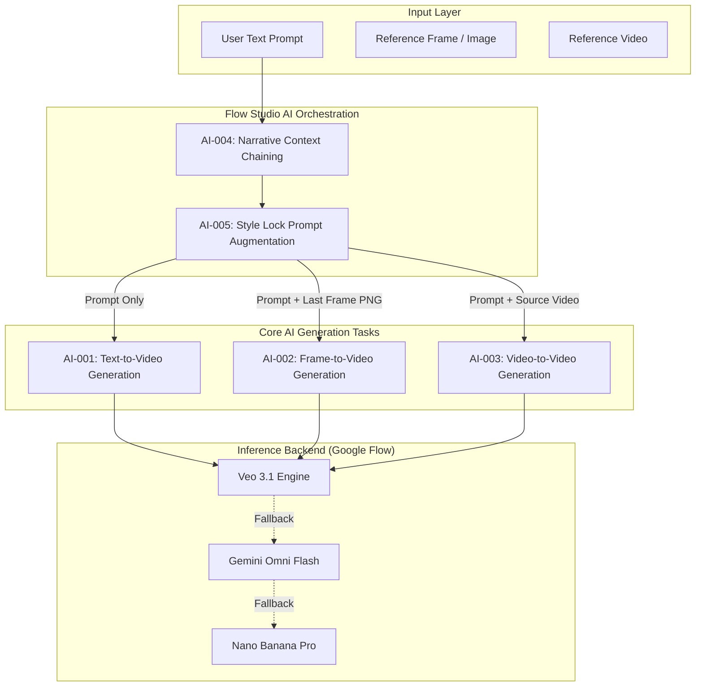
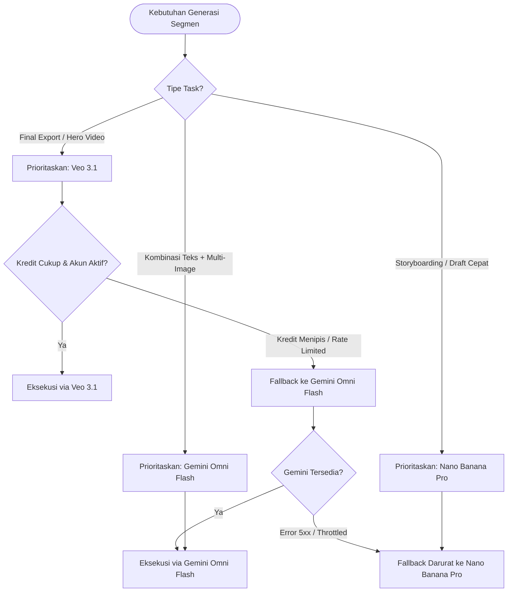
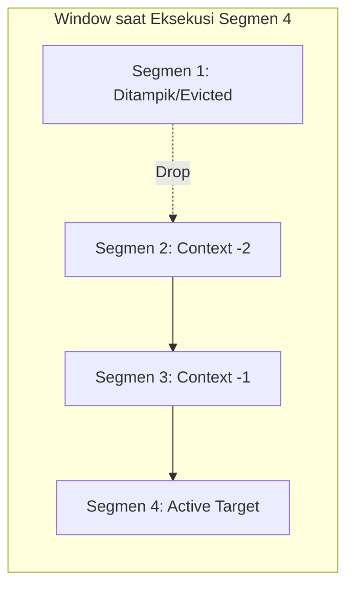
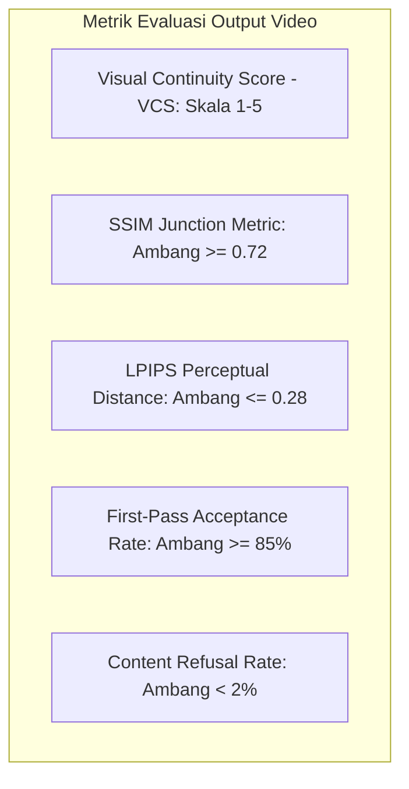
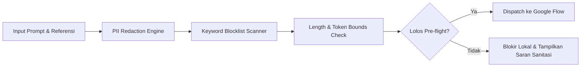
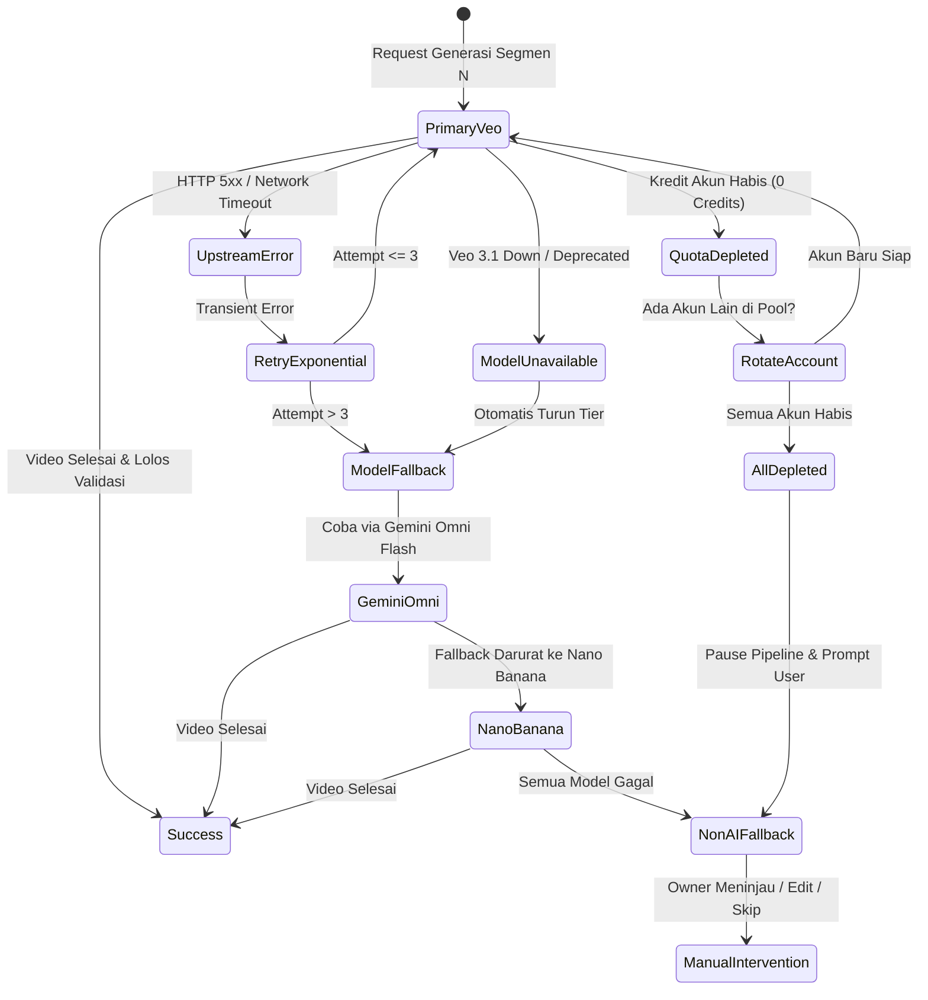
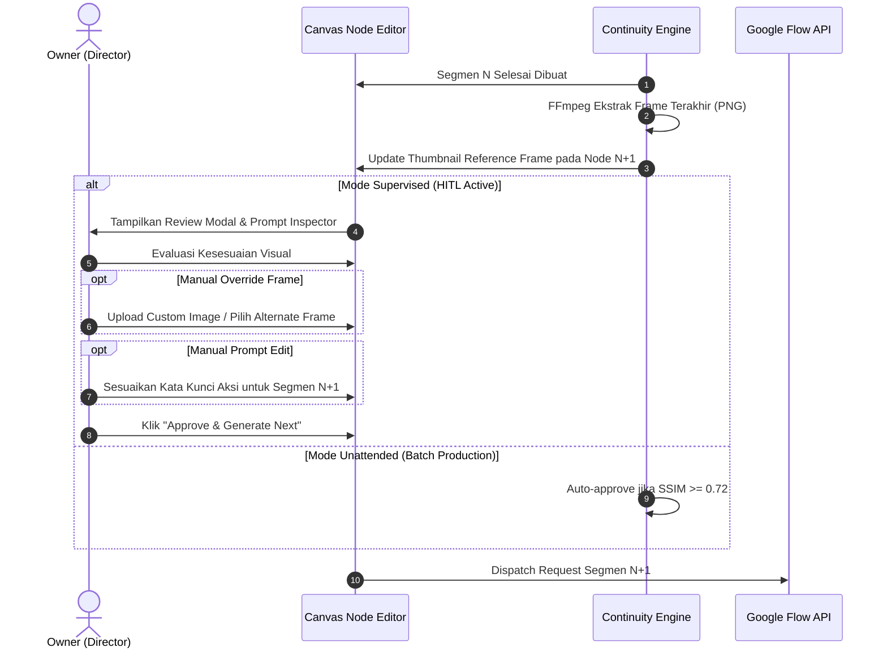

# AI Capability & Engineering Specification: Flow Studio

> **Project:** Flow Studio  
> **Document ID:** DOC-AI-001  
> **Version:** 1.0.0  
> **Status:** Draft  
> **Owner:** Software Architect & Planning Lead  
> **Last Updated:** 2026-09-24  
> **Depends On:** DOC-SRS-001  
> **Supersedes:** None  

---

## 1. Ringkasan Eksekutif & Prinsip Desain AI

### 1.1 Visi Sistem & Konteks Generative AI
Flow Studio dirancang untuk mentransformasikan platform generative video berbasis klip mikro (khususnya Google Flow) menjadi *production-ready long-form video workstation*. Batasan inheren dari model video generasi saat ini adalah ketidakmampuannya mempertahankan stabilitas temporal (*temporal coherence*), identitas subjek (*character consistency*), dan kesinambungan narasi (*narrative arc*) pada durasi di atas 10 detik dalam satu lintasan inferensi (*single inference pass*).

Flow Studio menyelesaikan masalah ini bukan dengan melatih model fondasi baru, melainkan melalui **Chained Micro-Generations Orchestration**:
1. Menjalankan inferensi sekuensial pada unit klip 10 detik.
2. Mengekstraksi *high-fidelity visual anchor* (frame terakhir) menggunakan FFmpeg.
3. Membawa serta *rolling narrative context* (3 adegan terakhir) dan menginjeksi *style lock descriptors* secara deterministik ke dalam prompt segmen lanjutan.
4. Menggabungkan klip-klip 10 detik menjadi video utuh berdurasi 3 hingga 5 menit (18–30 segmen) tanpa distorsi kontinuitas.

### 1.2 Prinsip Rekayasa AI Inti (Core AI Engineering Principles)
- **Local-First Prompt & Continuity Orchestration:** Seluruh perakitan prompt (*prompt assembly*), pelacakan state konteks, manipulasi referensi visual, dan evaluasi hasil dilakukan 100% pada proses lokal mesin pengguna (Rust backend + React UI). Tidak ada server perantara Flow Studio yang memproses atau menyimpan prompt pengguna.
- **Deterministic Prompt Grounding:** Menghindari halusinasi visual dan *style drift* dengan memisahkan prompt menjadi tiga lapisan independen: *Persistent Style Anchor*, *Narrative Context Carry-Over*, dan *Segment Action Prompt*.
- **Cost & Quota Awareness:** Operasi inferensi video adalah komputasi mahal dan dibatasi oleh kuota kredit harian/bulanan Google Flow. Setiap siklus inferensi harus diperlakukan sebagai transaksi bernilai tinggi dengan *pre-flight validation* ketat guna mencegah kegagalan yang membuang kredit (*wasted credits*).
- **Graceful Multi-Model Degradation:** Ketika model primer (*Veo 3.1*) mengalami degradasi jaringan, lonjakan latensi, atau penolakan kuota, sistem harus memiliki jalur fallback otomatis atau semi-otomatis ke model sekunder (*Gemini Omni Flash*) atau model *rapid prototyping* (*Nano Banana Pro*), dengan opsi intervensi manual tanpa merusak rantai pipeline.

---

## 2. Inventaris Kasus Penggunaan AI (AI Use Case Inventory)

Berikut adalah daftar kasus penggunaan AI formal yang diimplementasikan di dalam Flow Studio:



### 2.1 AI-001: Text-to-Video Generation (T2V)
- **Use Case ID:** `AI-001`
- **Nama Fitur:** Text-to-Video Initial Generation
- **Aktor:** Owner (Content Creator)
- **Tujuan:** Menghasilkan segmen video pertama (Scene 1) atau adegan baru yang mengalami perpindahan total (*hard transition* / *scene cut*) tanpa memerlukan referensi gambar sebelumnya.
- **Input:**
  - `prompt_text` (string, 10–1000 karakter): Deskripsi adegan, aksi subjek, dan sudut kamera.
  - `style_lock` (opsional, string): Deskripsi gaya visual global dari pengaturan proyek.
  - `aspect_ratio` (enum: `16:9`, `9:16`, `1:1`).
  - `seed` (opsional, integer): Nilai pengontrol determinisme generasi.
- **Output:** Berkas video MP4 (H.264, 1080p, 24/30 FPS, durasi 10 detik) yang diunduh ke direktori kerja proyek lokal.
- **Model Target:** Veo 3.1 (Primer), Gemini Omni Flash (Sekunder).
- **Kriteria Sukses (Success Criteria):**
  - Kuantitatif: Video berdurasi tepat 10 detik ($\pm 0.1$s), resolusi $\ge 1080\text{p}$, waktu pembuatan (dispatch hingga siap unduh) $\le 90$ detik.
  - Kualitatif: Visual bebas dari artefak distorsi parah (*eldritch morphing*), pencahayaan sesuai deskripsi prompt, pergerakan kamera halus.
- **Titik Interaksi Pengguna:** Owner mengonfigurasi teks prompt pada Prompt Node dan memicu eksekusi pada canvas.
- **Penanganan Kegagalan:** Jika prompt diblokir oleh moderasi upstream, tampilkan alasan penolakan dan izinkan perbaikan prompt tanpa memotong kuota kredit.

### 2.2 AI-002: Frame-to-Video Generation (F2V / Image-to-Video)
- **Use Case ID:** `AI-002`
- **Nama Fitur:** Sequential Frame-to-Video Continuation
- **Aktor:** Owner / Automated Pipeline Executor
- **Tujuan:** Menghasilkan segmen lanjutan (Scene $N+1$) yang melanjutkan adegan dari segmen sebelumnya (Scene $N$) dengan menggunakan frame terakhir Scene $N$ sebagai jangkar visual untuk menjaga kontinuitas subjek, pencahayaan, dan latar belakang.
- **Input:**
  - `reference_frame` (binary PNG, 1080p): Frame terakhir dari Scene $N$ yang diekstrak secara otomatis oleh FFmpeg sidecar (`-sseof -1 -frames:v 1`) atau frame yang di-override secara manual oleh Owner.
  - `continuation_prompt` (string): Prompt yang telah dirangkai dengan konteks adegan sebelumnya dan style lock descriptor.
  - `motion_strength / camera_motion` (opsional parameter jika didukung model).
- **Output:** Berkas video MP4 (durasi 10 detik) di mana frame ke-0 dari video baru memiliki keselarasan visual tinggi terhadap `reference_frame`.
- **Model Target:** Veo 3.1 (Primer dengan dukungan Image Conditioning), Gemini Omni Flash (Sekunder).
- **Kriteria Sukses (Success Criteria):**
  - Kuantitatif: Frame awal klip $N+1$ memiliki skor *Structural Similarity Index Measure* (SSIM) $\ge 0.72$ terhadap frame akhir klip $N$ pada area subjek statis.
  - Kualitatif: Tidak ada perubahan mendadak pada pakaian karakter, warna rambut, geometri wajah, atau kondisi cuaca/pencahayaan lingkungan (*lighting jump*).
- **Titik Interaksi Pengguna:** Berjalan otomatis dalam mode unattended; dalam mode supervised, Owner dapat meninjau thumbnail frame referensi dan melakukan crop/override sebelum request dikirim.

### 2.3 AI-003: Video-to-Video Generation (V2V)
- **Use Case ID:** `AI-003`
- **Nama Fitur:** Video-to-Video Stylization and Transformation
- **Aktor:** Owner
- **Tujuan:** Mentransformasikan klip video eksternal (misal rekaman aksi langsung pengguna atau draf animasi 3D kasar) menjadi klip sinematik baru yang mengikuti arahan prompt dan estetika visual terpilih, tetap mempertahankan gerakan dan komposisi asli.
- **Input:**
  - `source_video` (berkas MP4/WEBM, durasi $\le 10$ detik, resolusi $\le 1080\text{p}$).
  - `style_prompt` (string): Arahan transformasi estetika (misal: *"transform into dark cyberpunk anime, glowing neon reflections, Studio Ghibli cel-shaded textures"*).
  - `transformation_strength` (float: 0.1 - 1.0): Bobot deviasi terhadap video sumber.
- **Output:** Berkas video MP4 (durasi 10 detik) dengan pergerakan subjek identik dengan video sumber tetapi dengan aset visual, tekstur, dan rendering baru.
- **Model Target:** Veo 3.1 (Video Transformation Endpoint).
- **Kriteria Sukses (Success Criteria):**
  - Kuantitatif: Sinkronisasi waktu pergerakan (*motion trajectory*) mempertahankan korelasi temporal $\ge 85\%$ terhadap video sumber.
  - Kualitatif: Tidak terjadi *flickering* antar frame (*temporal flicker*), gaya artistik merata di seluruh durasi video.
- **Titik Interaksi Pengguna:** Owner mengimpor video klip via Video Node, menghubungkannya ke Generation Node bertipe V2V, dan mengatur slider *transformation strength*.

### 2.4 AI-004: Narrative Context Chaining
- **Use Case ID:** `AI-004`
- **Nama Fitur:** Automated Narrative Sliding Window Chaining
- **Aktor:** Internal Continuity Engine (Automated Subsystem)
- **Tujuan:** Merangkum dan mengalirkan konteks naratif penting dari segmen-segmen sebelumnya ke dalam prompt segmen berikutnya agar aksi cerita mengalir secara logis tanpa mengalami kehilangan memori alur (*narrative amnesia*).
- **Input:**
  - Riwayat prompt dari 3 segmen terakhir ($N-2$, $N-1$, $N$).
  - Status aksi terakhir subjek (e.g., *"character is running towards the abandoned temple door"*).
  - User prompt untuk segmen $N+1$.
- **Output:** Blok teks prompt terintegrasi dengan struktur:
  `Continuing from: [Ringkasan Segmen N-2 s/d N]. Current Action: [User Prompt Segmen N+1]`.
- **Model Target:** Deterministic Context Formatter (Local Regex/Algorithmic Engine di Rust core) + Gemini Omni Flash (opsional untuk perangkuman semantik tingkat lanjut jika prompt melebihi batas token).
- **Kriteria Sukses (Success Criteria):**
  - Kuantitatif: Total karakter prompt gabungan tidak melebihi batasan upstream (maksimal 4.000 karakter), waktu pembentukan konteks lokal $< 5\text{ ms}$.
  - Kualitatif: Prompt lanjutan mempertahankan kata kunci entitas penting (nama objek, lokasi, status emosi) tanpa repetisi kata yang mubazir.
- **Titik Interaksi Pengguna:** Owner dapat melihat pratinjau teks gabungan di panel "Context Inspector" dan menulis *prompt override* per segmen jika ingin memutus rantai narasi secara manual.

### 2.5 AI-005: Style Lock Prompt Augmentation
- **Use Case ID:** `AI-005`
- **Nama Fitur:** Visual Style Lock Descriptor Injection
- **Aktor:** Internal Continuity Engine (Automated Subsystem)
- **Tujuan:** Menjamin konsistensi sinematografi, palet warna, jenis lensa, dan gaya pencahayaan di seluruh adegan dalam satu proyek dengan menyuntikkan token gaya standar ke setiap payload inferensi.
- **Input:**
  - `style_lock_text` dari konfigurasi proyek (e.g., *"35mm film photography, Kodak Portra 400 color grading, soft volumetric rim lighting, shallow depth of field, 8k resolution, cinematic masterpiece"*).
  - Unaugmented segment prompt.
- **Output:** Prompt teraugmentasi dengan injeksi token gaya yang diposisikan secara optimal (awalan / *prefix* atau akhiran / *suffix* tergantung arsitektur attention model).
- **Model Target:** Deterministic Rule Engine (Rust backend).
- **Kriteria Sukses (Success Criteria):**
  - Kuantitatif: Injeksi 100% konsisten di seluruh segmen yang tergabung dalam pipeline proyek yang sama.
  - Kualitatif: Hasil video memiliki keseragaman *look and feel*, saturasi warna, dan kontras yang setara, memudahkan proses *color grading* akhir pada pascaproduksi.
- **Titik Interaksi Pengguna:** Owner mengatur deskripsi gaya pada *Project Settings Modal* atau toolbar *Style Lock Panel* (maksimal 500 karakter).

---

## 3. Matriks Kapabilitas Model (Model Capability Matrix)

Flow Studio beroperasi melalui reverse-engineered API Google Flow yang menyediakan akses ke keluarga model generasi visual Google. Karakteristik, batas performa, dan biaya operasional masing-masing model dijabarkan pada matriks berikut:

| Parameter Evaluasi | Google Veo 3.1 | Gemini Omni Flash | Nano Banana Pro |
|---|---|---|---|
| **Peran Utama Sistem** | Model Produksi Primer (High-Fidelity Video) | Model Sekunder / Fast Draft & Chaining | Model Prototyping Cepat / Low-Tier Fallback |
| **Modalitas Input** | Text-to-Video, Frame-to-Video, Video-to-Video | Text-to-Video, Multimodal Image Chaining | Text-to-Video (Lightweight) |
| **Resolusi Output** | 1080p Full HD (1920x1080) & 720p | 720p (1280x720) & 1080p ter-upscale | 720p (1280x720) native |
| **Durasi per Generasi** | Tepat 10.0 detik | 5.0 detik / 10.0 detik | 5.0 detik / 10.0 detik |
| **Frame Rate (FPS)** | 24 FPS (Sinematik) / 30 FPS | 24 FPS | 24 FPS |
| **Latensi Inferensi (P50)**| ~45 detik | ~20 detik | ~12 detik |
| **Latensi Inferensi (P90)**| ~75 detik | ~35 detik | ~22 detik |
| **Timeout Threshold** | 180 detik | 90 detik | 60 detik |
| **Konsumsi Kredit** | 2 Kredit per 10s generasi (`⚠️ Verification Required`) | 1 Kredit per 10s generasi (`⚠️ Verification Required`) | 1 Kredit per 10s generasi (`⚠️ Verification Required`) |
| **Batas Input Prompt** | Maksimal 4.000 karakter | Maksimal 8.000 karakter | Maksimal 2.000 karakter |
| **Batas Input Referensi** | 1 Image PNG/JPG (hingga 20 MB) | 1-2 Image PNG/JPG (hingga 15 MB) | 1 Image JPG (hingga 5 MB) |
| **Aspek Rasio Didukung** | 16:9, 9:16, 1:1 | 16:9, 9:16, 1:1, 4:3 | 16:9, 9:16 |
| **Audio Track Generation**| Ya (Ambient & SFX dasar tergenerasi) | Terbatas (Ambient sederhana) | Tidak ada (Bisu / Silent Video) |
| **Stabilitas Temporal** | Sangat Tinggi (SOTA temporal coherence) | Menengah (Sedikit deformasi pada gerakan cepat)| Rendah - Menengah (Cenderung bermutasi) |
| **Kemudahan Model Swap** | Tinggi (Menggunakan payload standar Flow Router) | Tinggi (Kompatibel dengan skema adapter yang sama)| Tinggi (Drop-in replacement di Generation Node)|
| **Data Residency** | Server Google Cloud (US/Global clusters) | Server Google Cloud (US/Global clusters) | Server Google Cloud (US/Global clusters) |

> ⚠️ **Verification Required:** Biaya kredit per generasi di atas didasarkan pada telemetri empiris reverse engineering Google Flow per September 2026. Kebijakan kuota dan tarif kredit Google dapat berubah sewaktu-waktu tanpa pemberitahuan resmi. Modul `flow-router` secara dinamis memverifikasi pengurangan kuota riil dari header respons upstream.

### 3.1 Heuristik Pemilihan Model (Model Selection Decision Tree)



---

## 4. Strategi Rekayasa Prompt & Konteks (Prompt & Context Strategy)

Kualitas kontinuitas narasi dan konsistensi visual video jangka panjang bergantung pada rekayasa prompt deterministik. Flow Studio menerapkan arsitektur *Three-Tier Prompt Composition*.

### 4.1 Struktur Perakitan Prompt (Prompt Assembly Anatomy)

Setiap request inferensi video yang dikirim ke upstream disusun dari blok-blok berikut:

```
┌────────────────────────────────────────────────────────────────────────┐
│ [STYLE LOCK PREFIX]                                                   │
│ "Cinematic film still, 35mm lens, photorealistic, volumetric warm      │
│  lighting, 8k resolution, highly detailed, color graded by DeHancer --"│
├────────────────────────────────────────────────────────────────────────┤
│ [NARRATIVE SLIDING WINDOW CONTEXT]                                    │
│ "Continuing from scene: The detective stepped out into the rain and    │
│  stared at the neon sign across the street. Next:                      │
├────────────────────────────────────────────────────────────────────────┤
│ [USER ACTION PROMPT (SEGMENT N)]                                       │
│ "The detective walks slowly toward the cybernetic alleyway, pulling his│
│  trench coat tight as steam rises from the pavement."                  │
├────────────────────────────────────────────────────────────────────────┤
│ [CHARACTER & SUBJECT ANCHORS]                                          │
│ "Subject anchor: male detective, mid-40s, sharp jawline, short graying │
│  hair, dark brown trench coat, blue tie."                              │
└────────────────────────────────────────────────────────────────────────┘
```

### 4.2 Mekanisme Sliding Window Konteks Naratif
Untuk mencegah ledakan konteks (*context bloat*) dan menjaga agar model fokus pada transisi adegan terkini, Flow Studio menerapkan **Sliding Window Naratif Maksimal 3 Segmen Terakhir**:



- **Aturan Pembentukan Konteks:**
  - Segmen 1: Tidak memiliki *carry-over context*.
  - Segmen 2: Membawa konteks dari Segmen 1 (`Continuing from: [Prompt 1]`).
  - Segmen 3: Membawa konteks dari Segmen 1 dan 2.
  - Segmen 4: Membawa konteks dari Segmen 2 dan 3 (Segmen 1 dikeluarkan dari window).
  - Segmen $N$: Membawa konteks dari $[N-2, N-1]$.
- **Budgeting & Pemotongan Karakter (Character Budget Truncation):**
  - Alokasi maksimal: **4.000 karakter**.
  - Style Lock: Maksimal 500 karakter (Prioritas 1 - Tidak boleh dipotong).
  - User Action Prompt: Bebas hingga 1.500 karakter (Prioritas 2 - Tidak boleh dipotong).
  - Character Anchors: Maksimal 500 karakter (Prioritas 3).
  - Sliding Context Carry-Over: Sisanya (hingga 1.500 karakter). Jika total panjang karakter melebihi 4.000 karakter, teks konteks adegan terlama dipangkas secara *sliding character boundary* dengan elipsis (`...`).

### 4.3 Style Lock & Cinematography Keywords Registry
Untuk memudahkan Owner membangun konsistensi visual, Flow Studio menyediakan *preset keywords* teruji yang terbukti menjaga stabilitas temporal pada model Veo dan Gemini:

| Gaya Sinematik | Keywords Rekomendasi (Style Lock Preset) |
|---|---|
| **Hyper-Realistic Cinema** | `shot on ARRI Alexa Mini LF, Cooke Anamorphic lenses, natural golden hour lighting, cinematic film grain, photorealistic 8k, subtle color grading, shallow depth of field` |
| **Dark Cyberpunk Noir** | `cyberpunk noir aesthetic, Blade Runner style, neon rim light, moody reflections in wet asphalt, dark shadows, volumetric fog, blue and amber teal palette` |
| **Studio Anime (Cel-Shaded)**| `high-end anime feature film style, Makoto Shinkai aesthetic, hand-drawn cel shading, vibrant sky, detailed clouds, soft lens flare, crisp line art, masterwork` |
| **Vintage 1970s Film** | `1970s 16mm kodachrome footage, heavy film grain, muted warm vintage colors, slight chromatic aberration, retro lens flare, authentic analog film look` |
| **Clean Corporate Minimal** | `minimalist commercial product videography, soft studio diffused light, pristine white cyclorama backdrop, high-key clean reflections, 4k sharp focus` |

### 4.4 Character Description Anchoring
Ketidakstabilan bentuk karakter (*character morphing*) adalah kegagalan paling sering dalam generative video chaining. Flow Studio mengimplementasikan *Subject Anchoring*:
- Setiap proyek menyediakan panel **"Master Character Registry"**.
- Deskripsi statis karakter disimpan dalam template terstruktur:
  `[Name]: [Gender/Age], [Facial Features], [Hair Style/Color], [Upper Clothing], [Lower Clothing], [Distinctive Accessories]`.
- Jika segmen ditandai memiliki karakter tersebut, deskripsi lengkap otomatis disematkan pada baris prompt segmen untuk memaksa model upstream mempertahankan atribut visual yang identik dengan frame referensi.

---

## 5. Rencana Evaluasi & Kontrol Kualitas (Evaluation Plan)

Kualitas output video AI dievaluasi melalui pendekatan dua fase: **Fase P0 (Human-in-the-Loop Visual Continuity Rubrics)** dan **Fase P2 (Automated Algorithmic Frame Similarity)**.

### 5.1 Golden Dataset Pengujian Regresi
Sebelum merilis versi prompt template baru atau memperbarui default model di aplikasi, serangkaian uji regresi dijalankan terhadap **15 Skenario Uji Kanonikal (Golden Dataset)**:

| ID Skenario | Kategori Pengujian | Deskripsi Skenario Multi-Segmen | Kompleksitas Transisi | Target Kualitas |
|---|---|---|---|---|
| `GOLD-001` | Cinematic Drama | Karakter pria berjalan dari interior kantor redup ke jalan raya bersalju (3 segmen). | Perubahan drastis pencahayaan (low-key ke high-key). | Pakaian & wajah tetap identik. |
| `GOLD-002` | Action Sequence | Pengejaran mobil di jalan tol malam hari dengan pergerakan kamera cepat (4 segmen). | Gerakan cepat (*high motion dynamics*). | Tidak ada artefak robek (*tearing*). |
| `GOLD-003` | Sci-Fi Fantasy | Pesawat luar angkasa mendekati stasiun orbital raksasa (3 segmen). | Detail geometri arsitektur kompleks. | Proporsi struktur konsisten. |
| `GOLD-004` | Anime Character | Gadis remaja berbicara di atas atap sekolah saat matahari terbenam (3 segmen). | Gaya cel-shading & proporsi mata. | Warna rambut & seragam stabil. |
| `GOLD-005` | Macro Product | Botol parfum berputar di atas alas marmer hitam dengan tetesan air (2 segmen). | Refleksi cairan dan tekstur material. | Tipografi label botol terbaca. |

### 5.2 Metrik Kualitas & Ambang Batas Penerimaan (Quality Acceptance Gates)



#### 5.2.1 Rubrik Evaluasi Manual (Fase P0 - VCS Rubric)
Setiap sambungan segmen dinilai berdasarkan 4 dimensi kualitatif dengan skala 1 hingga 5:
1. **Subject Stability (Bobot 35%):** Apakah proporsi wajah, pakaian, dan warna subjek utama identik antara frame akhir segmen $N$ dan frame awal segmen $N+1$?
2. **Background & Environmental Coherence (Bobot 25%):** Apakah latar belakang, perabot, dan cuaca tidak berpindah atau lenyap secara gaib?
3. **Lighting & Palette Uniformity (Bobot 20%):** Apakah arah bayangan, temperatur warna, dan saturasi menyatu secara alami?
4. **Motion Trajectory Continuity (Bobot 20%):** Apakah vektor pergerakan kamera dan arah gerak subjek terasa seperti kelanjutan adegan nyata, bukan potongan patah?

*Ambang batas kelulusan pipeline:* Nilai komposit VCS minimal **3.8 / 5.0**.

#### 5.2.2 Metrik Otomatis (Fase P2 - Algorithmic Similarity)
Pada Fase P2, Flow Studio mengintegrasikan pustaka analitik visual berbasis OpenCV / Rust Image processing:
- **Junction SSIM:** Menghitung *Structural Similarity Index* antara Frame $N_{last}$ dan Frame $N+1_{first}$.
  - Target: $\ge 0.72$ (Lulus otomatis).
  - Peringatan: $0.60 - 0.71$ (Flag kuning di UI: *Possible Visual Discontinuity*).
  - Gagal: $< 0.60$ (Menawarkan opsi re-roll atau crossfade otomatis).
- **Perceptual Metric (LPIPS / CLIP-Image):** Membandingkan jarak fitur perseptual untuk memastikan esensi adegan tidak bermutasi di luar toleransi artistik.

---

## 6. Guardrails, Moderasi Konten & Privasi Data (Guardrails & Safety)

### 6.1 Kepatuhan Moderasi Konten Upstream (Google Flow Safety Filters)
Google Flow menerapkan filter server-side yang sangat ketat terhadap konten input teks maupun gambar referensi. Kategori yang memicu pemblokiran langsung (*Prompt Refusal* / HTTP 400 Bad Request):
1. **CSAM & Child Endangerment:** Zero-tolerance mutlak.
2. **Graphic Violence & Gore:** Deskripsi kekerasan ekstrem, darah, dan mutilasi.
3. **Hate Speech & Harassment:** Pelecehan, diskriminasi berbasis SARA.
4. **Celebrity & Public Figure Likeness:** Nama tokoh publik nyata, politisi, atau selebritas tanpa hak izin.
5. **Copyrighted IP & Trademarks:** Karakter fiksi berhak cipta (e.g., *"Mickey Mouse"*, *"Spider-Man"*).

### 6.2 Pre-Flight Guardrails Lokal (Client-Side Screening)
Untuk mencegah pemblokiran akun Google akibat pengiriman prompt yang melanggar dan menghindari pemborosan kuota kredit, Flow Studio menjalankan pemindaian pre-flight di tingkat Rust core sebelum request menyentuh jaringan:



- **Client-Side Keyword Blocklist:** Kamus lokal berisi lebih dari 450 frasa risiko tinggi yang diketahui memicu Google SafeSearch filter.
- **Deteksi & Sanitasi PII (Personal Identifiable Information):**
  - Mengacu pada `SECURITY.md` (DOC-SEC-001 §13) dan UU PDP No. 27/2022: Dilarang menyertakan PII dalam prompt visual.
  - Regex scanner otomatis mendeteksi: Alamat email (`[\w\.-]+@[\w\.-]+\.\w+`), Nomor telepon Indonesia (`(\+62\|62\|0)8[1-9][0-9]{6,10}`), Nomor KTP/NIK (16 digit), dan Nomor Kartu Kredit (Luhn algorithm check).
  - Jika ditemukan, sistem melakukan penyamaran (*redaction*) menjadi token generik `[REDACTED_ENTITY]` atau menghentikan dispatch dengan dialog konfirmasi kepada Owner.

### 6.3 Penanganan Prompt Terblokir (Handling Blocked Prompts)
Ketika request tetap ditolak oleh server Google Flow dengan status penolakan keamanan:
1. **Analisis Error Code:** Tangkap kode error dari response JSON Google Flow (e.g., `SAFETY_FILTER_TRIGGERED`, `PROMPT_BLOCKED`).
2. **Zero Credit Loss Verification:** Verifikasi bahwa akun tidak dikenakan pemotongan kredit oleh Google Flow untuk transaksi yang ditolak.
3. **Smart Prompt Sanitizer:** UI menyediakan saran otomatis untuk menghapus kata-kata pemicu tanpa mengubah intensi dramatis cerita (misal: mengganti *"blood pouring"* menjadi *"crimson paint spreading"*).

---

## 7. Strategi Fallback, Degradasi & Self-Healing (Fallback & Degradation)

Sistem dirancang tahan banting (*resilient*) terhadap gangguan konektivitas, latensi tinggi upstream, dan habisnya kuota akun.



### 7.1 Hierarki Fallback Model (Model Fallback Ladder)
1. **Level 1 (Target Utama):** `Veo 3.1` (Kualitas grafis tertinggi, kontinuitas sinematik).
2. **Level 2 (High-Speed Fallback):** `Gemini Omni Flash` (Jika Veo mengalami antrean panjang upstream > 120s atau server overload).
3. **Level 3 (Rapid Prototyping Fallback):** `Nano Banana Pro` (Jika kuota kredit menipis atau untuk pengujian alur kasar).
4. **Level 4 (Non-AI Manual Mode):** Pengguna dapat mengimpor klip video eksternal secara manual untuk menggantikan segmen yang gagal di-generate, lalu melanjutkan pipeline ke segmen berikutnya.

### 7.2 Rotasi Akun Otomatis Saat Kredit Habis (Credit Depletion Fallback)
- Berdasarkan FR-004 dan `API-EVT-007`: Ketika akun aktif mengembalikan status kuota habis (`daily_remaining == 0` dan `monthly_remaining == 0`), modul `flow-router` secara otomatis mencari akun berikutnya dalam pool SQLite yang memiliki `session_valid == 1` dan kredit terbesar.
- Transisi akun terjadi secara transparan tanpa membatalkan state pipeline yang sedang berjalan.
- Jika seluruh akun dalam pool kehabisan kredit, eksekusi pipeline di-*pause* secara aman, state disimpan ke database, dan notifikasi dikirim ke UI meminta penambahan akun atau menunggu siklus reset kuota harian (00:00 UTC).

### 7.3 Kebijakan Retry Jaringan dengan Exponential Backoff
Sesuai dengan `NFR-003`, retry hanya dieksekusi untuk *transient errors* (kegagalan sementara seperti timeout jaringan, HTTP 500, HTTP 502, HTTP 503, HTTP 504):

$$\text{Delay}(n) = (2^n) \text{ detik} + \text{jitter}$$

- **Percobaan 1:** Tunggu 2 detik + random jitter (0–500ms).
- **Percobaan 2:** Tunggu 4 detik + random jitter.
- **Percobaan 3:** Tunggu 8 detik + random jitter.
- **Percobaan 4:** Tandai segmen sebagai `Failed`, catat rincian kegagalan ke `generation_log`, dan beri opsi kepada Owner: *Retry Segmen*, *Skip Segmen*, atau *Ganti Model*.
- *Non-retryable errors* (HTTP 400 Bad Request, HTTP 401 Unauthorized, HTTP 403 Forbidden, Filter Policy Violation) langsung menghentikan request tanpa retry untuk mencegah pemblokiran IP atau akun.

---

## 8. Model Kuota, Biaya & Strategi Konsumsi Kredit (Quota & Cost Model)

### 8.1 Struktur Tingkatan Akun Google Flow (Tier Structure)

Berdasarkan struktur layanan Google Flow per September 2026:

| Tingkatan Akun (Tier) | Kuota Kredit | Siklus Reset Kuota | Estimasi Biaya Langganan | Kapasitas Video 10s per Hari/Bulan |
|---|---|---|---|---|
| **Free Tier** | 50 Kredit / hari | Harian (00:00 UTC) | Gratis ($0) | 25 klip Veo (atau 50 klip Gemini) per hari |
| **Plus Tier** | 200 Kredit / bulan | Bulanan | ~$10 / bulan | ~100 klip Veo per bulan |
| **Pro Tier** | 1.000 Kredit / bulan | Bulanan | ~$30 / bulan | ~500 klip Veo per bulan |
| **Ultra 100 Tier** | 10.000 Kredit / bulan| Bulanan | ~$100 / bulan | ~5.000 klip Veo per bulan |
| **Ultra 200 Tier** | 25.000 Kredit / bulan| Bulanan | ~$200 / bulan | ~12.500 klip Veo per bulan |

### 8.2 Pemodelan Konsumsi Kredit Produksi Video Panjang (Long-Form Modeling)
Untuk memproduksi satu video panjang berdurasi 3 hingga 5 menit menggunakan klip dasar 10 detik:
- **Kebutuhan Durasi:**
  - Video 3 Menit (180 detik) = **18 Segmen**
  - Video 5 Menit (300 detik) = **30 Segmen**
- **Faktor Revisi & Re-Roll (Creative Multiplier):**
  Dalam praktiknya, tidak semua segmen yang dihasilkan pertama kali memiliki kualitas sempurna. Diperkirakan terdapat *re-roll rate* sebesar **30%**:
  - Untuk 18 segmen final: Memerlukan $\approx 24$ kali percobaan generasi.
  - Untuk 30 segmen final: Memerlukan $\approx 40$ kali percobaan generasi.
- **Kebutuhan Kredit Riil (Asumsi Model Veo 3.1 @ 2 kredit per generasi):**
  - Proyek 3 Menit: $24 \times 2 = \mathbf{48\text{ Kredit}}$. (Cukup dengan 1 Akun Free Tier dalam 1 hari).
  - Proyek 5 Menit: $40 \times 2 = \mathbf{80\text{ Kredit}}$. (Memerlukan minimal 2 Akun Free Tier atau 1 Akun Plus/Pro).

### 8.3 Strategi Pembakaran Kredit Optimal (Optimal Credit Burn Strategy)
Modul `flow-router` menerapkan algoritma pemilihan akun berdasarkan prinsip efisiensi ekonomi:
1. **Prioritas FIFO Kuota Harian (Daily Free Quota First):** Habiskan terlebih dahulu kuota harian 50 kredit dari akun Free Tier sebelum menyentuh akun berbayar (Plus/Pro). Hal ini memaksimalkan nilai kredit gratis yang akan hangus (*expire*) pada pukul 00:00 UTC jika tidak digunakan.
2. **Proteksi Saldo Bulanan:** Akun berbayar dengan saldo kredit bulanan hanya dijadikan *overflow buffer* ketika seluruh akun gratis harian telah mencapai limit `daily_remaining == 0`.
3. **Pemberitahuan Ambang Batas Proyek (Project Budget Cap):** Owner dapat menetapkan batasan kredit maksimal per proyek (misal: batasi maksimal 60 kredit untuk proyek ini). Jika estimasi terlampaui, pipeline meminta konfirmasi manual sebelum melanjutkan generasi berikutnya.

---

## 9. Alur Manusia di Dalam Loop (Human-in-the-Loop / HITL Workflow)

Meskipun Flow Studio mendukung eksekusi tanpa pengawasan (*unattended execution* per `NFR-005`), sistem menyadari bahwa dalam produksi kreatif tingkat tinggi, kontrol sutradara (*directorial control*) adalah kunci. Tiga titik kontrol HITL disediakan:



### 9.1 Titik Kontrol 1: Peninjauan & Override Frame Referensi (US-CONT-005)
- Sistem mengekstrak frame terakhir secara otomatis ke `{project_dir}/frames/segment_{N}_last.png`.
- Pada Generation Node segmen $N+1$, thumbnail frame tersebut ditampilkan bersama lencana visual (*Reference Source: Auto*).
- Owner dapat:
  1. Menerima frame otomatis tersebut.
  2. Membuka *Frame Selector* untuk memilih frame lain dalam klip segmen $N$ (misal frame pada detik ke-8 jika frame detik ke-10 mengalami blur gerakan).
  3. Mengunggah gambar eksternal hasil *touch-up* Photoshop / inpainting sebagai frame referensi kustom (`{project_dir}/overrides/segment_{N}_override.png`). Lencana visual berubah menjadi *Reference Source: Manual Override*.

### 9.2 Titik Kontrol 2: Modifikasi Prompt Inter-Segmen
- Setiap node memiliki kolom *Local Prompt Override*.
- Jika Owner merasa cerita perlu berbelok arah secara dramatis yang tidak tercakup dalam *Sliding Context Chaining*, Owner dapat mencentang opsi *"Bypass Previous Context"* dan menuliskan prompt baru yang berdiri sendiri.

### 9.3 Titik Kontrol 3: Re-roll Non-Destruktif (Branching Re-rolls)
- Jika hasil generasi suatu segmen tidak memuaskan, Owner dapat memicu fungsi *Re-roll Segment*.
- Sistem akan menghasilkan variasi baru dari segmen tersebut tanpa menghapus hasil generasi sebelumnya (disimpan sebagai `segment_N_v1.mp4`, `segment_N_v2.mp4`).
- Owner dapat memilih versi mana yang aktif digunakan sebagai basis ekstraksi frame referensi untuk segmen $N+1$.

---

## 10. Observabilitas, Telemetri AI & Diagnostik (AI Observability)

Untuk menjaga keandalan sistem dan memberikan transparansi menyeluruh atas kinerja inferensi eksternal, Flow Studio mengimplementasikan pencatatan telemetri lokal terstruktur pada tabel `generation_log` di basis data SQLite lokal.

### 10.1 Skema Telemetri Inferensi
Setiap pemanggilan inferensi mencatat metrik berikut:

```sql
-- Dikutip dari ERD.md (DOC-ERD-001)
-- Tabel generation_log merekam jejak audit inferensi AI
CREATE TABLE IF NOT EXISTS generation_log (
    id TEXT PRIMARY KEY,
    account_id TEXT,
    segment_id TEXT,
    request_payload_hash TEXT NOT NULL CHECK (length(request_payload_hash) = 64),
    response_status TEXT NOT NULL CHECK (response_status IN (
        'success', 'rate_limited', 'unauthorized', 'server_error', 'client_error', 'timeout'
    )),
    credits_consumed INTEGER NOT NULL DEFAULT 0 CHECK (credits_consumed >= 0),
    started_at TEXT NOT NULL,
    completed_at TEXT,
    error_message TEXT,
    FOREIGN KEY (account_id) REFERENCES accounts(id) ON DELETE SET NULL,
    FOREIGN KEY (segment_id) REFERENCES segments(id) ON DELETE SET NULL
);
```

### 10.2 Metrik Kunci yang Dipantau (Key Observability Metrics)

| Nama Metrik | Formula / Definisi | Target Operasional | Tindakan Jika Anomali |
|---|---|---|---|
| **E2E Generation Latency** | Waktu dari dispatch request hingga berkas video tersimpan di disk lokal. | $\le 75\text{ detik}$ (P90) untuk Veo 3.1 | Jika $> 120\text{s}$, tampilkan notifikasi antrean upstream lambat. |
| **Credit Burn Rate (CBR)** | Total kredit terkonsumsi per jam aktif eksekusi pipeline. | Sesuai estimasi rencana proyek | Peringatan jika konsumsi melebihi 40 kredit/jam tanpa hasil final. |
| **Model Failure Rate (MFR)**| $\frac{\text{Jumlah Generasi Gagal}}{\text{Total Percobaan Generasi}} \times 100\%$ | $\le 5\%$ dari seluruh request | Jika $> 15\%$, lakukan audit kesehatan akun dan koneksi proxy. |
| **Prompt Refusal Rate (PRR)**| $\frac{\text{Generasi Ditolak Kebijakan}}{\text{Total Permintaan Generasi}} \times 100\%$ | $\le 1\%$ | Evaluasi keyword blocklist lokal untuk memfilter lebih awal. |
| **Account Churn / Rotation Frequency** | Jumlah pergantian akun per sesi pipeline. | $\le 2$ pergantian per proyek 30 segmen | Verifikasi saldo awal pool akun sebelum pipeline dimulai. |

### 10.3 Manifest Generasi Proyek (Exportable Generation Manifest)
Saat mengekspor video akhir, Flow Studio menghasilkan berkas metadata pendamping `[project_name].manifest.json` yang berisi rekam jejak audit seluruh pipeline:
- Versi model yang digunakan pada setiap segmen.
- Teks prompt lengkap (beserta style lock dan carry-over context).
- Hash SHA-256 dari frame referensi yang diinjeksikan.
- Total durasi dan jumlah kredit riil yang dihabiskan untuk proyek tersebut.

---

## 11. Tata Kelola Data & Kepatuhan Keamanan (Data Governance & Security)

### 11.1 Aliran Data ke Pihak Ketiga (Third-Party Data Flow)
Sesuai dengan arsitektur keamanan di `SECURITY.md` (DOC-SEC-001) dan `ARCHITECTURE.md` (DOC-ARCH-001):
- **Tujuan Egress Tunggal:** Data inferensi hanya dikirimkan ke domain resmi Google Flow (`flow.google.com` dan endpoint API terkait Google Cloud).
- **Payload Sanitization:** Tidak ada data identitas mesin, IP address lokal, atau riwayat direktori PC yang dikirimkan ke upstream selain header standar peramban web modern (*User-Agent masquerading*).
- **Enkripsi Transit:** Komunikasi keluar wajib menggunakan protokol **TLS 1.3** dengan verifikasi sertifikat x509 yang valid.

### 11.2 Retensi Aset Grafis & Video Lokal
- Seluruh aset sementara (frame PNG hasil ekstrak, klip video parsial 10s) disimpan di direktori proyek pengguna (`{project_path}/cache/`).
- Pengguna memiliki kontrol penuh untuk menghapus cache sementara atau mengarsipkan seluruh aset melalui menu pengaturan proyek lokal.

---

## 12. Persyaratan Non-Fungsional Khusus AI (AI Non-Functional Requirements)

| ID NFR | Kategori | Spesifikasi Target | Prosedur Verifikasi |
|---|---|---|---|
| `NFR-AI-001` | **Dispatch Latency** | Interval antara penekanan tombol eksekusi dan pengiriman request HTTP keluar $\le 1.5\text{ detik}$. | Pencatatan timestamp audit antara event IPC dan socket send di Rust backend. |
| `NFR-AI-002` | **Frame Extraction Speed** | Ekstraksi frame terakhir via FFmpeg sidecar $\le 1.8\text{ detik}$ untuk klip 1080p 10 detik. | Pengujian benchmark subproses FFmpeg pada CPU minimum (Intel Core i5 Gen 8). |
| `NFR-AI-003` | **Prompt Assembly Performance**| Pembentukan sliding window, penggabungan style lock, dan regex sanitasi $\le 10\text{ ms}$. | Unit test mikro pada modul Rust context builder dengan string 4.000 karakter. |
| `NFR-AI-004` | **Resiliency under Upstream Outage**| Aplikasi tidak boleh crash jika Google Flow mengembalikan HTTP 500, HTML cloudflare error page, atau koneksi terputus tiba-tiba. | Injeksi mock HTTP proxy dengan respons acak (corrupt body, drop socket, 502 Bad Gateway). |
| `NFR-AI-005` | **Deterministic Serialization** | Konfigurasi AI node pada file `.flowproj` harus menghasilkan hash identik jika parameter prompt, seed, dan model tidak berubah. | Serialisasi JSON terurut (*canonical key ordering*) dan verifikasi hash SHA-256. |

---

## 13. Riwayat Revisi Dokumen

| Versi | Tanggal | Penulis | Perubahan Utama |
|---|---|---|---|
| `1.0.0` | 2026-09-24 | Software Architect & Planning Lead | Rilis draf inisial spesifikasi kapabilitas AI Flow Studio sesuai standar PLANNING_v5.2.md §11.11 dan DOC-SRS-001. Mencakup inventaris use case AI-001 s/d AI-005, model matrix, strategi prompt windowing, rencana evaluasi, guardrails, fallback, cost modeling, HITL, dan observabilitas. |
