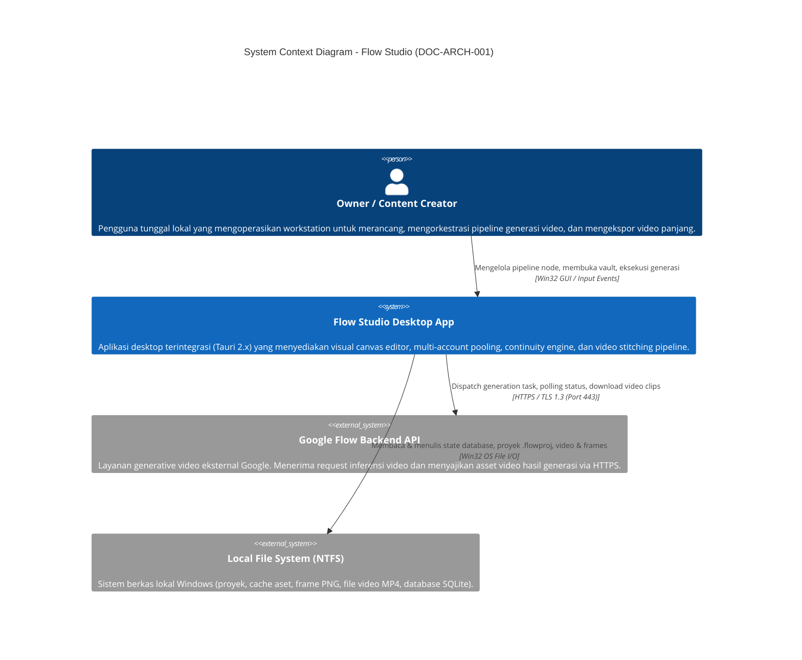
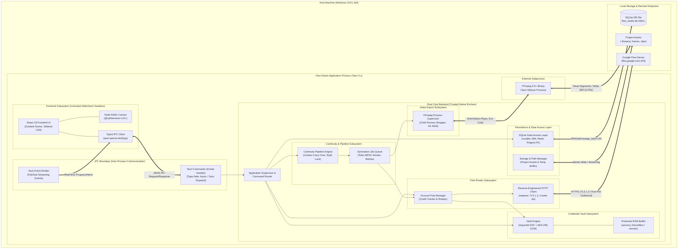
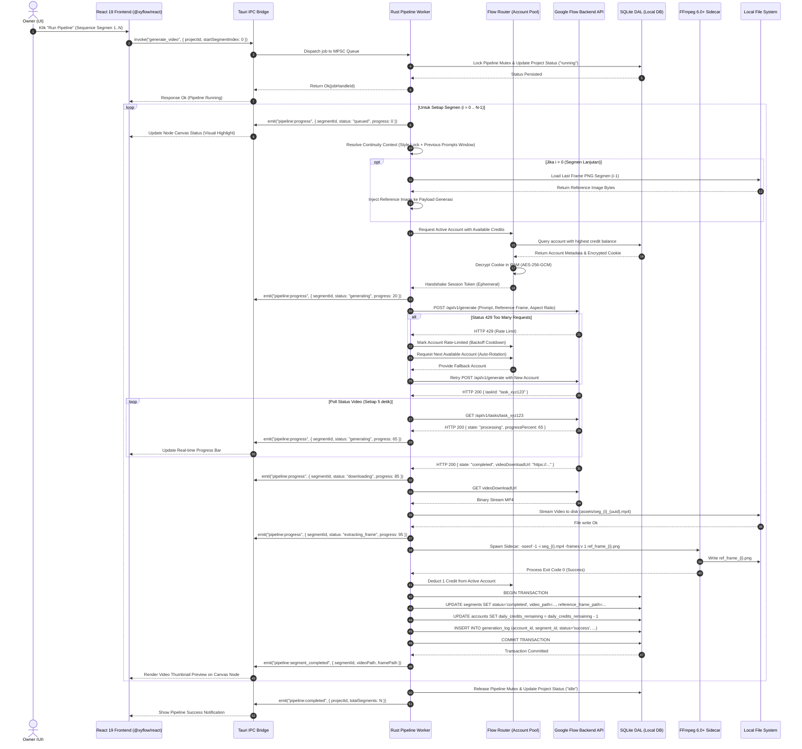

# Architecture Specification: Flow Studio

> **Project:** Flow Studio  
> **Document ID:** DOC-ARCH-001  
> **Version:** 1.0.0  
> **Status:** Draft  
> **Owner:** Software Architect & Planning Lead  
> **Last Updated:** 2026-09-24  
> **Depends On:** DOC-API-001, DOC-ERD-001, DOC-PERM-001  
> **Supersedes:** None  

---

## 1. Ringkasan Eksekutif & Prinsip Desain Arsitektur

### 1.1 Visi Sistem & Konteks Solusi
Flow Studio adalah sistem perangkat lunak desktop (*desktop workstation application*) berkinerja tinggi yang dirancang untuk platform Windows 10/11 x64. Misi arsitektural utama Flow Studio adalah menjembatani limitasi fundamental dari platform generative video Google Flow: batasan durasi klip video maksimal ~10 detik per generasi dan kuota kredit harian/bulanan yang ketat per akun Google.

Melalui pendekatan **Modular Monolith** berbasis framework **Tauri 2.x**, Flow Studio mengintegrasikan antarmuka grafis kanvas node interaktif (React 19 + `@xyflow/react`) dengan *native runtime engine* berbasis Rust. Sistem ini mengorkestrasi tiga pilar kemampuan:
1. **Multi-Account Flow Routing & Credit Pooling:** Mengelola *pool* akun Google Flow terenkripsi, memonitor sisa kredit secara real-time, dan melakukan failover/rotasi akun tanpa disrupsi pada pipeline pengguna.
2. **Deterministic Continuity Engine:** Menjaga koherensi visual dan gaya naratif lintas klip melalui ekstraksi otomatis *last-frame* resolusi penuh via FFmpeg sidecar, injeksi referensi visual ke segmen lanjutan, serta *sliding window prompt context chaining*.
3. **Lossless Video Assembly & Concat Pipeline:** Menggabungkan segmen-segmen video 10 detik secara sekuensial menjadi satu berkas video koheren berdurasi 3 hingga 5 menit tanpa artefak sambungan (*junction points*) melalui FFmpeg concat demuxer.

### 1.2 Prinsip Arsitektur Inti (Core Architectural Tenets)
- **Local-First & Data Sovereignty:** Seluruh metadata proyek, struktur node graph, riwayat audit generasi, dan berkas video tersimpan 100% di penyimpanan lokal pengguna (`%APPDATA%/FlowStudio/` dan direktori proyek lokal). Tidak ada telemetry komputasi atau berkas media yang dialirkan ke server cloud milik pihak ketiga di luar API resmi Google Flow.
- **Strict Cryptographic Enclave:** Kredensial akun pihak ketiga (Google Flow session cookies dan token otentikasi) dilindungi secara kriptografis menggunakan AES-256-GCM dengan kunci yang diturunkan melalui Argon2id dari Master Password lokal. Kunci hanya berada di RAM yang dilindungi (*memory wiping* / *zeroization*) selama status brankas `UNLOCKED`.
- **Zero-Stub Production Rigor:** Setiap modul arsitektural diimplementasikan secara utuh dengan penanganan error kanonikal (*canonical error envelopes*), batas transaksi SQLite yang ketat, serta pengujian terukur tanpa ada ketergantungan pada *dummy mock* atau *placeholder*.
- **Constrained Subprocess Sandboxing:** Subproses FFmpeg dijalankan secara terisolasi tanpa intervensi shell sistem (`cmd.exe` atau PowerShell) dan dibatasi izin aksesnya hanya pada direktori kerja proyek lokal yang telah divalidasi.
- **Minimal Attack Surface:** Aplikasi beroperasi dengan paradigma *zero inbound ports*. Tidak ada daemon jaringan, server HTTP lokal, atau port TCP/UDP yang dibuka untuk mendengarkan koneksi masuk (*zero listening ports*). Seluruh komunikasi eksternal hanya berupa *outbound HTTPS* terenkripsi (port 443) ke domain resmi Google.

---

## 2. Diagram Konteks & Kontainer (C4 Model)

### 2.1 C4 Level 1: System Context Diagram
Diagram konteks sistem mengilustrasikan batas sistem Flow Studio terhadap aktor manusia (Owner) dan sistem eksternal yang berinteraksi dengannya.



### 2.2 C4 Level 2: Container / Modular Monolith Diagram
Flow Studio mengadopsi arsitektur **Modular Monolith** dalam satu kesatuan proses aplikasi desktop Tauri 2.x. Seluruh dependensi subsistem backend berjalan dalam *native runtime* Rust yang berkomunikasi dengan UI renderer (WebView2) melalui Tauri IPC Bridge.



### 2.3 C4 Level 3: Rincian Komponen Modul Rust Core
Modul Rust Core dirancang secara ortogonal tanpa adanya *circular dependencies*:

| Nama Modul Rust | Tanggung Jawab Utama | Dependensi Internal | State Mutability Scope |
|---|---|---|---|
| `app_state` | Mengelola *global state container* (`Arc<AppState>`), inisialisasi runtime, manajemen konfigurasi sistem. | Semua modul Rust | Thread-safe, Read-mostly via `Arc` |
| `vault` | Eksekusi kriptografi Argon2id, AES-256-GCM, auto-lock inaktivitas 15 menit, *zeroize* kunci di RAM. | `db::dal` | `RwLock<VaultSession>` terlindungi |
| `account_pool` | Pemilihan akun aktif berbasis ketersediaan kredit (harian/bulanan), rotasi failover, validasi session. | `vault`, `db::dal`, `google_api` | `Mutex<AccountPoolState>` |
| `google_api` | Mengirim payload inferensi HTTP ke Google Flow, memantau *rendering task*, mengunduh berkas segmen video. | `account_pool` | Stateless HTTP Client (`reqwest::Client`) |
| `continuity` | Menghitung *sliding context window* prompt, mengunci *style prefix*, menyuntikkan *reference frame* ke payload. | `ffmpeg`, `db::dal` | Read-only graph state evaluation |
| `pipeline_job` | Worker antrean eksekusi sekuensial (`mpsc`), state machine segmen (`Queued` $\to$ `Generating` $\to$ `Extracting`), retry handler. | `google_api`, `continuity`, `ffmpeg` | Single pipeline worker loop (`Mutex<PipelineExecutionState>`) |
| `ffmpeg` | Abstraksi sidecar proses FFmpeg untuk ekstraksi frame terakhir (`-sseof -1`) dan *stitching concat demuxer*. | `storage` | I/O Process isolation |
| `db` | Abstraksi akses basis data SQLite menggunakan `rusqlite` dengan pool koneksi berorientasi thread lokal. | `storage` | Embedded SQLite instance (`WAL` mode) |
| `storage` | Resolusi direktori aman `%APPDATA%`, manajemen path proyek, pembersihan berkas sementara (*garbage collection*). | None | Local filesystem Win32 I/O |

---

## 3. Batas Kepercayaan & Wilayah Keamanan (Trust Boundaries)

Flow Studio membagi sistem ke dalam 4 zona kepercayaan (*trust zones*) yang dipisahkan secara tegas oleh mekanisme isolasi proses dan protokol komunikasi:

```
┌──────────────────────────────────────────────────────────────────────────────────┐
│ ZONE 1: UNTRUSTED / LOWER INTEGRITY                                             │
│ WebView2 Renderer (React 19 Frontend)                                            │
│ - Potensi risiko: XSS dari rendering prompt, compromised UI dependency npm      │
│ - Pembatasan: Tidak memiliki akses ke fs native, network raw socket, atau RAM OS│
└────────────────────────────────────────┬─────────────────────────────────────────┘
                                         │
                   TAURI IPC BOUNDARY   ▼ [Type-Safe Serialized JSON Envelope]
                                         │ (Strict Input Validation & Schema Sanitization)
┌────────────────────────────────────────┴─────────────────────────────────────────┐
│ ZONE 2: TRUSTED APPLICATION CORE (NATIVE SUPERVISOR)                             │
│ Rust Core Engine Process (Tauri 2.x)                                             │
│ - Kendali penuh: Command dispatcher, pipeline state machine, SQLite DAL          │
│ - Isolasi memori: Thread safety via Rust type system, ownership, dan borrow check│
│                                                                                  │
│   ┌──────────────────────────────────────────────────────────────────────────┐   │
│   │ ZONE 2A: CRYPTOGRAPHIC ENCLAVE (RESTRICTED IN-PROCESS SUB-ZONE)          │   │
│   │ Vault Engine & In-Memory Key Buffer                                      │   │
│   │ - Kunci AES-256-GCM berada dalam secrecy::SecretBox                      │   │
│   │ - Auto-zeroization saat lock timeout atau app shutdown                   │   │
│   │ - Tidak ada pointer atau serialized key yang pernah menyeberang ke Zone 1 │   │
│   └──────────────────────────────────────────────────────────────────────────┘   │
└───────────────────┬──────────────────────────────────────────┬───────────────────┘
                    │                                          │
   PROCESS SPAWN    │ (Pipe I/O, No Shell)     OUTBOUND HTTPS  │ (TLS 1.3 Only, Port 443)
                    ▼                                          ▼
┌──────────────────────────────────────┐     ┌─────────────────────────────────────┐
│ ZONE 3: CONSTRAINED SUBPROCESS       │     │ ZONE 4: EXTERNAL REMOTE BOUNDARY    │
│ FFmpeg Sidecar Binary                │     │ Google Flow Backend (flow.google.com)│
│ - Izin: R/W berkas proyek lokal      │     │ - Menerima generation payload       │
│ - Pembatasan: Tanpa soket jaringan   │     │ - Menyajikan byte video hasil render│
│ - Isolasi: Eksekusi argumen langsung │     │ - Tidak memiliki akses inbound      │
└──────────────────────────────────────┘     └─────────────────────────────────────┘
```

### 3.1 Detail Batas Kepercayaan
1. **Frontend-to-Backend IPC Boundary:**
   - Input yang berasal dari WebView2 dianggap **untrusted**. Seluruh parameter command (seperti input path, prompt string, UUID) wajib divalidasi dan disanitasi di layer Rust sebelum diproses oleh domain logic.
   - Serangan injeksi path (*path traversal*) dicegah dengan menolak input string yang mengandung sequence `..`, separator direktori absolut ilegal, atau karakter kontrol NTFS.
   - Master Password yang dikirim via IPC hanya digunakan sesaat untuk proses verifikasi Argon2id dan langsung ditimpa (*zeroized*) dari buffer penerimaan IPC.
2. **Cryptographic Enclave Boundary:**
   - Kunci enkripsi dekripsi kredensial disimpan dalam buffer yang mengimplementasikan trait `zeroize::ZeroizeOnDrop`.
   - Modul lain di dalam Rust Core hanya dapat meminta kredensial akun terdekripsi melalui antarmuka fungsional *ephemeral closure* (`vault.with_decrypted_cookie(account_id, |cookie| { ... })`), sehingga plain text cookie tidak bocor sebagai nilai return yang persisten di modul lain.
3. **Rust-to-FFmpeg Subprocess Boundary:**
   - Pemanggilan biner FFmpeg tidak pernah menggunakan perantara shell (`cmd /c` atau `sh -c`).
   - Argumen dilewatkan sebagai array string eksplisit via `std::process::Command` / `tauri::plugin::shell`, mengeliminasi celah *command injection*.
   - Standar input/output dialirkan melalui pipa (*pipes*) terisolasi yang dipantau dengan batas waktu eksekusi (*watchdog timeout*).
4. **Rust-to-Google Flow External Boundary:**
   - Komunikasi eksternal terbatas hanya pada *outbound HTTPS* ke host yang diizinkan (`*.google.com`, `flow.google.com`).
   - Sertifikat TLS divalidasi secara ketat terhadap *native trust store* sistem operasi Windows.
   - Tidak ada koneksi HTTP tidak terenkripsi (Port 80) yang diizinkan keluar dari aplikasi.

---

## 4. Alur Permintaan & Data (Request & Data Flow)

### 4.1 Diagram Sekuensial Pipeline Generasi Video
Diagram di bawah mendemonstrasikan orkestrasi lengkap mulai dari inisiasi generasi oleh Owner di UI hingga ekstraksi frame continuity dan finalisasi segmen.



### 4.2 Langkah Detail Eksekusi Pipeline (Phase-by-Phase Walkthrough)
1. **Validasi Graf & Kunci Pipeline:** Sistem memverifikasi integritas topologi node graph, memastikan tidak ada siklus (*acyclic check*), memvalidasi keberadaan Master Password session di memori, dan mengunci mutex eksekusi tunggal.
2. **Kompilasi Context Continuity:** Untuk setiap segmen yang dieksekusi, sistem mengevaluasi teks prompt:
   $$\text{Final Prompt} = [\text{Style Lock Prefix}] + [\text{Sliding Window History (max 3 segmen)}] + [\text{Segment Prompt}]$$
3. **Rotasi Akun & Deduplikasi Token:** Flow Router memilih akun yang valid (`session_valid = 1`) dengan sisa kuota kredit $> 0$. Jika terjadi *rate limit* (HTTP 429), akun tersebut langsung ditandai dalam status *cooldown* selama 15 menit dan sistem secara instan merotasi eksekusi ke akun cadangan berikutnya.
4. **Eksekusi Inferensi Asinkron:** Permintaan HTTP dikirim ke Google Flow API. Progress dipantau secara periodik menggunakan *exponential jitter polling* untuk menghindari deteksi automasi yang agresif.
5. **Ekstraksi Frame Presisi:** Segera setelah binary MP4 tersimpan di direktori proyek, engine menjalankan subproses FFmpeg dengan parameter khusus:
   ```bash
   ffmpeg.exe -y -sseof -1 -i "seg_01.mp4" -update 1 -q:v 2 "ref_01.png"
   ```
   Ekstraksi dilakukan langsung dari keyframe/frame terakhir untuk meminimalkan beban CPU dan menjamin resolusi asli tanpa kompresi tambahan.
6. **Pencatatan Transaksional SQLite:** Pembaruan status segmen, pengurangan kuota kredit akun, dan penulisan catatan audit log dieksekusi dalam satu *atomic transaction block* untuk menjamin konsistensi ACID.

---

## 5. Kepemilikan Modul (Module Ownership & Boundaries)

Untuk memastikan akuntabilitas arsitektural dan menghindari ambiguitas tanggung jawab teknis, batas kepemilikan dibagi menjadi 3 domain spesifik:

```
┌─────────────────────────────────────────────────────────────────────────────┐
│                             MODULE OWNERSHIP MATRIX                         │
├─────────────────────┬───────────────────────────┬───────────────────────────┤
│ FRONTEND DOMAIN     │ BACKEND DOMAIN (RUST)     │ DEVOPS & INFRA DOMAIN     │
│ (Lead: Frontend Eng)│ (Lead: Systems/Rust Eng)  │ (Lead: DevOps/Release Eng)│
├─────────────────────┼───────────────────────────┼───────────────────────────┤
│ • UI Component Tree │ • Tauri IPC Handlers      │ • Tauri Bundler Config    │
│ • React Flow Canvas │ • Vault & AES/Argon2 KDF  │ • Windows NSIS/MSI Scripts│
│ • Zustand State     │ • Flow Router & Pooling   │ • GitHub Actions CI/CD    │
│ • Storybook Stories │ • Continuity Engine       │ • FFmpeg Binary Bundling  │
│ • Client Validation │ • SQLite DAL & Migrations │ • Code Signing & Ed25519  │
│ • Localized Strings │ • FFmpeg Subprocess Wrap  │ • Release Artifact Check  │
└─────────────────────┴───────────────────────────┴───────────────────────────┘
```

### 5.1 Rincian Matriks Tanggung Jawab
- **Frontend Domain:** Bertanggung jawab atas rendering antarmuka pengguna berbasis React 19, performa 60 FPS pada kanvas `@xyflow/react`, validasi lokal pada form input, penanganan visual states (default, hover, active, loading, error, disabled) sesuai `DESIGN.md`, dan manajemen state reaktif melalui Zustand. Frontend tidak diperkenankan mengandung logika bisnis manipulasi file atau kriptografi langsung.
- **Backend Domain (Rust):** Bertanggung jawab atas kebenaran logika orkestrator pipeline, integritas konkurensi (Mutex/RwLock), manajemen memori aman (*secure zeroization*), konsistensi transaksi SQLite, komunikasi HTTP ke server Google, dan pengawasan subproses FFmpeg. Seluruh kontrak data harus didefinisikan di modul ini dan diekspor ke frontend.
- **DevOps & Release Domain:** Bertanggung jawab atas pipeline build multi-platform (fokus Windows x64), skrip installer NSIS, verifikasi hash SHA-256 untuk biner eksternal FFmpeg yang di-bundle, penandatanganan kode digital (*code signing*), dan konfigurasi skrip rilis.

---

## 6. Arsitektur Komunikasi: Sinkron vs Asinkron (Sync vs Async)

Komunikasi antar modul di dalam Flow Studio diatur secara presisi untuk menjamin antarmuka UI tetap responsif (*non-blocking 60 FPS*) bahkan saat operasi I/O berat atau inferensi video sedang berjalan.

```
┌─────────────────────────────────────────────────────────────────────────────┐
│                          COMMUNICATION MATRIX                               │
├───────────────────┬──────────────┬──────────────────┬───────────────────────┤
│ Pola Komunikasi   │ Mekanisme    │ Sifat Eksekusi   │ Kasus Penggunaan      │
├───────────────────┼──────────────┼──────────────────┼───────────────────────┤
│ Command (Fast)    │ Tauri Invoke │ Sinkron / Ringan │ `check_vault_status`, │
│                   │              │ (< 15 ms)        │ `get_system_info`,    │
│                   │              │                  │ `list_projects`       │
├───────────────────┼──────────────┼──────────────────┼───────────────────────┤
│ Command (Async)   │ Tauri Invoke │ Asinkron (Tokio) │ `unlock_vault` (KDF), │
│                   │              │ (Future/Promise) │ `add_account`,        │
│                   │              │                  │ `generate_video`      │
├───────────────────┼──────────────┼──────────────────┼───────────────────────┤
│ Push Event Stream │ Tauri Emit   │ Fire-and-Forget  │ `pipeline:progress`,  │
│                   │              │ Asinkron Realtime│ `vault:state_changed`,│
│                   │              │                  │ `account:credit_upd`  │
├───────────────────┼──────────────┼──────────────────┼───────────────────────┤
│ Background Worker │ Tokio MPSC   │ Queue Sequential │ Antrean pipeline task,│
│                   │ Channel      │ Internal Backend │ health check monitor  │
└───────────────────┴──────────────┴──────────────────┴───────────────────────┘
```

### 6.1 Tauri Commands: Sinkron vs Asinkron
- **Fast Commands:** Operasi yang hanya membaca data dari memori RAM (misalnya memeriksa status flag brankas atau membaca pengaturan UI) dieksekusi secara instan dan langsung mengembalikan nilai.
- **Asynchronous Task Commands:** Operasi yang melibatkan komputasi CPU intensif (seperti kalkulasi hashing password Argon2id yang memakan waktu ~500ms) atau operasi I/O disk/jaringan didefinisikan menggunakan fungsi `async fn` di Rust yang dieksekusi dalam *thread pool* Tokio. Pemanggilan dari frontend mengembalikan JavaScript `Promise`, mencegah pembekuan *main UI thread*.

### 6.2 Tauri Events: Push Notification & Real-Time Telemetry
Ketika pipeline generasi berjalan (dapat memakan waktu 2 hingga 5 menit per segmen), frontend tidak melakukan polling agresif melalui command. Sebaliknya, backend menggunakan `app_handle.emit()` untuk menyiarkan status secara reaktif:
- `pipeline:progress`: Membawa data persentase eksekusi, tahap pemrosesan (`queued`, `generating`, `downloading`, `extracting_frame`), dan throughput transfer.
- `account:credit_updated`: Menyiarkan sisa kredit terbaru segera setelah satu generasi selesai diproses.
- `vault:state_changed`: Memberitahukan frontend ketika brankas terkunci secara otomatis akibat inaktivitas.

### 6.3 Concurrency Control & Mutex Strategy
Untuk menghindari *race conditions* dan *deadlocks*, backend menerapkan hirarki penguncian memori yang ketat:
1. **Global Pipeline Lock (`tokio::sync::Mutex<PipelineExecutionState>`):** Menjamin hanya ada tepat 1 pipeline video yang aktif berjalan pada satu waktu. Command baru yang mencoba memulai generasi saat pipeline aktif akan langsung ditolak dengan kode `E_PIPELINE_BUSY`.
2. **Account Allocation Mutex (`std::sync::Mutex<AccountPool>`):** Digunakan secara singkat (< 5 ms) hanya untuk membaca dan mengalokasikan akun berikutnya dari *priority list*. Kunci segera dilepaskan sebelum request jaringan dikirim ke Google Flow.
3. **Database Write Mutex:** Pengelolaan konkurensi SQLite diatur pada layer driver `rusqlite` dengan memanfaatkan mode `WAL` (Write-Ahead Logging), memungkinkan pembacaan multi-thread secara simultan tanpa terblokir oleh operasi penulisan tunggal.

---

## 7. Integrasi Eksternal (External Integrations)

Flow Studio mengandalkan dua integrasi eksternal kritis: antarmuka HTTP ke layanan Google Flow dan biner lokal FFmpeg.

### 7.1 Reverse-Engineered HTTP Client ke Google Flow
Karena Google Flow tidak menyediakan SDK publik resmi berbayar, Flow Studio memanfaatkan komunikasi HTTP internal yang direkayasa balik (*reverse-engineered*):
- **Transport Security & Headers:** Seluruh permintaan menggunakan TLS 1.3 via pustaka `reqwest`. Klien meniru (*mimic*) header peramban modern untuk menghindari anomali deteksi:
  - `User-Agent: Mozilla/5.0 (Windows NT 10.0; Win64; x64) AppleWebKit/537.36 (KHTML, like Gecko) Chrome/128.0.0.0 Safari/537.36`
  - `Origin: https://flow.google.com`
  - `Referer: https://flow.google.com/`
  - `Accept: application/json, text/plain, */*`
- **Cookie Jar Isolation:** Setiap akun Google Flow memiliki *isolated cookie jar* di memori. Kredensial sesi (`__Secure-` cookies, SAPISID, HSID, SSID) disuntikkan secara dinamis saat request dibentuk.
- **Resilience & Jitter:** Polling status render menggunakan interval acak bertingkat (*exponential backoff with jitter*):
  $$t_{\text{poll}} = \text{clamp}(5.0 \times 1.25^k \pm \text{rand}(0.5, 1.5), 3.0, 15.0) \text{ detik}$$
  Hal ini memitigasi risiko deteksi automasi berbasis pola interval statis.

### 7.2 Subproses Biner FFmpeg 6.0+ (Sidecar)
FFmpeg bertindak sebagai mesin pemrosesan media utama pada level desktop lokal:
- **Metode Pemanggilan:** Binary FFmpeg dibundel bersama instalasi aplikasi sebagai Tauri Sidecar di direktori `$RESOURCE/bin/ffmpeg.exe`.
- **Ekstraksi Frame Presisi (Continuity):**
  Untuk menangkap frame visual terakhir dari segmen MP4 tanpa melakukan decoding ulang seluruh berkas (yang memakan waktu dan daya komputasi):
  ```bash
  ffmpeg.exe -hide_banner -loglevel error -sseof -1 -i "input_seg.mp4" -update 1 -q:v 2 "output_frame.png"
  ```
  Opsi `-sseof -1` melompat langsung ke 1 detik sebelum berkas selesai dan mengambil frame terakhir dari stream video secara akurat dalam waktu $< 1.5$ detik.
- **Concatenation Demuxer (Lossless Stitching):**
  Penggabungan segmen video yang memiliki parameter resolusi, codec (H.264), dan framerate seragam dilakukan tanpa transcoding (*stream copy*):
  ```bash
  ffmpeg.exe -hide_banner -loglevel error -f concat -safe 0 -i "segments_manifest.txt" -c copy -y "final_output.mp4"
  ```
  Jika pengguna meminta transcoding ke format lain (misalnya WEBM VP9 atau resolusi 720p/1080p), FFmpeg dipanggil dengan profil encoder terkonfigurasi secara terpisah.

---

## 8. Manajemen Pekerjaan, Antrean & Pemulihan Kegagalan (Job Queue & Retries)

### 8.1 Arsitektur Antrean In-Process (MPSC Queue)
Generasi video berdurasi panjang memerlukan eksekusi berurutan yang dapat diandalkan. Flow Studio menggunakan sistem antrean *in-process* berbasis Tokio MPSC (*Multiple Producer, Single Consumer*):

```
┌─────────────────────────────────────────────────────────────────────────────┐
│                          IN-PROCESS PIPELINE QUEUE                          │
│                                                                             │
│  [UI Event: Start Pipeline]                                                 │
│             │                                                               │
│             ▼                                                               │
│     ┌──────────────┐      mpsc::channel(32)     ┌──────────────────────┐    │
│     │  Job Sender  │───────────────────────────►│ Job Receiver Worker │    │
│     └──────────────┘                            └──────────┬───────────┘    │
│                                                            │                │
│                                    ┌───────────────────────┴──────────────┐ │
│                                    ▼                                      ▼ │
│                         ┌───────────────────────┐            ┌────────────┐ │
│                         │ Segment Task Loop     │            │Cancel Token│ │
│                         │ (State Machine 0..N)  │            └────────────┘ │
│                         └───────────────────────┘                           │
└─────────────────────────────────────────────────────────────────────────────┘
```

1. **Job Initialization:** Command `generate_video` memvalidasi daftar segmen yang siap dieksekusi dan mengirimkan pesan `StartPipelineCommand` ke channel worker.
2. **Sequential Guarantee:** Worker memproses tepat 1 segmen hingga tuntas (Request $\to$ Poll $\to$ Download $\to$ Extract Frame) sebelum mengambil segmen berikutnya dari antrean.
3. **Cancellation Token:** Setiap pipeline dikaitkan dengan `tokio_util::sync::CancellationToken`. Jika pengguna menekan tombol "Cancel Pipeline", token diaktifkan, membatalkan request HTTP yang sedang menggantung dan mematikan subproses FFmpeg yang sedang aktif.

### 8.2 Kebijakan Percobaan Ulang (Retry Policy) & Dead-Letter Behavior
- **Transient Network Failures:** Kegagalan koneksi TCP, timeout DNS, atau response HTTP 5xx dari Google Flow ditangani dengan maksimal 3 kali percobaan ulang (*max retries: 3*) menggunakan jeda waktu *exponential backoff* (5s, 10s, 20s).
- **Rate Limit (HTTP 429):** Jika menerima respon 429, akun aktif langsung dibebaskan dari antrean dan dialihkan ke akun berikutnya. Percobaan untuk segmen yang sama diulang seketika menggunakan akun baru tanpa menambah counter `retry_count`.
- **Dead-Letter State (Segment Failure):** Jika segmen gagal setelah mencapai batas maksimum percobaan ulang (*retry exhaustion*):
  - Status segmen pada SQLite diperbarui menjadi `failed`.
  - Pesan error dicatat ke tabel `generation_log`.
  - Pipeline secara otomatis memasuki status `PAUSED_ON_ERROR`.
  - Pengguna diberikan dialog interaktif dengan tiga opsi:
    1. **Retry Segment:** Mencoba ulang segmen yang gagal dengan akun yang sama atau akun berbeda.
    2. **Skip Segment:** Melewati segmen tersebut (melanjutkan pipeline tanpa frame referensi dari segmen ini).
    3. **Abort Pipeline:** Menghentikan seluruh sisa eksekusi pipeline.

---

## 9. Arsitektur Berkas & Penyimpanan (File & Storage Architecture)

Flow Studio beroperasi secara *local-first* dengan struktur direktori yang terorganisir rapi di bawah sistem berkas Windows.

### 9.1 Tata Letak Direktori Aplikasi & Proyek
```
%APPDATA%/FlowStudio/                             <-- Application Data Root
├── flow_studio.db                                <-- SQLite Database Utama
├── flow_studio.db-wal                            <-- SQLite Write-Ahead Log
├── flow_studio.db-shm                            <-- SQLite Shared Memory Index
├── logs/                                         <-- Rolling Structured Logs
│   ├── flow_studio-2026-09-24.log
│   └── flow_studio-2026-09-25.log
└── temp/                                         <-- Ephemeral Buffer (Auto-cleaned)
    └── staging/

<ProjectDirectory>/                               <-- Direktori Kerja Proyek Pengguna
├── project.flowproj                              <-- File Proyek JSON (Graph Canvas State)
├── assets/                                       <-- Aset Hasil Generasi
│   ├── segments/                                 <-- Video Klip Mentah (MP4)
│   │   ├── seg_01_a8f9c2d1.mp4
│   │   └── seg_02_e3b4a5f6.mp4
│   ├── frames/                                   <-- Ekstraksi Reference Frames (PNG)
│   │   ├── frame_01_a8f9c2d1.png
│   │   └── frame_02_e3b4a5f6.png
│   └── references/                               <-- Gambar/Video Input Pengguna
│       └── character_sheet.png
└── exports/                                      <-- Output Video Final yang Digabung
    └── final_movie_20260924_1080p.mp4
```

### 9.2 Spesifikasi Format File Proyek (`.flowproj`)
Berkas `.flowproj` menggunakan format JSON terkompresi atau terstruktur yang portabel. Semua path aset internal disimpan menggunakan **relative path** terhadap lokasi berkas `.flowproj`, memungkinkan satu folder proyek dipindahkan (*relocated*) ke partisi drive lain tanpa merusak keterkaitan aset media.

### 9.3 Manajemen Berkas Sementara & Garbage Collection
- **Ephemeral Frame Buffers:** Berkas frame PNG sementara yang dibuat selama proses stitching atau verifikasi thumbnail dibersihkan secara otomatis saat aplikasi ditutup secara normal.
- **Disk Space Pre-Flight Check:** Sebelum memulai generasi video multi-segmen (misalnya 30 segmen), backend memeriksa ketersediaan ruang disk bebas pada partisi target. Jika ruang disk bebas $< 2.0 \text{ GB}$, eksekusi ditolak dengan error `E_DISK_SPACE_LOW`.

---

## 10. Arsitektur Caching & Invalidasi

Untuk mengoptimalkan latensi antarmuka pengguna dan meminimalkan beban I/O disk, Flow Studio menerapkan strategi caching multi-tingkat:

```
┌─────────────────────────────────────────────────────────────────────────────┐
│                          MULTI-LEVEL CACHING                                │
├─────────────────────┬──────────────┬──────────────────┬─────────────────────┤
│ Jenis Cache         │ Media Simpan │ Strategi TTL     │ Pemicu Invalidasi   │
├─────────────────────┼──────────────┼──────────────────┼─────────────────────┤
│ Account Credits     │ RAM (Rust)   │ 60 detik         │ Generasi selesai,   │
│ & Quota Status      │              │                  │ manual refresh,     │
│                     │              │                  │ health check        │
├─────────────────────┼──────────────┼──────────────────┼─────────────────────┤
│ Frame Thumbnails    │ RAM (LRU 50) │ Session Life     │ Node dihapus,       │
│ & Visual Previews   │ (WebView2)   │                  │ gambar di-replace   │
├─────────────────────┼──────────────┼──────────────────┼─────────────────────┤
│ Extracted Last      │ Disk (Local  │ Permanen selama  │ Segmen di-generate  │
│ Frames (PNG)        │ Project)     │ segmen valid     │ ulang, segmen delete│
├─────────────────────┼──────────────┼──────────────────┼─────────────────────┤
│ Generated Segments  │ Disk (Local  │ Permanen (Data   │ Penghapusan eksplisit│
│ (MP4 Assets)        │ Project)     │ Inti Pengguna)   │ oleh Owner          │
└─────────────────────┴──────────────┴──────────────────┴─────────────────────┘
```

- **Custom Asset Protocol (`asset://`):** File video MP4 dan gambar resolusi tinggi tidak dialirkan melalui skema base64 pada IPC. Frontend memuat aset langsung dari disk menggunakan protokol bawaan Tauri yang telah di-whitelist ke direktori proyek lokal yang aktif.

---

## 11. Batas Konsistensi & Transaksi (Database Integrity)

Sistem penyimpanan relasional lokal menggunakan engine SQLite 3 yang diakses melalui pustaka `rusqlite`.

### 11.1 SQLite Configuration & WAL Mode
Saat aplikasi menginisialisasi koneksi database, konfigurasi performa dan integritas berikut wajib diterapkan:
```sql
PRAGMA journal_mode = WAL;          -- Mengizinkan concurrent read saat write berlangsung
PRAGMA synchronous = NORMAL;        -- Menyeimbangkan performa I/O dan durabilitas ACID
PRAGMA foreign_keys = ON;           -- Menegakkan referential integrity pada seluruh tabel
PRAGMA busy_timeout = 5000;         -- Menunggu hingga 5 detik jika terjadi lock database
PRAGMA temp_store = MEMORY;         -- Menyimpan struktur sementara di RAM
```

### 11.2 Batas Transaksi Kritis (Transaction Boundaries)
Setiap mutasi status yang melibatkan lebih dari satu entitas wajib dibungkus dalam blok `BEGIN IMMEDIATE TRANSACTION`:
1. **Generasi Berhasil (Segment Completion):**
   ```sql
   BEGIN IMMEDIATE TRANSACTION;
   UPDATE segments 
      SET status = 'completed', video_path = ?1, reference_frame_path = ?2, updated_at = ?3 
    WHERE id = ?4;
   UPDATE accounts 
      SET daily_credits_remaining = daily_credits_remaining - 1, updated_at = ?3 
    WHERE id = ?5;
   INSERT INTO generation_log (id, account_id, segment_id, response_status, credits_consumed, started_at, completed_at)
   VALUES (?6, ?5, ?4, 'success', 1, ?7, ?3);
   COMMIT;
   ```
2. **Penghapusan Akun (Account Deletion):**
   Saat akun dihapus, foreign key `ON DELETE SET NULL` pada tabel `generation_log` memastikan riwayat komputasi dan audit sisa kredit tidak terhapus (*audit preservation*), sementara entitas akun dihapus secara permanen dari tabel `accounts`.

---

## 12. Observabilitas: Logging, Metrik & Tracing

Flow Studio mengimplementasikan sistem observabilitas lokal yang komprehensif untuk memudahkan diagnosis masalah teknis tanpa mengorbankan privasi pengguna.

### 12.1 Arsitektur Logging Terstruktur (`tracing`)
Backend Rust menggunakan ekosistem `tracing` dan `tracing-appender`:
- **Format Output:** JSON terstruktur untuk berkas log persisten di disk, dan teks berwarna untuk konsol pengembangan.
- **Log Rotation:** Berkas log dirotasi setiap hari (`daily rolling appender`) dengan batas retensi 7 hari terakhir. Berkas lama dihapus secara otomatis.
- **Kategori Log Level:**
  - `ERROR`: Kesalahan fatal sistem, kegagalan dekripsi vault, database corrupt.
  - `WARN`: Sesi akun Google expired, HTTP 429 rate limit, subproses FFmpeg timeout retry.
  - `INFO`: Lifecycle aplikasi, inisialisasi pipeline, segmen selesai di-generate.
  - `DEBUG`: Detail resolusi context window prompt, durasi ekstraksi frame.

### 12.2 Kebijakan Zero-Secret Logging (Kerahasiaan Mutlak)
Sesuai dengan `INV-004`, **tidak ada secret yang boleh muncul dalam log**:
```rust
// Aturan Masking Wajib pada Seluruh Tracing Spans & Events:
tracing::info!(
    account_id = %account.id,
    email = %mask_email(&account.email), // Contoh: "u***r@gmail.com"
    credit_left = account.daily_credits_remaining,
    "Dispatching video generation task"
);
// DILARANG KERAS MENCATAT:
// - Plaintext master password
// - Enkripsi/dekripsi session cookies (SAPISID, HSID, SID)
// - Authorization Bearer tokens
```
Modul logger menyaring setiap pesan secara otomatis menggunakan ekspresi reguler untuk mendeteksi token string sebelum ditulis ke disk.

### 12.3 Metrik Kinerja Lokal
Aplikasi mengumpulkan metrik operasional internal yang disimpan di memori dan dicatat secara periodik:
- `generation_duration_seconds`: Waktu yang dibutuhkan Google Flow untuk memproses satu segmen video.
- `ffmpeg_frame_extraction_ms`: Latensi ekstraksi last-frame PNG oleh FFmpeg.
- `active_accounts_count`: Jumlah akun yang berstatus `Active` dan siap digunakan.

---

## 13. Arsitektur Anti-Abuse, Rate Limiting & Keamanan Jaringan

### 13.1 Penempatan Rate Limiter Lokal & Proteksi Brute-Force
Meskipun Flow Studio adalah aplikasi desktop, perlindungan terhadap *abuse* diterapkan secara ketat pada dua batas:
1. **Local Vault Protection:**
   - Hashing master password menggunakan Argon2id dengan parameter intensif komputasi: Memory cost $64\text{ MB}$, Time cost $3\text{ iterasi}$, Parallelism $4\text{ threads}$.
   - Mekanisme **Anti-Brute Force**: Jika input master password salah 3 kali berturut-turut, sistem mengaktifkan *cooldown timer* selama **30 detik**. Seluruh upaya unlock selama periode ini langsung ditolak tanpa kalkulasi hash.
2. **Google Flow Egress Rate Limiter:**
   - Untuk mencegah pemblokiran akun Google akibat pengiriman request yang berlebihan, modul `flow-router` menerapkan **Token Bucket Algorithm** per akun di level aplikasi lokal:
     - Maksimal 1 request generasi aktif per akun dalam satu waktu.
     - Cooldown minimum 10 detik antar generasi pada akun yang sama.

### 13.2 Pemeriksaan Port Mencurigakan (Suspicious Port Audit)
Sesuai standar PLANNING_v5.2.md section 11.8:
- **Jumlah Port Inbound yang Dibuka:** **0 (Nol)**. Aplikasi Flow Studio adalah *closed-inbound desktop client*. Tidak ada listening socket server yang diaktifkan (tidak ada HTTP server lokal, WebSocket server, atau debugging listener yang mengikat ke `0.0.0.0` atau `127.0.0.1`).
- **Lalu Lintas Jaringan Outbound:** Dibatasi secara ketat hanya pada **TCP Port 443 (HTTPS)** keluar ke domain resmi `flow.google.com` dan endpoint autentikasi Google.
- **Audit Komparasi Terhadap Known C2/Malware Ports:**

| Port | Status Flow Studio | Risiko Malware / C2 Dikenal | Kontrol Pencegahan / Verifikasi |
|---|---|---|---|
| `4444` | **TIDAK DIBUKA** | Default Metasploit listener | Tidak ada socket listener di kode Rust/Tauri. |
| `5555` | **TIDAK DIBUKA** | Android ADB, Trojan RAT | Dinonaktifkan, verified by socket audit test. |
| `6666-6669` | **TIDAK DIBUKA** | IRC-based Botnet C2 | Protokol IRC tidak diintegrasikan. |
| `8888` | **TIDAK DIBUKA** | Alternatif HTTP Proxy / C2 | Dinonaktifkan; UI dilayani in-process oleh WebView2. |
| `9001` | **TIDAK DIBUKA** | Tor default relay / C2 | Tidak ada routing Tor atau proxy lokal. |
| `12345` | **TIDAK DIBUKA** | NetBus trojan | Dinonaktifkan. |
| `31337` | **TIDAK DIBUKA** | Back Orifice / Elite Backdoor | Dinonaktifkan. |

Seluruh komunikasi antara Frontend (React) dan Backend (Rust) terjadi melalui saluran IPC native internal sistem operasi (Windows Named Pipes / Shared Memory IPC yang diatur oleh kernel via Win32 WebView2), sehingga tidak mengekspos port jaringan lokal apapun.

---

## 14. Modus Kegagalan & Penurunan Kinerja Anggun (Failure Modes & Graceful Degradation)

| Skenario Kegagalan | Dampak Sistem | Mekanisme Deteksi | Penanganan & Degradasi Anggun |
|---|---|---|---|
| **Google Flow HTTP 429 (Rate Limited)** | Generasi segmen tertunda sementara. | Kode respon HTTP 429 dari API. | Akun ditandai *cooling down* (15 menit). Engine otomatis melakukan failover ke akun berikutnya di pool. Jika semua akun habis, pipeline di-pause dan UI menampilkan dialog "All accounts depleted". |
| **Sesi Akun Kedaluwarsa (HTTP 401)** | Akun tidak dapat dipakai untuk inferensi. | Respon 401 Unauthorized atau redirect login. | Akun ditandai `session_valid = 0`. Notifikasi push dikirim ke UI dengan tombol "Re-authenticate via Webview". Pipeline beralih ke akun aktif lain. |
| **Biner FFmpeg Crash / Terhenti** | Ekstraksi frame atau stitching gagal. | Child process exit code $\neq 0$ atau watchdog timeout (> 60 detik). | Subproses dimatikan secara paksa (*kill*). Log error dicatat. Sistem mencoba ulang operasi ekstraksi frame 1 kali. Jika tetap gagal, pipeline dijeda (*paused*) dengan pesan diagnostik. |
| **Ruang Penyimpanan Penuh (Disk Full)** | Berkas video rusak atau penulisan database gagal. | Error `std::io::ErrorKind::StorageFull` saat penulisan MP4/DB. | Pipeline seketika dihentikan aman (*safe abort*). Transaksi SQLite di-rollback. UI menampilkan modal peringatan kapasitas disk kritis dengan panduan lokasi folder yang perlu dibersihkan. |
| **Koneksi Jaringan Terputus Total** | Polling task dan request video gagal. | Error timeout socket DNS / TCP pada `reqwest`. | Worker mencoba ulang dengan jeda bertingkat (*exponential backoff* hingga 3x). Jika koneksi belum pulih, pipeline di-pause tanpa menghilangkan state yang sudah selesai, memungkinkan "Resume Pipeline" saat internet aktif kembali. |
| **Master Password Salah 3 Kali** | Akses ke vault tertolak. | Counter verifikasi pada `vault_engine`. | Sistem mengunci input password selama 30 detik (*cooldown penalty*). Tombol submit di-disable pada UI dengan indikator hitung mundur (*countdown timer*). |

---

## 15. Keputusan Bangun vs Beli (Build vs. Buy Decisions)

Keputusan arsitektur utama didokumentasikan berdasarkan evaluasi trade-off teknik yang objektif:

### 15.1 ADR Summary 1: Tauri 2.x vs Electron
- **Keputusan:** Memilih **Tauri 2.x**.
- **Justifikasi:** Tauri mengonsumsi memori idle yang jauh lebih rendah (~40 MB vs ~200+ MB pada Electron), ukuran installer sangat ramping (< 15 MB vs > 85 MB), dan backend Rust menyediakan performa tinggi untuk komputasi kriptografi, parsing stream biner, dan kontrol proses tingkat rendah tanpa overhead Node.js runtime.
- **Risiko & Mitigasi:** Ketergantungan pada runtime WebView2 Windows yang terpasang di OS. Dimitigasi dengan memanfaatkan WebView2 Evergreen runtime yang sudah terpasang secara *pre-installed* pada 99% instalasi modern Windows 10 dan Windows 11.

### 15.2 ADR Summary 2: @xyflow/react vs Custom Canvas Engine
- **Keputusan:** Mengadopsi library **`@xyflow/react` v12+**.
- **Justifikasi:** Membangun *node canvas engine* kustom dari nol memerlukan ribuan baris kode untuk menangani interaksi pan/zoom, selection box, edge routing, dan drag-and-drop. `@xyflow/react` menyediakan fondasi kanvas yang teruji di industri dengan kemampuan kustomisasi node yang sangat fleksibel dan performa rendering berbasis React 19.
- **Risiko & Mitigasi:** Potensi bottleneck performa jika jumlah node melebihi ribuan. Dimitigasi oleh fakta bahwa domain masalah Flow Studio dibatasi secara arsitektural maksimal 100 node per proyek (sangat aman di bawah kapasitas rendering `@xyflow/react`).

### 15.3 ADR Summary 3: SQLite 3 + WAL vs Flat JSON Storage
- **Keputusan:** Menggunakan **SQLite 3 dengan Write-Ahead Logging (WAL)** untuk data operasional dan relasional, serta berkas JSON terpisah khusus untuk definisi kanvas `.flowproj`.
- **Justifikasi:** Penyimpanan kredensial multi-akun, status kuota, dan audit log generasi memerlukan jaminan integritas referensial dan transaksi ACID. Menyimpan seluruh data operasional ke berkas flat JSON rawan korupsi data (*write race conditions*) jika aplikasi mengalami *force close* saat generasi video sedang berlangsung.

### 15.4 ADR Summary 4: Modular Monolith vs External Daemon Process
- **Keputusan:** Mengintegrasikan seluruh subsistem ke dalam **satu biner monolitik Tauri** (Modular Monolith) alih-alih memisahkannya menjadi daemon service terpisah di background.
- **Justifikasi:** Sesuai prinsip *Complexity Budget*, Flow Studio adalah alat desktop personal. Menjalankan daemon background terpisah menimbulkan overhead instalasi layanan Windows (Windows Service), manajemen IPC antar-proses yang rapuh, dan meningkatkan kerumitan lifecycle tanpa keuntungan bisnis yang nyata pada fase P0.

---

## 16. Pemicu Skalabilitas & Batasan Kapasitas (Scaling Triggers)

Flow Studio dirancang secara optimal untuk skala penggunaan kreator konten personal pada satu mesin kerja (*workstation*). Batasan kapasitas dan pemicu transisi arsitektur didefinisikan secara kuantitatif:

```
┌─────────────────────────────────────────────────────────────────────────────┐
│                          SCALE & CAPACITY BUDGET                            │
├─────────────────────┬──────────────────┬──────────────────┬─────────────────┤
│ Dimensi Kapasitas   │ Batas Desain P0  │ Pemicu Skala     │ Tindakan        │
│                     │ (Optimal)        │ (Scale Trigger)  │ Rekayasa Arsitektur │
├─────────────────────┼──────────────────┼──────────────────┼─────────────────┤
│ Jumlah Akun Pool    │ 1 - 10 Akun      │ > 10 Akun        │ Migrasi UI dari │
│                     │                  │                  │ flat list ke    │
│                     │                  │                  │ virtualized grid│
├─────────────────────┼──────────────────┼──────────────────┼─────────────────┤
│ Node per Project    │ 10 - 50 Node     │ > 100 Node       │ Terapkan canvas │
│ Canvas              │                  │                  │ viewport culling│
│                     │                  │                  │ pada @xyflow    │
├─────────────────────┼──────────────────┼──────────────────┼─────────────────┤
│ Segmen per Pipeline │ 1 - 30 Segmen    │ > 30 Segmen      │ Aktifkan chunked│
│ Execution           │ (3 - 5 menit)    │                  │ partial concat  │
│                     │                  │                  │ ke disk scratch │
├─────────────────────┼──────────────────┼──────────────────┼─────────────────┤
│ Ukuran Basis Data   │ < 100 MB         │ > 500 MB         │ Jalankan VACUUM │
│ SQLite              │                  │                  │ otomatis & purge│
│                     │                  │                  │ log > 90 hari   │
├─────────────────────┼──────────────────┼──────────────────┼─────────────────┤
│ Concurrent Pipeline │ 1 Pipeline       │ > 1 Pipeline     │ Pisahkan worker │
│ Execution           │ (Strict Mutex)   │                  │ thread pool     │
│                     │                  │                  │ (Scope P2)      │
└─────────────────────┴──────────────────┴──────────────────┴─────────────────┘
```

---

## 17. Topologi Deployment & Distribusi

Flow Studio didistribusikan sebagai aplikasi desktop mandiri (*standalone installer*) untuk sistem operasi Microsoft Windows.

```
┌─────────────────────────────────────────────────────────────────────────────┐
│                        WINDOWS X64 DEPLOYMENT TOPOLOGY                      │
│                                                                             │
│  [GitHub Actions CI Pipeline]                                               │
│             │                                                               │
│             ├─► Cargo Build (--release, LTO=fat, codegen-units=1)           │
│             ├─► Vite Build (React 19 Frontend Bundle)                       │
│             ├─► Bundle FFmpeg 6.0+ Sidecar Binaries                         │
│             └─► Tauri CLI Bundler (NSIS / MSI Generator)                    │
│                        │                                                    │
│                        ▼                                                    │
│        FlowStudio_Setup_x64.exe (NSIS Installer)                            │
│                        │                                                    │
│                        ▼ Install ke Mesin Pengguna                          │
│  ┌───────────────────────────────────────────────────────────────────────┐  │
│  │ %LOCALAPPDATA%/Programs/FlowStudio/                                   │  │
│  │ ├── FlowStudio.exe           <-- Main Executable Binary               │  │
│  │ ├── ffmpeg.exe               <-- Bundled FFmpeg Sidecar               │  │
│  │ └── resources/               <-- Web Assets & Native DLLs             │  │
│  └───────────────────────────────────────────────────────────────────────┘  │
└─────────────────────────────────────────────────────────────────────────────┘
```

### 17.1 Spesifikasi Paket Rilis
- **Target OS:** Windows 10 (Build 19041+) / Windows 11 x64.
- **Installer Type:** NSIS (.exe) dengan opsi instalasi per-user (tidak membutuhkan hak akses Administrator UAC saat instalasi standar).
- **Integrity & Verification:** Setiap paket rilis disertai berkas checksum `SHA-256` resmi dan ditandatangani menggunakan kunci privat Ed25519 untuk mendukung fitur *auto-updater* bawaan Tauri.

---

## 18. Anggaran Kompleksitas (Complexity Budget)

Untuk menjaga kode tetap bersih, mudah dipelihara, dan bebas dari *over-engineering*, arsitektur Flow Studio menerapkan aturan ketat:

1. **Aturan Layanan Tunggal (Single Service Rule):** Seluruh fungsionalitas aplikasi berada dalam satu biner monolitik Tauri. Pembuatan service terpisah, daemon independen di background, atau microservices dilarang keras pada fase P0 dan P1.
2. **Justifikasi Dependensi Eksternal (Dependency Justification Registry):** Setiap dependensi third-party baru di `Cargo.toml` atau `package.json` wajib memiliki justifikasi eksplisit pada tabel di bawah:

| Dependensi Eksternal | Modul Pengguna | Menggantikan Apa | Risiko & Mitigasi Pemeliharaan |
|---|---|---|---|
| `tauri` (v2.x) | App Shell | Electron / WRY manual | Risiko update breaking Tauri API; dimitigasi pin versi minor. |
| `tauri-specta` | IPC Bridge | Manual TypeScript interfaces | Menjamin type safety IPC otomatis; risiko dependensi generator. |
| `rusqlite` | Storage DAL | Raw SQLite C bindings / ORM | Ringan, aman, tanpa overhead runtime async sqlx untuk embedded DB. |
| `argon2` | Vault Engine | PBKDF2 / BCrypt | Standar modern KDF tahan GPU brute force; performa teruji. |
| `aes-gcm` | Vault Engine | Manual OpenSSL bindings | Implementasi murni Rust, zero-copy, minim celah keamanan C. |
| `reqwest` | Flow Router | Raw sockets / hyper manual | Mendukung TLS modern, connection pooling, dan cookie jar. |
| `tracing` | Observability | log crate standar | Menyediakan tracing spans berstruktur JSON untuk debugging asinkron. |
| `@xyflow/react` | Frontend Canvas| Custom HTML5 Canvas engine | Standar industri untuk node editor; risiko ukuran bundle (~120KB). |
| `zustand` | State Management| Redux / React Context API | Boilerplate sangat minim, performa re-render optimal di React 19. |

---

## 19. Kebijakan Utang Teknis (Technical Debt Policy)

Arsitektur mengakui bahwa kompromi teknis dapat terjadi untuk mempercepat validasi MVP, namun harus dicatat dan dikendalikan secara transparan:

1. **Registrasi Utang Teknis (`DEBT-XXX`):** Setiap *workaround*, implementasi sementara, atau keterbatasan performa yang diketahui wajib dicatat dalam format resmi:
   ```markdown
   ### [DEBT-001] Reverse-Engineered Private API Google Flow
   - **Kategori:** External Integration
   - **Deskripsi:** Menggunakan endpoint privat Google Flow yang dapat berubah sewaktu-waktu tanpa pemberitahuan resmi.
   - **Rencana Pembayaran:** Implementasikan adapter pattern fleksibel pada modul `flow-router` sehingga saat endpoint berubah, penyesuaian hanya terjadi pada 1 file isolasi.
   - **Batas Waktu Review:** Pasca rilis MVP v1.0.0.
   - **Otoritas Keputusan:** Software Architect & Planning Lead.
   ```
2. **Ambang Batas Pelunasan Utang:**
   - Maksimal 5 item `DEBT-XXX` aktif berkategori *High/Critical* dalam satu siklus rilis.
   - Setiap rilis minor (v1.x.0) wajib mengalokasikan minimal 20% kapasitas sprint untuk pelunasan item utang teknis yang terdaftar.

---

## 20. Invarian Global Arsitektur (Global Invariants INV-001 s/d INV-016)

Seluruh komponen, modul, dan kontributor teknis pada proyek Flow Studio terikat tanpa kecuali pada 16 Invarian Global berikut:

| ID Invariant | Nama Invariant | Definisi & Penegakan Konkret pada Flow Studio |
|---|---|---|
| **INV-001** | **Contract-First API** | Setiap penambahan atau perubahan antarmuka wajib dimulai dari pembaruan dokumen `API.md`. Rust struct dan TypeScript bindings via `tauri-specta` diturunkan langsung dari spesifikasi kontrak tersebut. |
| **INV-002** | **Schema Change Synchronization** | Setiap modifikasi kolom atau tabel SQLite wajib disertai file migrasi bertanggal di modul Rust DAL dan pembaruan diagram `ERD.md` dalam *pull request* yang sama. |
| **INV-003** | **Immutable Identifiers** | Semua entitas primer (`accounts`, `projects`, `segments`, `generation_log`) menggunakan UUIDv4 string yang tidak dapat diubah atau digunakan ulang (*immutable*). |
| **INV-004** | **No Secrets in Code, Docs or Logs** | Dilarang keras menempatkan password, cookie sesi Google, atau kunci privat pada source code, repositori git, log tracing, maupun screenshot dokumentasi. |
| **INV-005** | **Unbroken P0 Traceability** | Setiap fitur, tabel, command IPC, dan alur data harus memiliki keterkaitan (*traceability link*) langsung ke Functional Requirement P0 pada `SRS.md` dan `PRD`. |
| **INV-006** | **Store UTC, Display Local** | Semua stempel waktu (*timestamps*) wajib disimpan dalam format ISO-8601 UTC string (`YYYY-MM-DDTHH:MM:SSZ`) di SQLite. Konversi ke waktu lokal hanya dilakukan pada layer presentasi React. |
| **INV-007** | **Integer Minor Unit Representation** | Nilai kredit akun dan kuota harian/bulanan wajib direpresentasikan sebagai bilangan bulat (*non-negative integers*). Dilarang menggunakan tipe *floating point* untuk perhitungan kredit. |
| **INV-008** | **Canonical Error Envelope** | Seluruh pemanggilan Tauri IPC mengembalikan struktur result seragam: `Ok(T)` atau `Err(AppError)` dengan kode error unik terstandarisasi (`E_CODE`), pesan deskriptif, dan status retryable. |
| **INV-009** | **Localization-Ready UI Strings** | Seluruh teks antarmuka yang tampil kepada pengguna tidak boleh di-hardcode di dalam komponen React; semua string dikelola melalui kamus lokalisasi terpusat. |
| **INV-010** | **External Call Resilience & Metrics** | Setiap pemanggilan jaringan ke Google Flow dan pemanggilan subproses FFmpeg wajib memiliki timeout eksplisit, kebijakan retry, serta metrik durasi eksekusi. |
| **INV-011** | **Production-Grade Code Quality** | Dilarang menggunakan *code stubs*, placeholder `TODO`, fungsi `panic!()`, atau unhandled `.unwrap()` pada jalur eksekusi produksi modul Rust dan React. |
| **INV-012** | **Local Vault Protection & Rate Limiting** | Brute force master password dicegah melalui Argon2id hashing dan *penalty cooldown* 30 detik setelah 3 kali gagal. Vault terkunci otomatis setelah inaktivitas 15 menit. |
| **INV-013** | **Session & Key Concurrency Mutex** | Operasi autentikasi, rotasi akun, dan eksekusi pipeline dilindungi oleh mutex eksekusi tunggal guna mencegah banjir request simultan ke endpoint Google Flow. |
| **INV-014** | **Six Visual States UI Coverage** | Setiap elemen interaktif pada kanvas node dan UI wajib mengimplementasikan 6 status visual lengkap: *default, hover, active/focused, loading, disabled, error*. |
| **INV-015** | **Design Token Contract Compliance** | Seluruh styling tampilan wajib mengacu pada token warna tema gelap (*dark theme contract*), tipografi, dan spasi yang didefinisikan pada `DESIGN.md`. |
| **INV-016** | **Zero Inbound Listening Ports** | Aplikasi dilarang keras membuka listening socket server pada port lokal apapun (Inbound Ports = 0). Komunikasi jaringan hanya berupa outbound HTTPS (port 443). |

---

## 21. Matriks Kepatuhan & Verifikasi Arsitektur

Sebagai bukti kesiapan teknis, matriks berikut memvalidasi pemenuhan spesifikasi terhadap seluruh persyaratan dalam perencanaan:

```
┌─────────────────────────────────────────────────────────────────────────────┐
│                    ARCHITECTURE SPECIFICATION AUDIT                         │
├───────────────────────────────┬───────────────────────────────┬─────────────┤
│ Persyaratan Bagian 11.8       │ Lokasi Implementasi Spesifik  │ Status      │
├───────────────────────────────┼───────────────────────────────┼─────────────┤
│ Context Diagram               │ Section 2.1 (Mermaid C4)      │ VERIFIED ✅ │
│ Container / Module Diagram    │ Section 2.2 & 2.3             │ VERIFIED ✅ │
│ Trust Boundaries              │ Section 3.1 & Diagram         │ VERIFIED ✅ │
│ Request & Data Flow           │ Section 4.1 & 4.2             │ VERIFIED ✅ │
│ Module Ownership              │ Section 5.1                   │ VERIFIED ✅ │
│ Sync vs Async Communication   │ Section 6.1, 6.2, 6.3         │ VERIFIED ✅ │
│ External Integrations         │ Section 7.1 & 7.2             │ VERIFIED ✅ │
│ Caching & Invalidation        │ Section 10.1 & Tabel          │ VERIFIED ✅ │
│ Job Queue & Retries           │ Section 8.1 & 8.2             │ VERIFIED ✅ │
│ Consistency & Transactions    │ Section 11.1 & 11.2           │ VERIFIED ✅ │
│ Storage & File Architecture   │ Section 9.1, 9.2, 9.3         │ VERIFIED ✅ │
│ Logging, Metrics, Tracing     │ Section 12.1, 12.2, 12.3      │ VERIFIED ✅ │
│ Scaling Triggers              │ Section 16.1 (Tabel Budget)   │ VERIFIED ✅ │
│ Failure Modes & Degradation   │ Section 14.1 (Matriks Kasus)  │ VERIFIED ✅ │
│ Build-vs-Buy Decisions        │ Section 15.1 - 15.4           │ VERIFIED ✅ │
│ Deployment Topology           │ Section 17.1                  │ VERIFIED ✅ │
│ Global Invariants (001 - 016) │ Section 20.1 (Tabel Lengkap)  │ VERIFIED ✅ │
│ Complexity Budget             │ Section 18.1 & 18.2           │ VERIFIED ✅ │
│ Tech Debt Policy              │ Section 19.1 & 19.2           │ VERIFIED ✅ │
│ Suspicious Port Check         │ Section 13.2 (Audit Inbound 0)│ VERIFIED ✅ │
└───────────────────────────────┴───────────────────────────────┴─────────────┘
```
