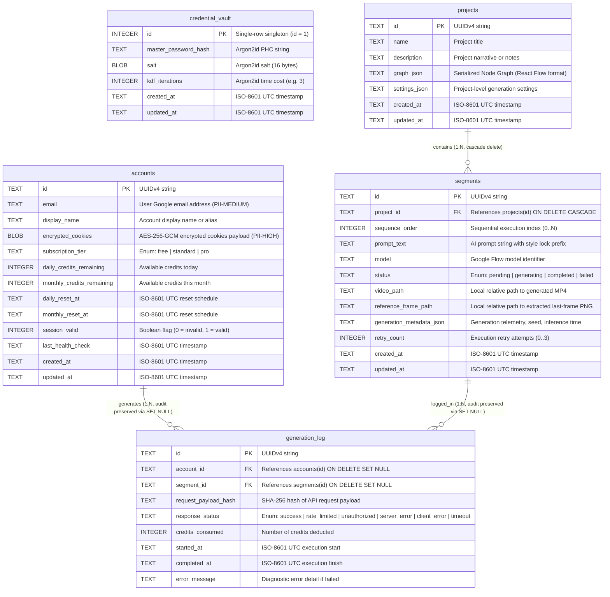
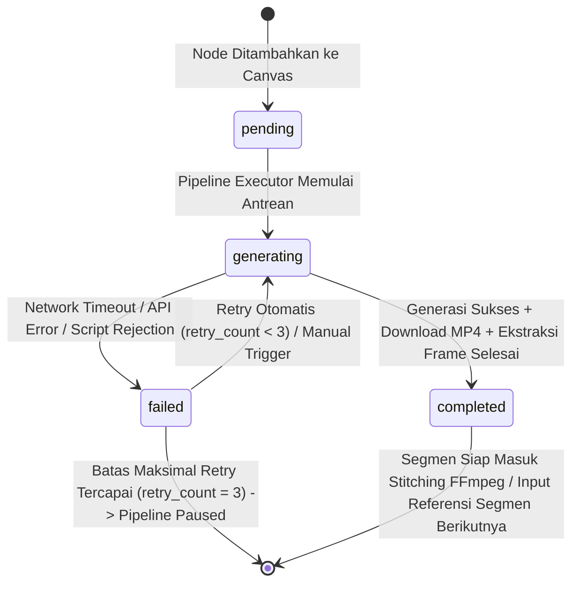
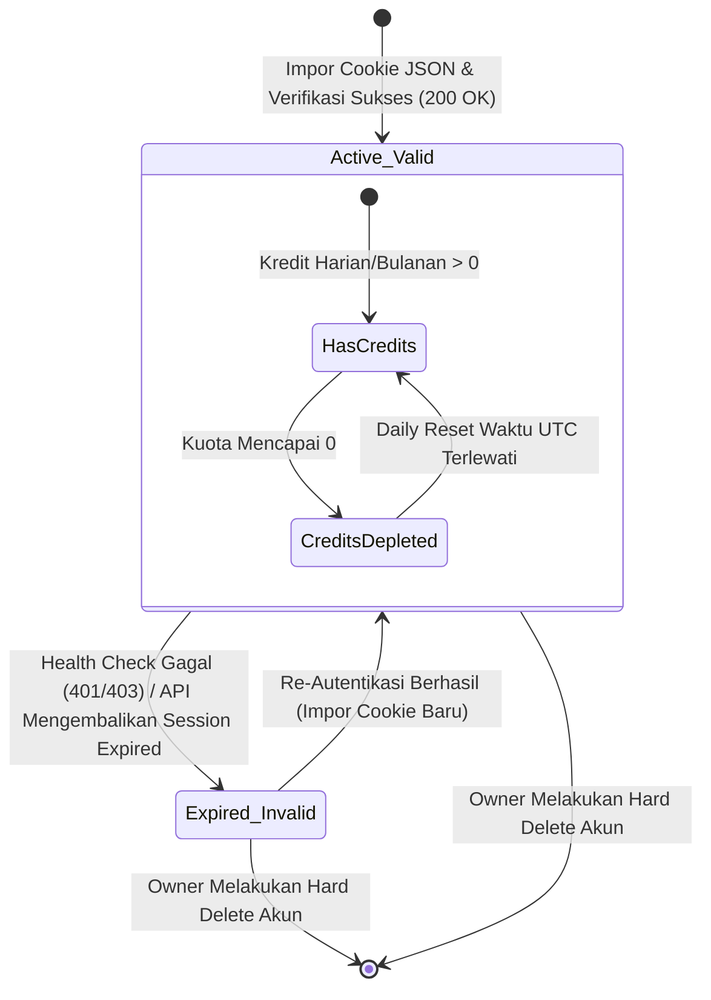

# ERD: Flow Studio — Entity Relationship Diagram & Data Dictionary

> **Project:** Flow Studio  
> **Document ID:** DOC-ERD-001  
> **Version:** 1.0.0  
> **Status:** Draft  
> **Owner:** Software Architect & Planning Lead  
> **Last Updated:** 2026-09-24  
> **Depends On:** DOC-SRS-001  
> **Supersedes:** None  

---

## 1. Pendahuluan dan Ringkasan Eksekutif

Dokumen ini mendefinisikan arsitektur basis data relasional lokal (*data model*), skema tabel, kamus data (*data dictionary*), batasan integritas (*constraints*), strategi pengindeksan (*indexing strategy*), siklus hidup status (*status lifecycle*), kebijakan retensi, serta pertimbangan migrasi untuk **Flow Studio**.

Flow Studio mengimplementasikan penyimpanan lokal berbasis **SQLite 3** yang diorkestrasi langsung oleh modul backend Rust (Tauri 2.x) menggunakan driver `rusqlite` / `sqlx`. Basis data ini berfungsi sebagai sistem pencatatan (*system of record*) untuk:
1. Konfigurasi keamanan dan derivasi kunci enkripsi master (*credential vault*).
2. Metadata akun Google Flow serta payload cookie terenkripsi (*account pool*).
3. Struktur canvas node pipeline dan metadata proyek (*projects*).
4. Urutan segmen video, prompt chaining, parameter AI, dan path referensi visual (*segments*).
5. Rekam jejak audit eksekusi generasi API dan konsumsi kredit (*generation log*).

### 1.1 Prinsip Arsitektur Data
- **Local-First & Zero-Cloud Leakage:** Seluruh data operasional tersimpan di mesin lokal pengguna (`%APPDATA%/FlowStudio/flow_studio.db` pada Windows). Tidak ada data transaksi atau credential yang dikirim ke server pusat milik Flow Studio.
- **Strict Cryptographic Isolation:** Data sensitif autentikasi (cookie sesi Google) tidak pernah disimpan dalam bentuk plaintext. Kolom kredensial dienkripsi menggunakan AES-256-GCM dengan *key derivation* Argon2id sebelum persistensi ke SQLite.
- **Single-User Scope:** Tidak ada abstraksi *multi-tenancy* atau *row-level security* berbasis tenant ID karena aplikasi dirancang khusus sebagai alat desktop personal (*single-user local workstation*).
- **Referential Integrity & Safe Audit Preservation:** Menegakkan foreign key constraints (`PRAGMA foreign_keys = ON`). Penghapusan entitas operasional (`accounts`, `projects`) menerapkan hard delete, namun catatan audit riwayat generasi (`generation_log`) tetap dipertahankan dengan relasi *nullable* (`ON DELETE SET NULL`) guna keperluan audit jejak komputasi tanpa melanggar privasi kredensial.

---

## 2. Mermaid Entity Relationship Diagram (ERD)



---

## 3. Klasifikasi dan Penandaan Sensitivitas Data (PII Tagging Taxonomy)

Untuk memenuhi standar keamanan dan privasi data (UU PDP / GDPR-aligned baseline sesuai `PLANNING_v5.2.md` §11.6 dan §11.9), setiap kolom diklasifikasikan ke dalam taksonomi sensitivitas berikut:

| Kategori Tag | Tingkat Sensitivitas | Deskripsi & Regulasi | Aturan Penyimpanan & Proteksi |
|---|---|---|---|
| **PII-HIGH** | Kritis / Rahasia | Data otentikasi sesi rahasia (`cookies`, `session tokens`). Jika terekspos, dapat menyebabkan pembajakan akun Google pengguna secara langsung. | Wajib dienkripsi at-rest menggunakan AES-256-GCM. Kunci derivasi wajib Argon2id. Dilarang masuk ke log diagnostic, console output, atau error dump. |
| **PII-MEDIUM** | Sensitif / Pribadi | Data yang mengidentifikasi identitas natural person (`email`, alamat surat elektronik). | Disimpan plaintext di database lokal terproteksi OS filesystem ACL. Ditampilkan di UI. Masked jika dicetak ke diagnostic export logs. |
| **INTERNAL-SECURITY** | Kritis / Keamanan Sistem | Data derivasi kriptografi (`password hash`, `salt`, `iterations`). | Hanya dibaca oleh modul otentikasi internal Rust. Hash menggunakan Argon2id format standar PHC. |
| **NON-PII** | Standar / Teknis | Metadata operasional proyek, graph canvas, sequence order, file path lokal, status eksekusi, hash SHA-256, dan log teknis. | Disimpan plaintext di SQLite lokal. Boleh dimasukkan ke log aplikasi level `INFO`/`DEBUG`. |

---

## 4. Definisi Skema Tabel dan Kamus Data (Data Dictionary)

### 4.1 Tabel: `credential_vault`

#### 4.1.1 Tujuan Entitas
Menyimpan konfigurasi kriptografi autentikasi aplikasi (*master password verification data*). Tabel ini adalah *singleton* (hanya memiliki tepat satu baris dengan `id = 1`) yang memvalidasi apakah master password yang dimasukkan pengguna valid untuk menurunkan kunci enkripsi memori (*encryption key derivation*) tanpa pernah menyimpan master password plaintext.

#### 4.1.2 Kamus Data
| Nama Kolom | Tipe Data SQLite | Nullable | Nilai Default | Sensitivitas / PII | Deskripsi & Validasi |
|---|---|---|---|---|---|
| `id` | `INTEGER` | NO | `1` | `NON-PII` | Primary key fixed singleton. Dibatasi oleh check constraint `id = 1`. |
| `master_password_hash` | `TEXT` | NO | - | `INTERNAL-SECURITY` | PHC string representasi hash Argon2id (berisi versi, memory cost 64MB, time cost 3, parallelism 1, salt, dan digest). Panjang 96–128 karakter. |
| `salt` | `BLOB` | NO | - | `INTERNAL-SECURITY` | Cryptographic random salt (16 bytes) yang digunakan untuk input derivasi kunci enkripsi database master. |
| `kdf_iterations` | `INTEGER` | NO | `3` | `NON-PII` | Parameter time cost Argon2id untuk kebutuhan audit komputasi derivasi. Minimal bernilai 3. |
| `created_at` | `TEXT` | NO | `(strftime('%Y-%m-%dT%H:%M:%fZ', 'now'))` | `NON-PII` | Waktu pembuatan master vault (ISO-8601 UTC format). |
| `updated_at` | `TEXT` | NO | `(strftime('%Y-%m-%dT%H:%M:%fZ', 'now'))` | `NON-PII` | Waktu perubahan/rotasi master password (ISO-8601 UTC format). |

#### 4.1.3 Batasan Integritas (Constraints)
- **Primary Key:** `PRIMARY KEY (id)`
- **Check Constraints:**
  - `CHECK (id = 1)` — Memastikan hanya terdapat satu baris konfigurasi vault.
  - `CHECK (length(salt) = 16)` — Memastikan panjang salt kriptografis tepat 16 byte.
  - `CHECK (kdf_iterations >= 3)` — Menegakkan baseline keamanan Argon2id time cost.

---

### 4.2 Tabel: `accounts`

#### 4.2.1 Tujuan Entitas
Menyimpan pool akun Google Flow yang dimiliki oleh Owner, melacak kuota kredit (harian dan subscription bulanan), menyimpan credential sesi terenkripsi, serta memfasilitasi algoritma *auto-rotation* saat pipeline generasi berlangsung.

#### 4.2.2 Kamus Data
| Nama Kolom | Tipe Data SQLite | Nullable | Nilai Default | Sensitivitas / PII | Deskripsi & Validasi |
|---|---|---|---|---|---|
| `id` | `TEXT` | NO | - | `NON-PII` | Primary key berupa UUIDv4 string (36 karakter, misal: `550e8400-e29b-41d4-a716-446655440000`). |
| `email` | `TEXT` | NO | - | `PII-MEDIUM` | Alamat email akun Google yang terotentikasi. Wajib unik di seluruh pool. |
| `display_name` | `TEXT` | NO | - | `NON-PII` | Label/alias akun untuk antarmuka pengguna (misal: "Personal Main", "Account #2"). Panjang 1–100 karakter. |
| `encrypted_cookies` | `BLOB` | NO | - | `PII-HIGH` | Payload biner terenkripsi AES-256-GCM yang memuat array cookie JSON Google Flow (termasuk 12-byte IV/nonce dan 16-byte authentication tag). |
| `subscription_tier` | `TEXT` | NO | `'free'` | `NON-PII` | Tier langganan Google Flow. Enum: `'free'`, `'standard'`, `'pro'`. |
| `daily_credits_remaining` | `INTEGER` | NO | `50` | `NON-PII` | Sisa kredit gratis harian akun (default Google Flow: 50 per hari). Nilai >= 0. |
| `monthly_credits_remaining` | `INTEGER` | NO | `0` | `NON-PII` | Sisa kredit paket langganan bulanan berbayar (jika ada). Nilai >= 0. |
| `daily_reset_at` | `TEXT` | YES | `NULL` | `NON-PII` | Estimasi waktu reset kredit harian berikutnya (ISO-8601 UTC). Diisi berdasarkan response header Google Flow atau kalkulasi 24 jam. |
| `monthly_reset_at` | `TEXT` | YES | `NULL` | `NON-PII` | Estimasi waktu reset kredit bulanan berikutnya (ISO-8601 UTC). |
| `session_valid` | `INTEGER` | NO | `1` | `NON-PII` | Boolean flag indikator validitas sesi: `1` (Active/Valid), `0` (Expired/Revoked). |
| `last_health_check` | `TEXT` | YES | `NULL` | `NON-PII` | Waktu verifikasi sesi terakhir kali ke backend Google Flow (ISO-8601 UTC). |
| `created_at` | `TEXT` | NO | `(strftime('%Y-%m-%dT%H:%M:%fZ', 'now'))` | `NON-PII` | Waktu akun didaftarkan ke pool lokal (ISO-8601 UTC). |
| `updated_at` | `TEXT` | NO | `(strftime('%Y-%m-%dT%H:%M:%fZ', 'now'))` | `NON-PII` | Waktu pembaruan terakhir data akun atau kredit (ISO-8601 UTC). |

#### 4.2.3 Batasan Integritas (Constraints)
- **Primary Key:** `PRIMARY KEY (id)`
- **Unique Constraints:**
  - `UNIQUE (email)` — Mencegah impor ganda dari akun Google yang sama.
- **Check Constraints:**
  - `CHECK (subscription_tier IN ('free', 'standard', 'pro'))`
  - `CHECK (daily_credits_remaining >= 0)`
  - `CHECK (monthly_credits_remaining >= 0)`
  - `CHECK (session_valid IN (0, 1))`
  - `CHECK (length(encrypted_cookies) > 28)` — Payload minimal 12 byte IV + 1 byte data + 16 byte GCM tag.

---

### 4.3 Tabel: `projects`

#### 4.3.1 Tujuan Entitas
Menyimpan project metadata, dokumen node graph serial (kompatibel dengan `@xyflow/react`), dan konfigurasi global pipeline (resolusi default, style lock template, parameter model).

#### 4.3.2 Kamus Data
| Nama Kolom | Tipe Data SQLite | Nullable | Nilai Default | Sensitivitas / PII | Deskripsi & Validasi |
|---|---|---|---|---|---|
| `id` | `TEXT` | NO | - | `NON-PII` | Primary key berupa UUIDv4 string (36 karakter). |
| `name` | `TEXT` | NO | - | `NON-PII` | Nama proyek video (panjang 1–255 karakter). Digunakan sebagai basis nama file ekspor video. |
| `description` | `TEXT` | YES | `NULL` | `NON-PII` | Catatan/sinopsis proyek yang ditulis oleh Owner. |
| `graph_json` | `TEXT` | NO | `'{"nodes":[],"edges":[],"viewport":{"x":0,"y":0,"zoom":1}}'` | `NON-PII` | Representasi JSON state visual React Flow (koordinat node, tipe edge, metadata custom input). |
| `settings_json` | `TEXT` | NO | `'{}'` | `NON-PII` | Konfigurasi pipeline proyek dalam format JSON (misal: default aspect ratio, style lock string, timeout setting). |
| `created_at` | `TEXT` | NO | `(strftime('%Y-%m-%dT%H:%M:%fZ', 'now'))` | `NON-PII` | Timestamp pembuatan proyek (ISO-8601 UTC). |
| `updated_at` | `TEXT` | NO | `(strftime('%Y-%m-%dT%H:%M:%fZ', 'now'))` | `NON-PII` | Timestamp modifikasi proyek terakhir (ISO-8601 UTC). |

#### 4.3.3 Batasan Integritas (Constraints)
- **Primary Key:** `PRIMARY KEY (id)`
- **Check Constraints:**
  - `CHECK (length(name) > 0)`
  - `CHECK (json_valid(graph_json) = 1)` — Memvalidasi bahwa dokumen graph merupakan JSON valid.
  - `CHECK (json_valid(settings_json) = 1)` — Memvalidasi bahwa pengaturan proyek merupakan JSON valid.

---

### 4.4 Tabel: `segments`

#### 4.4.1 Tujuan Entitas
Menyimpan unit generasi video individual (~10 detik per segmen) yang terikat pada sebuah proyek. Mengatur urutan eksekusi, prompt contextual, model AI, path file video lokal hasil render, path referensi frame visual, dan status state machine.

#### 4.4.2 Kamus Data
| Nama Kolom | Tipe Data SQLite | Nullable | Nilai Default | Sensitivitas / PII | Deskripsi & Validasi |
|---|---|---|---|---|---|
| `id` | `TEXT` | NO | - | `NON-PII` | Primary key berupa UUIDv4 string (36 karakter). |
| `project_id` | `TEXT` | NO | - | `NON-PII` | Foreign key yang mereferensikan `projects(id)`. |
| `sequence_order` | `INTEGER` | NO | - | `NON-PII` | Indeks urutan eksekusi sekuensial (0-indexed: 0, 1, 2, ...). Unik dalam satu proyek. |
| `prompt_text` | `TEXT` | NO | - | `NON-PII` | Teks prompt lengkap yang dikirim ke Google Flow (sudah mencakup prefix style lock). |
| `model` | `TEXT` | NO | `'flow-v1'` | `NON-PII` | Pengidentifikasi model generasi Google Flow yang digunakan (misal: `'flow-v1'`, `'flow-v2'`). |
| `status` | `TEXT` | NO | `'pending'` | `NON-PII` | Siklus status eksekusi. Enum: `'pending'`, `'generating'`, `'completed'`, `'failed'`. |
| `video_path` | `TEXT` | YES | `NULL` | `NON-PII` | Path relatif file video hasil generasi terhadap direktori proyek (misal: `assets/seg_001.mp4`). |
| `reference_frame_path` | `TEXT` | YES | `NULL` | `NON-PII` | Path relatif frame terakhir yang diekstrak FFmpeg sebagai referensi segmen berikutnya (misal: `assets/ref_001.png`). |
| `generation_metadata_json` | `TEXT` | YES | `NULL` | `NON-PII` | Metadata teknis hasil render dari backend (seed, dimensi, durasi aktual, response headers) dalam JSON. |
| `retry_count` | `INTEGER` | NO | `0` | `NON-PII` | Jumlah percobaan eksekusi ulang jika terjadi kegagalan (0 sampai 3). |
| `created_at` | `TEXT` | NO | `(strftime('%Y-%m-%dT%H:%M:%fZ', 'now'))` | `NON-PII` | Timestamp registrasi segmen (ISO-8601 UTC). |
| `updated_at` | `TEXT` | NO | `(strftime('%Y-%m-%dT%H:%M:%fZ', 'now'))` | `NON-PII` | Timestamp status transisi atau pembaruan file segmen (ISO-8601 UTC). |

#### 4.4.3 Batasan Integritas (Constraints)
- **Primary Key:** `PRIMARY KEY (id)`
- **Foreign Keys:**
  - `FOREIGN KEY (project_id) REFERENCES projects(id) ON DELETE CASCADE ON UPDATE CASCADE`
- **Unique Constraints:**
  - `UNIQUE (project_id, sequence_order)` — Memastikan tidak ada tabrakan nomor urutan dalam satu proyek.
- **Check Constraints:**
  - `CHECK (sequence_order >= 0)`
  - `CHECK (status IN ('pending', 'generating', 'completed', 'failed'))`
  - `CHECK (retry_count >= 0 AND retry_count <= 3)`
  - `CHECK (generation_metadata_json IS NULL OR json_valid(generation_metadata_json) = 1)`

---

### 4.5 Tabel: `generation_log`

#### 4.5.1 Tujuan Entitas
Menyediakan jejak audit (*audit trail*) dan telemetri pemakaian komputasi untuk setiap panggilan API generasi ke Google Flow. Mencatat konsumsi kredit, performa durasi inferensi, hash integritas payload (tanpa menyimpan prompt mentah atau cookie), dan kode status respons.

#### 4.5.2 Kamus Data
| Nama Kolom | Tipe Data SQLite | Nullable | Nilai Default | Sensitivitas / PII | Deskripsi & Validasi |
|---|---|---|---|---|---|
| `id` | `TEXT` | NO | - | `NON-PII` | Primary key berupa UUIDv4 string (36 karakter). |
| `account_id` | `TEXT` | YES | `NULL` | `NON-PII` | Foreign key ke `accounts(id)`. Bernilai NULL jika akun terkait dihapus dari pool (*safe audit retention*). |
| `segment_id` | `TEXT` | YES | `NULL` | `NON-PII` | Foreign key ke `segments(id)`. Bernilai NULL jika segmen atau proyek dihapus. |
| `request_payload_hash` | `TEXT` | NO | - | `NON-PII` | Hash heksadesimal SHA-256 (64 karakter) dari payload JSON yang dikirim ke Google Flow. Menjaga verifikasi tanpa membocorkan credential. |
| `response_status` | `TEXT` | NO | - | `NON-PII` | Status kategoris dari respons backend. Enum: `'success'`, `'rate_limited'`, `'unauthorized'`, `'server_error'`, `'client_error'`, `'timeout'`. |
| `credits_consumed` | `INTEGER` | NO | `0` | `NON-PII` | Jumlah kredit yang terpotong pada akun untuk eksekusi ini (umumnya 1 kredit per klip 10 detik). Nilai >= 0. |
| `started_at` | `TEXT` | NO | - | `NON-PII` | Timestamp waktu permintaan HTTP mulai dikirim (ISO-8601 UTC). |
| `completed_at` | `TEXT` | YES | `NULL` | `NON-PII` | Timestamp saat respons diterima atau proses timeout (ISO-8601 UTC). |
| `error_message` | `TEXT` | YES | `NULL` | `NON-PII` | Ringkasan pesan kesalahan teknis (telah disanitasi dari cookie/token) jika respons gagal. |

#### 4.5.3 Batasan Integritas (Constraints)
- **Primary Key:** `PRIMARY KEY (id)`
- **Foreign Keys:**
  - `FOREIGN KEY (account_id) REFERENCES accounts(id) ON DELETE SET NULL ON UPDATE CASCADE`
  - `FOREIGN KEY (segment_id) REFERENCES segments(id) ON DELETE SET NULL ON UPDATE CASCADE`
- **Check Constraints:**
  - `CHECK (response_status IN ('success', 'rate_limited', 'unauthorized', 'server_error', 'client_error', 'timeout'))`
  - `CHECK (credits_consumed >= 0)`
  - `CHECK (length(request_payload_hash) = 64)`

---

## 5. Strategi Pengindeksan dan Dukungan Pola Kueri (Indexing Strategy)

Indeks dirancang berdasarkan analisis pola akses (*access patterns*) pada backend Rust flow-router, pipeline execution loop, antarmuka React Flow, dan dashboard account manager.

| Nama Indeks | Tabel Target | Kolom Indeks | Query Pattern yang Didukung | Alasan Desain & Frekuensi |
|---|---|---|---|---|
| `idx_accounts_selection` | `accounts` | `(session_valid, daily_credits_remaining DESC, monthly_credits_remaining DESC)` | `SELECT * FROM accounts WHERE session_valid = 1 AND (daily_credits_remaining > 0 OR monthly_credits_remaining > 0) ORDER BY daily_credits_remaining DESC, monthly_credits_remaining DESC LIMIT 1;` | **Kritis (Tinggi).** Dipanggil oleh routing engine pada setiap pembuatan segmen untuk memilih akun paling optimal secara instan. |
| `idx_accounts_email` | `accounts` | `(email)` | `SELECT id FROM accounts WHERE email = ?;` | **Operasional (Sedang).** Digunakan saat import akun untuk mendeteksi collision / akun duplikat. (Didukung otomatis via `UNIQUE`). |
| `idx_accounts_health_check` | `accounts` | `(session_valid, last_health_check ASC)` | `SELECT * FROM accounts WHERE session_valid = 1 ORDER BY last_health_check ASC;` | **Background Task (Berkala).** Polling verifikasi sesi setiap 30 menit tanpa melakukan full-table scan. |
| `idx_projects_updated_at` | `projects` | `(updated_at DESC)` | `SELECT id, name, description, updated_at FROM projects ORDER BY updated_at DESC;` | **UI Dashboard (Tinggi).** Menampilkan daftar "Recent Projects" pada saat aplikasi pertama kali terbuka. |
| `idx_segments_pipeline_seq` | `segments` | `(project_id, sequence_order ASC)` | `SELECT * FROM segments WHERE project_id = ? ORDER BY sequence_order ASC;` | **Pipeline Execution (Sangat Tinggi).** Memuat rantai segmen sekuensial dari segmen ke-0 sampai ke-N untuk eksekusi atau ekspor FFmpeg. (Didukung via composite constraint). |
| `idx_segments_status_lookup` | `segments` | `(project_id, status)` | `SELECT COUNT(*) FROM segments WHERE project_id = ? AND status = 'completed';` atau mencari segmen `pending` berikutnya. | **State Orchestration (Tinggi).** Menghitung progres bar, mengecek kelayakan ekspor video (minimal 2 segmen complete), dan mengambil item antrean berikutnya. |
| `idx_genlog_account_retention` | `generation_log` | `(account_id, started_at DESC)` | `SELECT * FROM generation_log WHERE account_id = ? ORDER BY started_at DESC LIMIT 50;` | **Account Telemetry (Sedang).** Menampilkan histori pemakaian kredit per akun pada dialog detail akun. |
| `idx_genlog_started_at` | `generation_log` | `(started_at)` | `DELETE FROM generation_log WHERE started_at < datetime('now', '-90 days');` | **Archival / Maintenance (Harian).** Eksekusi pembersihan log usang melewati batas retensi 90 hari. |
| `idx_genlog_segment` | `generation_log` | `(segment_id)` | `SELECT * FROM generation_log WHERE segment_id = ? ORDER BY started_at DESC;` | **Debugging Node (Rendah).** Inspeksi riwayat retry dan kesalahan spesifik pada node tertentu di canvas. |

### 5.1 Skrip DDL Indeks Lengkap (SQLite)
```sql
-- Indeks seleksi auto-rotation akun
CREATE INDEX IF NOT EXISTS idx_accounts_selection 
ON accounts (session_valid, daily_credits_remaining DESC, monthly_credits_remaining DESC);

-- Indeks health check berkala akun
CREATE INDEX IF NOT EXISTS idx_accounts_health_check 
ON accounts (session_valid, last_health_check ASC);

-- Indeks daftar proyek terurut waktu modifikasi
CREATE INDEX IF NOT EXISTS idx_projects_updated_at 
ON projects (updated_at DESC);

-- Indeks sekuensial eksekusi segmen pipeline
CREATE INDEX IF NOT EXISTS idx_segments_pipeline_seq 
ON segments (project_id, sequence_order ASC);

-- Indeks status segmen untuk orchestrator
CREATE INDEX IF NOT EXISTS idx_segments_status_lookup 
ON segments (project_id, status);

-- Indeks log berdasarkan akun
CREATE INDEX IF NOT EXISTS idx_genlog_account 
ON generation_log (account_id, started_at DESC);

-- Indeks kebijakan retensi dan pembersihan log
CREATE INDEX IF NOT EXISTS idx_genlog_started_at 
ON generation_log (started_at);

-- Indeks tracking riwayat segmen
CREATE INDEX IF NOT EXISTS idx_genlog_segment 
ON generation_log (segment_id);
```

---

## 6. Diagram Siklus Hidup Status (Enum & Status Lifecycle)

### 6.1 Siklus Hidup Status Segmen (`segments.status`)

Kolom `status` pada tabel `segments` mengatur *deterministic sequential chaining state machine* pada engine kontinuitas. Segmen ke-$(N+1)$ tidak boleh mulai dieksekusi sebelum segmen ke-$N$ mencapai status terminal `completed`.



#### Aturan Transisi Status Segmen:
1. **`pending` → `generating`**: Hanya terjadi jika segmen sebelumnya ($N-1$) sudah berstatus `completed` (kecuali segmen urutan 0) dan akun aktif dengan kuota tersedia telah di-*lock* oleh router.
2. **`generating` → `completed`**: Terjadi ketika tiga tahapan atomik berhasil:
   - Video ~10 detik selesai digenerate oleh Google Flow.
   - File video berhasil diunduh ke `video_path`.
   - Frame terakhir berhasil diekstrak menggunakan FFmpeg ke `reference_frame_path`.
3. **`generating` → `failed`**: Terjadi jika panggilan API gagal, session expired di tengah request, atau FFmpeg gagal mengekstrak frame. Nilai `retry_count` diinkrementasi (+1).
4. **`failed` → `generating`**: Terjadi otomatis jika `retry_count < 3` menggunakan algoritma *exponential backoff* atau saat Owner menekan tombol "Retry Node" secara manual di canvas.

---

### 6.2 Siklus Hidup Status Akun (`accounts.session_valid`)

Mengatur kelayakan sebuah akun untuk dipilih dalam *account pool*.



---

### 6.3 Siklus Hidup Status Eksekusi Log (`generation_log.response_status`)

Nilai status merepresentasikan kategorisasi hasil transaksi transmisi API:
- **`success`**: Permintaan diterima, proses selesai, kredit terpotong.
- **`rate_limited`**: Server merespons HTTP 429. Memicu pemilihan akun berikutnya atau jeda backoff.
- **`unauthorized`**: Server merespons HTTP 401/403. Flag `accounts.session_valid` langsung ditandai `0`.
- **`server_error`**: Server Google merespons HTTP 5xx. Memerlukan penanganan retry pada level segmen.
- **`client_error`**: Kesalahan HTTP 4xx selain 401/429 (misal prompt melanggar filter keamanan Google Flow).
- **`timeout`**: Batas waktu koneksi/inferensi (default 120 detik) terlampaui tanpa respons server.

---

## 7. Kebijakan Kolom Audit (Audit Fields Policy)

Berdasarkan evaluasi terhadap pedoman `PLANNING_v5.2.md` §11.6 untuk aplikasi **desktop single-user**:

### 7.1 Evaluasi Lapangan
- **`created_at` dan `updated_at` (DIAPLIKASIKAN):**
  Wajib hadir di seluruh entitas tabel utama (`credential_vault`, `accounts`, `projects`, `segments`). Disimpan dalam format string standar ISO-8601 UTC berpresisi milidetik: `YYYY-MM-DDTHH:MM:SS.SSSZ`.
- **`created_by` dan `updated_by` (TIDAK DIGUNAKAN):**
  Aplikasi Flow Studio beroperasi secara lokal untuk satu orang pengguna (*single-user Owner*). Menyimpan kolom identitas aktor di setiap baris akan menimbulkan redundansi data (*structural slop*) tanpa memberikan nilai audit tambahan.
- **`tenant_id` (TIDAK DIGUNAKAN):**
  Sistem bukan sistem multi-tenant cloud/SaaS. Setiap instalasi lokal mengelola berkas database SQLite terisolasi di workstation pengguna.

### 7.2 Implementasi Mekanisme Pembaruan Otomatis (SQLite Triggers)
Untuk menjamin kolom `updated_at` selalu diperbarui secara akurat tanpa bergantung sepenuhnya pada konsistensi layer aplikasi, SQLite trigger diaktifkan:

```sql
-- Trigger untuk tabel accounts
CREATE TRIGGER IF NOT EXISTS trg_accounts_updated_at
AFTER UPDATE ON accounts
FOR EACH ROW
WHEN NEW.updated_at <= OLD.updated_at
BEGIN
    UPDATE accounts 
    SET updated_at = strftime('%Y-%m-%dT%H:%M:%fZ', 'now') 
    WHERE id = OLD.id;
END;

-- Trigger untuk tabel projects
CREATE TRIGGER IF NOT EXISTS trg_projects_updated_at
AFTER UPDATE ON projects
FOR EACH ROW
WHEN NEW.updated_at <= OLD.updated_at
BEGIN
    UPDATE projects 
    SET updated_at = strftime('%Y-%m-%dT%H:%M:%fZ', 'now') 
    WHERE id = OLD.id;
END;

-- Trigger untuk tabel segments
CREATE TRIGGER IF NOT EXISTS trg_segments_updated_at
AFTER UPDATE ON segments
FOR EACH ROW
WHEN NEW.updated_at <= OLD.updated_at
BEGIN
    UPDATE segments 
    SET updated_at = strftime('%Y-%m-%dT%H:%M:%fZ', 'now') 
    WHERE id = OLD.id;
END;

-- Trigger untuk tabel credential_vault
CREATE TRIGGER IF NOT EXISTS trg_credential_vault_updated_at
AFTER UPDATE ON credential_vault
FOR EACH ROW
WHEN NEW.updated_at <= OLD.updated_at
BEGIN
    UPDATE credential_vault 
    SET updated_at = strftime('%Y-%m-%dT%H:%M:%fZ', 'now') 
    WHERE id = OLD.id;
END;
```

---

## 8. Kebijakan Penghapusan Data (Deletion Policy)

### 8.1 Evaluasi Soft Delete vs Hard Delete
Flow Studio **tidak menerapkan soft delete** (`deleted_at`, `deleted_by`) untuk entitas operasional (`accounts`, `projects`, `segments`). 

**Dasar Pertimbangan Keputusan:**
1. **Privasi & Kebersihan Kredensial:** Saat pengguna memilih "Remove Account", pengguna mengharapkan seluruh cookie Google miliknya benar-benar lenyap dari storage lokal tanpa menyisakan jejak yang dapat direkonstruksi (*irreversible removal*).
2. **Pengelolaan Ruang Disk Lokal:** File video AI dan image frame berukuran masif (ratusan megabyte). Menghapus proyek berarti seluruh artefak segmen lokal harus segera di-unlinked dari filesystem dan database untuk mencegah kehabisan kapasitas storage lokal.
3. **Ketiadaan Kebutuhan Recovery Multi-user:** Karena ini adalah local developer tool, kompleksitas filter kueri `WHERE deleted_at IS NULL` di seluruh join justru meningkatkan risiko bug operasional.

### 8.2 Perilaku Integritas Penghapusan (Foreign Key Cascade vs Set Null)
1. **Penghapusan Proyek (`projects`):**
   Menerapkan `ON DELETE CASCADE` pada relasi `segments`. Menghapus proyek otomatis membersihkan seluruh baris `segments` yang terasosiasi dengannya di database (serta memicu penghapusan file video/gambar lokal di filesystem oleh backend handler).
2. **Preservasi Catatan Jejak Generasi (`generation_log`):**
   Tabel `generation_log` tidak boleh terhapus secara tidak sengaja ketika `accounts` atau `segments` dihapus. Relasi didefinisikan dengan `ON DELETE SET NULL`.
   - Jika akun `X` dihapus dari pool: Baris log terkait akun `X` tetap ada dengan nilai `account_id = NULL`, namun riwayat konsumsi kredit, performa latency, dan kode status tetap utuh untuk audit historis performa komputasi.
   - Jika segmen `Y` dihapus: Baris log terkait tetap ada dengan `segment_id = NULL`.

---

## 9. Kebijakan Retensi dan Pengarsipan Data (Retention & Archival Policy)

| Kategori Data | Tabel Sasaran | Masa Retensi | Aksi Pasca Retensi | Mekanisme Pembersihan |
|---|---|---|---|---|
| **Kredensial Akun** | `accounts`, `credential_vault` | Permanen hingga dihapus eksplisit oleh Owner | Hard Delete dari tabel SQLite. Zeroization memory buffer. | Dialog konfirmasi pengguna ("Hapus Akun" atau "Reset Vault"). |
| **Proyek & Segmen** | `projects`, `segments` | Permanen hingga dihapus eksplisit oleh Owner | Hard Delete database record + unlinking berkas `.mp4` & `.png` lokal. | Tombol "Delete Project" pada dashboard. |
| **Audit Jejak Generasi** | `generation_log` | **90 Hari (Rolling Window)** | Hard Delete baris log yang lebih tua dari 90 hari. | Dijalankan secara otomatis di latar belakang saat *cold startup* aplikasi. |
| **Berkas Sementara (Temp Files)** | Filesystem (`/temp/*.tmp`) | 24 Jam | Dihapus dari OS temporary directory. | Cleanup hook saat shutdown atau inisialisasi aplikasi. |

### 9.1 Kueri Pemeliharaan dan Pembersihan Log Berkala
Setiap kali aplikasi dibuka (*startup sequence*), modul background maintenance menjalankan:
```sql
-- Hapus catatan log generasi yang telah melampaui masa simpan 90 hari
DELETE FROM generation_log 
WHERE started_at < strftime('%Y-%m-%dT%H:%M:%fZ', datetime('now', '-90 days'));

-- Jalankan optimasi database periodik jika terjadi pembersihan masif
PRAGMA incremental_vacuum(100);
```

---

## 10. Pertimbangan Implementasi dan Migrasi SQLite (Migration Considerations)

### 10.1 Konfigurasi PRAGMA Wajib
Saat modul Rust backend membuka koneksi ke SQLite database, pengaturan PRAGMA berikut wajib dieksekusi sebelum transaksi pertama:

```sql
-- 1. Aktifkan penegakan Foreign Key (SQLite default adalah OFF)
PRAGMA foreign_keys = ON;

-- 2. Aktifkan Write-Ahead Logging untuk konkurensi optimal antara background health-check dan UI read
PRAGMA journal_mode = WAL;

-- 3. Sinkronisasi NORMAL memberikan keseimbangan performa optimal dan perlindungan korupsi data
PRAGMA synchronous = NORMAL;

-- 4. Batasi auto-vacuum ke mode incremental guna mencegah freeze I/O saat menghapus file besar
PRAGMA auto_vacuum = INCREMENTAL;

-- 5. Set timeout busy handler (5000 ms) agar thread tidak langsung error saat terjadi disk contention
PRAGMA busy_timeout = 5000;

-- 6. Enforce UTF-8 encoding
PRAGMA encoding = 'UTF-8';
```

### 10.2 Manajemen Migrasi Skema Berversi (Versioned Migrations)
Sistem migrasi diatur menggunakan pustaka migrasi berbasis Rust terintegrasi (seperti `refinery` atau `sqlx-migrator`). Tabel metadata internal `_schema_migrations` melacak versi skema yang telah diterapkan:

```sql
CREATE TABLE IF NOT EXISTS _schema_migrations (
    version INTEGER PRIMARY KEY,
    name TEXT NOT NULL,
    applied_at TEXT NOT NULL DEFAULT (strftime('%Y-%m-%dT%H:%M:%fZ', 'now')),
    checksum TEXT NOT NULL
);
```

#### Aturan Evolusi Skema SQLite:
1. **Append-Only Migration Files:** Setiap perubahan skema disimpan dalam berkas terpisah berurutan: `V001__initial_schema.sql`, `V002__add_index_xyz.sql`, dll.
2. **Keterbatasan `ALTER TABLE` pada SQLite:** SQLite memiliki dukungan terbatas untuk `ALTER TABLE` (misalnya tidak mendukung pengubahan tipe kolom atau penambahan check constraint pada tabel yang sudah ada). Jika modifikasi kolom non-trivial diperlukan pada versi mendatang, gunakan pola **12-Step Table Recreation Pattern**:
   - Buat tabel sementara `new_table` dengan struktur baru.
   - Salin data: `INSERT INTO new_table SELECT ... FROM old_table;`.
   - Hapus tabel lama: `DROP TABLE old_table;`.
   - Ubah nama: `ALTER TABLE new_table RENAME TO old_table;`.
   - Buat ulang indeks dan triggers terkait.
3. **Atomic Migration Transactions:** Setiap skrip migrasi wajib dibungkus dalam blok `BEGIN IMMEDIATE TRANSACTION;` dan `COMMIT;` sehingga jika terjadi kegagalan (misalnya disk penuh), database tidak tertinggal dalam kondisi korup atau setengah ter-migrasi.

---

## 11. Skrip DDL Lengkap (Initial Baseline DDL)

Berikut adalah skrip SQL lengkap untuk menginisialisasi skema basis data Flow Studio pada peluncuran perdana:

```sql
-- ============================================================================
-- Flow Studio Database Initialization Script
-- Document ID: DOC-ERD-001
-- Engine: SQLite 3 (WAL Mode, Foreign Keys Enforced)
-- ============================================================================

PRAGMA foreign_keys = ON;

-- ----------------------------------------------------------------------------
-- 1. Table: credential_vault
-- ----------------------------------------------------------------------------
CREATE TABLE IF NOT EXISTS credential_vault (
    id INTEGER PRIMARY KEY CHECK (id = 1),
    master_password_hash TEXT NOT NULL,
    salt BLOB NOT NULL CHECK (length(salt) = 16),
    kdf_iterations INTEGER NOT NULL DEFAULT 3 CHECK (kdf_iterations >= 3),
    created_at TEXT NOT NULL DEFAULT (strftime('%Y-%m-%dT%H:%M:%fZ', 'now')),
    updated_at TEXT NOT NULL DEFAULT (strftime('%Y-%m-%dT%H:%M:%fZ', 'now'))
);

-- ----------------------------------------------------------------------------
-- 2. Table: accounts
-- ----------------------------------------------------------------------------
CREATE TABLE IF NOT EXISTS accounts (
    id TEXT PRIMARY KEY,
    email TEXT NOT NULL UNIQUE,
    display_name TEXT NOT NULL,
    encrypted_cookies BLOB NOT NULL CHECK (length(encrypted_cookies) > 28),
    subscription_tier TEXT NOT NULL DEFAULT 'free' CHECK (subscription_tier IN ('free', 'standard', 'pro')),
    daily_credits_remaining INTEGER NOT NULL DEFAULT 50 CHECK (daily_credits_remaining >= 0),
    monthly_credits_remaining INTEGER NOT NULL DEFAULT 0 CHECK (monthly_credits_remaining >= 0),
    daily_reset_at TEXT,
    monthly_reset_at TEXT,
    session_valid INTEGER NOT NULL DEFAULT 1 CHECK (session_valid IN (0, 1)),
    last_health_check TEXT,
    created_at TEXT NOT NULL DEFAULT (strftime('%Y-%m-%dT%H:%M:%fZ', 'now')),
    updated_at TEXT NOT NULL DEFAULT (strftime('%Y-%m-%dT%H:%M:%fZ', 'now'))
);

-- ----------------------------------------------------------------------------
-- 3. Table: projects
-- ----------------------------------------------------------------------------
CREATE TABLE IF NOT EXISTS projects (
    id TEXT PRIMARY KEY,
    name TEXT NOT NULL CHECK (length(name) > 0),
    description TEXT,
    graph_json TEXT NOT NULL DEFAULT '{"nodes":[],"edges":[],"viewport":{"x":0,"y":0,"zoom":1}}' CHECK (json_valid(graph_json) = 1),
    settings_json TEXT NOT NULL DEFAULT '{}' CHECK (json_valid(settings_json) = 1),
    created_at TEXT NOT NULL DEFAULT (strftime('%Y-%m-%dT%H:%M:%fZ', 'now')),
    updated_at TEXT NOT NULL DEFAULT (strftime('%Y-%m-%dT%H:%M:%fZ', 'now'))
);

-- ----------------------------------------------------------------------------
-- 4. Table: segments
-- ----------------------------------------------------------------------------
CREATE TABLE IF NOT EXISTS segments (
    id TEXT PRIMARY KEY,
    project_id TEXT NOT NULL,
    sequence_order INTEGER NOT NULL CHECK (sequence_order >= 0),
    prompt_text TEXT NOT NULL,
    model TEXT NOT NULL DEFAULT 'flow-v1',
    status TEXT NOT NULL DEFAULT 'pending' CHECK (status IN ('pending', 'generating', 'completed', 'failed')),
    video_path TEXT,
    reference_frame_path TEXT,
    generation_metadata_json TEXT CHECK (generation_metadata_json IS NULL OR json_valid(generation_metadata_json) = 1),
    retry_count INTEGER NOT NULL DEFAULT 0 CHECK (retry_count >= 0 AND retry_count <= 3),
    created_at TEXT NOT NULL DEFAULT (strftime('%Y-%m-%dT%H:%M:%fZ', 'now')),
    updated_at TEXT NOT NULL DEFAULT (strftime('%Y-%m-%dT%H:%M:%fZ', 'now')),
    FOREIGN KEY (project_id) REFERENCES projects(id) ON DELETE CASCADE ON UPDATE CASCADE,
    UNIQUE (project_id, sequence_order)
);

-- ----------------------------------------------------------------------------
-- 5. Table: generation_log
-- ----------------------------------------------------------------------------
CREATE TABLE IF NOT EXISTS generation_log (
    id TEXT PRIMARY KEY,
    account_id TEXT,
    segment_id TEXT,
    request_payload_hash TEXT NOT NULL CHECK (length(request_payload_hash) = 64),
    response_status TEXT NOT NULL CHECK (response_status IN ('success', 'rate_limited', 'unauthorized', 'server_error', 'client_error', 'timeout')),
    credits_consumed INTEGER NOT NULL DEFAULT 0 CHECK (credits_consumed >= 0),
    started_at TEXT NOT NULL,
    completed_at TEXT,
    error_message TEXT,
    FOREIGN KEY (account_id) REFERENCES accounts(id) ON DELETE SET NULL ON UPDATE CASCADE,
    FOREIGN KEY (segment_id) REFERENCES segments(id) ON DELETE SET NULL ON UPDATE CASCADE
);

-- ----------------------------------------------------------------------------
-- Indexes
-- ----------------------------------------------------------------------------
CREATE INDEX IF NOT EXISTS idx_accounts_selection 
ON accounts (session_valid, daily_credits_remaining DESC, monthly_credits_remaining DESC);

CREATE INDEX IF NOT EXISTS idx_accounts_health_check 
ON accounts (session_valid, last_health_check ASC);

CREATE INDEX IF NOT EXISTS idx_projects_updated_at 
ON projects (updated_at DESC);

CREATE INDEX IF NOT EXISTS idx_segments_pipeline_seq 
ON segments (project_id, sequence_order ASC);

CREATE INDEX IF NOT EXISTS idx_segments_status_lookup 
ON segments (project_id, status);

CREATE INDEX IF NOT EXISTS idx_genlog_account 
ON generation_log (account_id, started_at DESC);

CREATE INDEX IF NOT EXISTS idx_genlog_started_at 
ON generation_log (started_at);

CREATE INDEX IF NOT EXISTS idx_genlog_segment 
ON generation_log (segment_id);

-- ----------------------------------------------------------------------------
-- Triggers for Automatic updated_at Maintenance
-- ----------------------------------------------------------------------------
CREATE TRIGGER IF NOT EXISTS trg_credential_vault_updated_at
AFTER UPDATE ON credential_vault
FOR EACH ROW
WHEN NEW.updated_at <= OLD.updated_at
BEGIN
    UPDATE credential_vault 
    SET updated_at = strftime('%Y-%m-%dT%H:%M:%fZ', 'now') 
    WHERE id = OLD.id;
END;

CREATE TRIGGER IF NOT EXISTS trg_accounts_updated_at
AFTER UPDATE ON accounts
FOR EACH ROW
WHEN NEW.updated_at <= OLD.updated_at
BEGIN
    UPDATE accounts 
    SET updated_at = strftime('%Y-%m-%dT%H:%M:%fZ', 'now') 
    WHERE id = OLD.id;
END;

CREATE TRIGGER IF NOT EXISTS trg_projects_updated_at
AFTER UPDATE ON projects
FOR EACH ROW
WHEN NEW.updated_at <= OLD.updated_at
BEGIN
    UPDATE projects 
    SET updated_at = strftime('%Y-%m-%dT%H:%M:%fZ', 'now') 
    WHERE id = OLD.id;
END;

CREATE TRIGGER IF NOT EXISTS trg_segments_updated_at
AFTER UPDATE ON segments
FOR EACH ROW
WHEN NEW.updated_at <= OLD.updated_at
BEGIN
    UPDATE segments 
    SET updated_at = strftime('%Y-%m-%dT%H:%M:%fZ', 'now') 
    WHERE id = OLD.id;
END;
```

---

## 12. Matriks Verifikasi Kebutuhan (Traceability Matrix)

| Requirement SRS | Entitas Terkait | Mekanisme Integritas di Skema Database |
|---|---|---|
| **FR-001** (Impor Akun & Session) | `accounts` | `encrypted_cookies BLOB`, `email UNIQUE`, validasi `session_valid` |
| **FR-002** (Hapus Akun) | `accounts`, `generation_log` | Hard delete `accounts`, preservasi riwayat via `generation_log.account_id ON DELETE SET NULL` |
| **FR-003** (Pelacakan Kuota) | `accounts` | `daily_credits_remaining`, `monthly_credits_remaining`, `daily_reset_at` |
| **FR-004** (Auto-Rotation) | `accounts` | Pengindeksan komposit `idx_accounts_selection` untuk seleksi instan akun aktif berkuota terbanyak |
| **FR-005** (Health Check) | `accounts` | `last_health_check`, `session_valid`, indeks `idx_accounts_health_check` |
| **FR-010 – FR-015** (Node Canvas) | `projects` | `graph_json` menyimpan node structure & edge positions dengan `CHECK (json_valid(graph_json) = 1)` |
| **FR-020 – FR-024** (Continuity Chaining) | `segments` | `sequence_order`, `UNIQUE (project_id, sequence_order)`, status state machine, `reference_frame_path` |
| **FR-040 – FR-042** (Credential Security) | `credential_vault`, `accounts` | Singleton `credential_vault` (Argon2id salt & hash), `encrypted_cookies` berenkripsi AES-256-GCM |
| **NFR-012** (Audit & Logging) | `generation_log` | `request_payload_hash` (SHA-256 tanpa log credential), `response_status`, retensi 90 hari |
