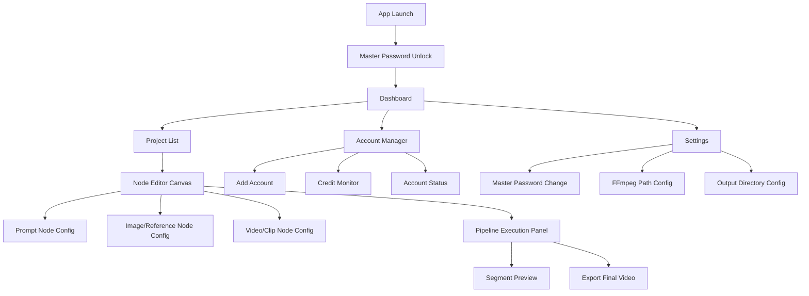

# PLANNING — Product & Project Overview: Flow Studio

> **Project:** Flow Studio  
> **Document ID:** DOC-PLAN-001  
> **Version:** 1.0.0  
> **Status:** Draft  
> **Owner:** Software Architect & Planning Lead  
> **Last Updated:** 2026-09-24  
> **Depends On:** DOC-MANIFEST-001  
> **Supersedes:** None

---

## 1. Executive Summary

Flow Studio (working title: Flow Chainer) adalah desktop application untuk Windows yang memungkinkan content creator memproduksi AI-generated video berdurasi panjang (3–5 menit) dari Google Flow — platform yang secara native hanya menghasilkan klip maksimal ~10 detik per generasi.

Aplikasi ini mengatasi dua limitasi utama Google Flow: durasi per-klip yang pendek dan credit quota per akun yang terbatas. Flow Studio melakukan pooling credits dari multiple Google Flow accounts, lalu menjalankan pipeline generasi sequential di mana setiap segment di-chain secara otomatis menggunakan last-frame extraction dan prompt context carry-over untuk menjaga visual continuity. Hasilnya di-concatenate via FFmpeg menjadi satu video koheren.

Delivery surface adalah Tauri 2.x desktop app dengan node-based editor (@xyflow/react v12+) sebagai paradigma utama untuk merancang pipeline video. Proyek ini dikembangkan oleh solo developer untuk personal use, dengan kemungkinan distribusi di masa depan.

---

## 2. Problem Statement & Opportunity

### 2.1 Problem Statement

Google Flow (flow.google.com) menghasilkan video clip AI berkualitas tinggi, namun memiliki dua constraint fundamental:

1. **Durasi terbatas:** Setiap generasi menghasilkan maksimal ~10 detik video. Tidak ada mekanisme native untuk menyambung beberapa generasi menjadi video panjang yang koheren.
2. **Credit quota terbatas:** Setiap akun memiliki batas credit — 50/hari (free), 200/bulan (Plus), 1.000/bulan (Pro), 10.000/bulan (Ultra $100), 25.000/bulan (Ultra $200). Satu akun tidak cukup untuk produksi video panjang yang memerlukan puluhan generasi.

Kedua limitasi ini membuat Google Flow tidak praktis untuk content creator yang membutuhkan video berdurasi menit, bukan detik.

### 2.2 Opportunity

Content creator yang memiliki multiple Google Flow accounts dapat memanfaatkan total credit pool mereka secara efisien jika ada tool yang:

- mengelola rotasi akun secara otomatis saat credit habis;
- menjaga visual continuity lintas segment tanpa manual intervention;
- menyediakan workflow intuitif untuk merancang sequence video multi-segment.

Flow Studio mengisi gap ini sebagai desktop tool yang sepenuhnya lokal, tanpa dependency ke cloud service pihak ketiga selain Google Flow itu sendiri.

---

## 3. Objectives & Success Metrics

### 3.1 Objectives

| ID | Objective | Measurable Target |
|---|---|---|
| OBJ-01 | Menghasilkan video koheren berdurasi panjang dari chained segments | Output video 3–5 menit (18–30 segments) dalam satu session |
| OBJ-02 | Memaksimalkan utilisasi credit dari multiple accounts | Auto-rotation tanpa manual switching; ≥95% credit utilization dari semua akun aktif |
| OBJ-03 | Menjaga visual continuity lintas segments | Continuity engine: last-frame extraction + prompt context carry-over otomatis |
| OBJ-04 | Menyediakan workflow visual yang intuitif | Node editor dengan drag-drop; pipeline dari prompt → generate → preview → export dalam satu canvas |
| OBJ-05 | Mengamankan credentials yang tersimpan | AES-256-GCM encryption dengan master password; credential tidak pernah plaintext di disk |

### 3.2 North Star Metric

**Metric:** Average coherent video duration produced per session.

**Formula:**

```
North Star = Σ(durasi_output_video_per_session) / Σ(jumlah_session)
```

- `durasi_output_video_per_session`: total durasi (detik) video final yang berhasil di-export dalam satu editing session.
- `jumlah_session`: satu session dimulai saat user membuka project dan berakhir saat export selesai atau project ditutup.

**Target:** 180–300 detik (3–5 menit) dari 18–30 chained segments per session.

**Pengukuran:** Local counter di SQLite — durasi output per export event, dihitung rata-rata rolling 30 hari terakhir.

> 💡 Reasoning: Metric ini langsung mengukur value proposition utama — kemampuan menghasilkan video panjang koheren dari klip pendek. Jika angka ini naik, berarti continuity engine, credit pooling, dan UX pipeline bekerja efektif secara bersamaan.
> 🔁 Revisit Trigger: Jika Google Flow menaikkan durasi per-generasi menjadi >30 detik, target segment count perlu disesuaikan.

---

## 4. Target Users & Stakeholders

### 4.1 Target Users

| Persona | Deskripsi | Kebutuhan Utama |
|---|---|---|
| Content Creator (Primary) | Individu yang memiliki 5–10 Google Flow accounts dan ingin memproduksi AI-generated long-form video | Pipeline sederhana: tulis prompt → generate segments → review → export video panjang |

### 4.2 Stakeholders

| Role | Stakeholder | Kepentingan |
|---|---|---|
| Developer & User | Solo developer | Membangun tool personal untuk produksi video AI; kemungkinan distribusi di kemudian hari |

---

## 5. Scope

### 5.1 P0 — MVP-Blocking

Fitur yang wajib ada untuk MVP dianggap fungsional. Tanpa salah satu fitur P0, aplikasi tidak menghasilkan value proposition yang dijanjikan.

#### 5.1.1 FEAT-FLOW_ROUTER — Multi-Account Flow Router (Rust Module)

| Capability | Detail |
|---|---|
| Account management | Add, remove, dan monitor Google Flow accounts |
| Cookie/token import | Import session cookies/tokens dari browser untuk autentikasi |
| Credit tracking | Tracking credit usage per akun: daily limit dan monthly limit |
| Auto-rotation | Otomatis switch ke akun lain saat credit akun aktif habis |
| Internal API | REST-like internal API untuk komunikasi dengan frontend via Tauri Commands |
| HTTP client | Reverse-engineered HTTP client (reqwest, async, cookie jar) ke Google Flow backend |
| Video generation | Text-to-video, image-to-video, video-to-video generation requests |
| Status polling & download | Polling render status dan download video segment setelah selesai |

#### 5.1.2 FEAT-NODE_EDITOR — Node-Based Pipeline Editor (React 19 + @xyflow/react v12+)

| Capability | Detail |
|---|---|
| Canvas | Node editor canvas dengan pan, zoom, dan grid |
| Node types | 3 tipe node: Prompt Node, Image/Reference Node, Video/Clip Node |
| Edge connections | Drag-drop edge connections antar node dengan type validation |
| Pipeline execution | Sequential execution per segment — satu segment selesai baru lanjut ke berikutnya |
| Continuity engine | Auto-extract last frame dari segment sebelumnya (via FFmpeg), inject sebagai reference untuk segment berikutnya, prompt context carry-over |
| Segment preview | Preview hasil per segment langsung di canvas |
| Video concat | Concatenation/stitching semua segments via FFmpeg |
| Export | Export final video ke file system |

#### 5.1.3 FEAT-CREDENTIAL_VAULT — Encrypted Credential Storage

| Capability | Detail |
|---|---|
| Encryption | AES-256-GCM encryption untuk semua stored credentials |
| Master password | Master password untuk unlock credential vault; vault locked saat aplikasi idle |
| Storage | SQLite database untuk credential metadata; encrypted blobs untuk sensitive data |

### 5.2 P1 — Post-MVP Enhancements

Fitur yang meningkatkan produktivitas dan kualitas output, tetapi tidak blocking untuk MVP.

| ID | Feature | Detail |
|---|---|---|
| P1-01 | Credit dashboard | Real-time credit dashboard untuk semua akun: usage, remaining, daily/monthly breakdown |
| P1-02 | Audio support | Dukungan audio native via Veo 3.1; audio generation bersamaan dengan video |
| P1-03 | Style presets | Preset style system: anime, cinematic, realistic, dan custom presets |
| P1-04 | Storyboard timeline | Timeline view horizontal sebagai alternatif node editor untuk linear workflows |
| P1-05 | Template pipelines | Preset pipeline workflows yang bisa di-reuse (misal: "5-segment cinematic intro") |
| P1-06 | Undo/redo | Undo/redo di node editor dengan history stack |
| P1-07 | Batch queue | Queue multiple projects untuk diproses sequential |
| P1-08 | Smart retry | Auto re-generate segments yang hasilnya buruk berdasarkan heuristic atau manual flag |

### 5.3 P2 — Future Enhancements

Fitur exploratory untuk iterasi jangka panjang.

| ID | Feature | Detail |
|---|---|---|
| P2-01 | Plugin system | Extensible plugin system untuk custom node types |
| P2-02 | Multi-format export | Export ke berbagai format dan resolusi (MP4, WebM, MOV; 720p, 1080p, 4K) |
| P2-03 | Version history | Version history per project dengan rollback capability |
| P2-04 | Scene comparison | Side-by-side comparison 2–3 generated results per segment, pick best |
| P2-05 | Prompt enhancement | Prompt suggestion dan enhancement via local LLM (Ollama atau sejenisnya) |

---

## 6. Out of Scope

Item berikut secara eksplisit **tidak** akan dikerjakan dalam proyek ini:

| Item | Alasan |
|---|---|
| Mobile app (iOS/Android) | Delivery surface adalah desktop Windows; video editing workflow tidak cocok untuk mobile |
| Self-hosted AI model | Flow Studio bergantung sepenuhnya pada Google Flow sebagai generation backend |
| Multi-user / collaboration | Personal tool untuk solo use; tidak ada shared state atau concurrent editing |
| SaaS / monetization | Tidak ada subscription, payment, atau cloud backend; sepenuhnya local |
| Cloud deployment | Aplikasi berjalan sepenuhnya di local machine; tidak ada server component |

---

## 7. Sitemap & Information Architecture

Berikut adalah information architecture dari Flow Studio, menggambarkan hierarki layar dan navigasi utama.



### 7.1 Deskripsi Layar Utama

| Layar | Fungsi |
|---|---|
| Master Password Unlock | Entry point; unlock credential vault dengan master password |
| Dashboard | Overview: jumlah project, total credit tersedia, quick actions |
| Project List | CRUD project; setiap project = satu pipeline/video |
| Account Manager | Kelola Google Flow accounts: add/remove, credit tracking, status |
| Node Editor Canvas | Workspace utama: drag-drop nodes, connect edges, configure per-node, run pipeline |
| Pipeline Execution Panel | Progress per-segment: queued → generating → downloading → done |
| Segment Preview | Playback preview per-segment di dalam canvas |
| Export Final Video | Concatenate semua segments, pilih output path, export |
| Settings | Konfigurasi global: master password, FFmpeg binary path, default output directory |

---

## 8. Release Strategy & Milestones

### 8.1 Release Strategy

Proyek ini menggunakan single-track release strategy karena dikembangkan solo developer untuk personal use:

1. **Alpha (internal):** Semua fitur P0 fungsional, testing manual oleh developer.
2. **Beta (personal use):** Stabilisasi, edge case handling, performance tuning.
3. **v1.0 (optional distribution):** Packaging untuk distribusi jika kualitas cukup.

### 8.2 Milestones

| Milestone | Gate | Deskripsi | Exit Criteria |
|---|---|---|---|
| MS-01: Flow Router Core | — | HTTP client + single account generation | Berhasil generate 1 video dari 1 akun via CLI/test harness |
| MS-02: Multi-Account Rotation | — | Credit tracking + auto-rotation | Generate 5 segments sequential dari 2+ akun tanpa manual switch |
| MS-03: Node Editor MVP | — | Canvas + 3 node types + edge connections | Pipeline 5 nodes tersusun di canvas, data flow ter-validate |
| MS-04: Continuity Engine | — | Last-frame extraction + reference injection | 3 chained segments menunjukkan visual continuity yang koheren |
| MS-05: Pipeline Execution | — | End-to-end: prompt → generate → preview → concat → export | Export video 60 detik (6 segments) dari node editor |
| MS-06: Credential Vault | — | AES-256-GCM vault + master password | Credentials encrypted at rest; unlock/lock cycle bekerja |
| MS-07: Alpha Release | Gate C | Semua P0 integrated | Export video 3 menit (18 segments) dari 3+ akun dalam satu session |
| MS-08: Beta Stabilization | Gate D | Bug fixes, edge cases, polish | 5 consecutive sessions tanpa crash; video quality konsisten |

---

## 9. Timeline Range & Effort Basis

### 9.1 Asumsi Kapasitas

- Solo developer, part-time (~15–20 jam/minggu).
- Familiar dengan Tauri 2.x (pengalaman dari proyek OpenPacket).
- Familiar dengan React + TypeScript.
- Reverse-engineering Google Flow API memerlukan riset awal yang tidak bisa di-estimasi presisi.

### 9.2 Estimasi Range

| Phase | Scope | Optimistic | Pessimistic | Catatan |
|---|---|---|---|---|
| Phase 0: Riset API | Reverse-engineer Google Flow endpoints, cookie/auth flow | 1 minggu | 3 minggu | Paling tidak pasti — bergantung pada kompleksitas obfuscation |
| Phase 1: Flow Router | HTTP client, single account, credit tracking | 1 minggu | 2 minggu | Bergantung pada stabilitas hasil riset Phase 0 |
| Phase 2: Multi-Account | Rotation logic, account manager UI | 1 minggu | 2 minggu | — |
| Phase 3: Node Editor | Canvas, 3 node types, edge connections, Zustand state | 2 minggu | 3 minggu | @xyflow/react menyediakan base; custom node types perlu effort |
| Phase 4: Continuity Engine | FFmpeg last-frame, reference injection, prompt carry-over | 1 minggu | 3 minggu | Eksperimen visual continuity memerlukan iterasi |
| Phase 5: Pipeline Execution | Sequential execution, preview, concat, export | 1 minggu | 2 minggu | — |
| Phase 6: Credential Vault | AES-256-GCM, master password, lock/unlock | 1 minggu | 1 minggu | Well-defined scope |
| Phase 7: Integration & Polish | End-to-end testing, bug fixes, UX polish | 2 minggu | 4 minggu | — |
| **Total** | **P0 MVP** | **10 minggu** | **20 minggu** | Part-time basis (~15–20 jam/minggu) |

> 💡 Reasoning: Range 10–20 minggu mencerminkan uncertainty utama pada Phase 0 (reverse-engineering) dan Phase 4 (visual continuity). Jika Google Flow API ternyata well-structured, timeline bisa lebih cepat. Jika obfuscated atau memerlukan Playwright fallback, timeline mendekati batas atas.

---

## 10. Tech Stack Summary

| Layer | Technology | Alasan Pemilihan |
|---|---|---|
| App Shell | Tauri 2.x | Lightweight, Rust backend, familiar dari proyek OpenPacket; bundle size kecil dibanding Electron |
| Frontend | React 19 + TypeScript | Ekosistem mature, type safety, kompatibel dengan @xyflow/react |
| Node Editor | @xyflow/react v12+ | Library node editor paling mature di React ecosystem; custom node types, edge routing, minimap |
| State Management | Zustand | Lightweight, TypeScript-first, no boilerplate; cocok untuk medium-complexity state |
| Backend Module | Rust (embedded di Tauri core) | Tidak perlu separate daemon; langsung sebagai Tauri Command handler |
| HTTP Client | reqwest (Rust) | Async, cookie jar support, TLS native; cocok untuk reverse-engineered API calls |
| Video Processing | FFmpeg (bundled) | Industry standard; frame extraction, concatenation, transcoding |
| Credential Store | SQLite + AES-256-GCM | SQLite untuk metadata, AES-256-GCM untuk encrypted blobs; Rust crypto libraries |
| IPC | Tauri Commands + Events | Native IPC mechanism Tauri; type-safe dengan tauri-specta |

> 💡 Reasoning: Stack ini memprioritaskan familiarity (Tauri, React) dan performance (Rust backend, reqwest). Keputusan untuk embed router di Tauri core (bukan separate daemon) mengurangi operational complexity untuk personal tool.
> 🔁 Revisit Trigger: Jika Google Flow memerlukan full browser context untuk auth, evaluasi Playwright integration sebagai fallback (lihat ASM-02).

---

## 11. Code Quality Baseline

Standar code quality untuk proyek ini didefinisikan secara lengkap di [`CODE_QUALITY.md`](./CODE_QUALITY.md) (DOC-QUAL-001).

Baseline minimum yang berlaku:

- **Anti-AI-slop rules:** Tidak ada narrative comments, TODO stubs, swallowed exceptions, debug leftovers, unused imports, hardcoded secrets, atau generic variable names di seluruh codebase.
- **File decomposition:** Maksimal 400 LOC per file (eksklusif komentar/blank); fungsi maksimal 80 baris.
- **Type safety:** TypeScript strict mode untuk frontend; Rust type system untuk backend — tidak ada `any` atau `unwrap()` tanpa justifikasi.
- **Error handling:** Semua error di-propagate atau di-handle secara eksplisit. Tidak ada swallowed exceptions.
- **Testing minimum:** Unit test untuk business logic (credit rotation, continuity engine); integration test untuk pipeline execution.

---

## 12. Design System Reference

Design system untuk proyek ini didefinisikan secara lengkap di [`DESIGN.md`](./DESIGN.md) (DOC-DES-001).

Ringkasan arah visual:

- **Theme:** Dark mode sebagai default dan satu-satunya theme. Aesthetic creative tool (referensi: Blender, DaVinci Resolve, ComfyUI).
- **Color palette:** Dark neutrals (zinc/slate family) dengan accent color untuk status dan interactivity.
- **Typography:** System font stack; monospace untuk technical values (credit counts, durations).
- **Node editor styling:** Custom node designs dengan visual distinction per node type (warna accent berbeda untuk Prompt, Image/Reference, Video/Clip).
- **Spacing & layout:** 4px base unit; 8px grid system.
- **Accessibility:** WCAG 2.2 AA contrast ratios minimum; keyboard navigation untuk semua interactive elements.

---

## 13. Constraints

| ID | Constraint | Impact |
|---|---|---|
| CON-01 | Google Flow tidak memiliki public API — integrasi bergantung pada reverse-engineered HTTP endpoints atau browser automation | Fragile integration; endpoint dapat berubah tanpa pemberitahuan |
| CON-02 | Durasi maksimal per generasi ~10 detik | Video panjang memerlukan chaining banyak segments; 3 menit = minimal 18 segments |
| CON-03 | Credit terbatas per akun per bulan | Memerlukan multiple accounts untuk produksi volume; credit pooling adalah kebutuhan fundamental |
| CON-04 | Solo developer capacity (~15–20 jam/minggu) | Timeline lebih panjang; scope P0 harus tetap minimal |
| CON-05 | Windows-only delivery target (P0) | Tauri 2.x mendukung cross-platform, tetapi testing dan packaging fokus Windows untuk MVP |

---

## 14. Assumption Register

| ID | Assumption | Status | Default Value | Impact if Wrong | Validation Method |
|---|---|---|---|---|---|
| ASM-01 | Node type ketiga adalah Video/Clip reference (bukan Audio atau Text-only) | ASSUMED | Video/Clip node | Perlu redesign node type system | Validasi saat user testing pertama |
| ASM-02 | Primary integration via reverse-engineered HTTP; Playwright headless sebagai fallback | ASSUMED | HTTP-first | Jika HTTP tidak feasible, beralih ke Playwright (lebih lambat, lebih resource-intensive) | Validasi di Phase 0 riset API |
| ASM-03 | Target durasi output 3–5 menit (18–30 segments) cukup untuk use case utama | ASSUMED | 3–5 menit | Jika butuh lebih panjang, perlu optimasi credit usage dan execution time | Review setelah 10 session pertama |
| ASM-04 | Tauri 2.x familiar dan stabil untuk use case ini (pengalaman dari OpenPacket) | ASSUMED | Tauri 2.x | Jika Tauri 2.x memiliki blocker, fallback ke Electron | Validasi di Phase 1 |
| ASM-05 | Aplikasi sepenuhnya lokal, tidak memerlukan cloud component | ASSUMED | Local-only | Jika perlu cloud sync di masa depan, perlu tambah backend | Tetap lokal untuk MVP |
| ASM-06 | Google Flow dapat diakses secara headless (tanpa visible browser window) | ASSUMED | Headless | Jika butuh visible browser, UX degradasi dan resource usage naik | Validasi di Phase 0 |
| ASM-07 | Jumlah akun yang dikelola 5–10 per instance | ASSUMED | 5–10 akun | Jika lebih dari 10, perlu evaluasi performance rotation logic dan UI account manager | Monitoring usage |
| ASM-08 | Output default: auto-concat semua segments + opsi export per-segment | ASSUMED | Concat + per-segment | — | Validasi saat user testing |
| ASM-09 | Video-only di P0; audio support (Veo 3.1) masuk P1 | ASSUMED | Video P0, Audio P1 | Jika audio critical di P0, scope dan timeline bertambah | Keputusan final sebelum Phase 3 |
| ASM-10 | Style preset system masuk P1 (bukan P0) | ASSUMED | Style preset P1 | — | — |
| ASM-11 | Aplikasi untuk personal use | ASSUMED | Personal tool | Jika distribusi, perlu tambah licensing, auto-update, error reporting | Keputusan setelah v1.0 alpha |
| ASM-12 | UI dalam Bahasa Inggris | ASSUMED | English UI | — | — |

---

## 15. Risk Register

> ⚠️ Risk Flag `RSK-001` — Google Flow API Reverse-Engineering Fragility
> - Probability: High
> - Impact: Critical
> - Mitigation: (1) Abstract API layer sehingga endpoint changes hanya memerlukan update di satu module. (2) Implementasi Playwright headless sebagai fallback integration. (3) Monitoring endpoint changes via automated health check saat app startup.
> - Trigger: API call mulai gagal dengan HTTP 4xx/5xx setelah sebelumnya berfungsi; response structure berubah.
> - Owner: Solo Developer

> ⚠️ Risk Flag `RSK-002` — ToS Violation & Account Ban Risk
> - Probability: High
> - Impact: High
> - Mitigation: (1) Rate limiting internal — jangan exceed normal human usage patterns. (2) Randomized delay antar requests. (3) Gunakan akun yang memang dimiliki sendiri. (4) Tidak mendistribusikan tool sebagai service yang mendorong ToS violation massal.
> - Trigger: Satu atau lebih akun menerima warning, suspension, atau ban dari Google.
> - Owner: Solo Developer

> ⚠️ Risk Flag `RSK-003` — Visual Continuity Across Segments
> - Probability: High
> - Impact: High
> - Mitigation: (1) Last-frame extraction sebagai reference image untuk segment berikutnya. (2) Prompt context carry-over — include deskripsi visual dari segment sebelumnya. (3) Style locking via consistent prompt prefix. (4) Manual override — user bisa re-generate segment yang tidak koheren.
> - Trigger: Output video menunjukkan jarring visual transition antar segments meskipun continuity engine aktif.
> - Owner: Solo Developer

> ⚠️ Risk Flag `RSK-004` — Credential Security
> - Probability: Medium
> - Impact: High
> - Mitigation: (1) AES-256-GCM encryption at rest. (2) Master password required untuk unlock. (3) Auto-lock setelah idle period. (4) Credentials tidak pernah logged atau ditulis ke file lain. (5) Memory zeroization setelah credential digunakan.
> - Trigger: Credentials ter-expose di log, file, atau memory dump.
> - Owner: Solo Developer

> ⚠️ Risk Flag `RSK-005` — Google Flow UI/API Changes
> - Probability: Medium
> - Impact: Medium
> - Mitigation: (1) Thin adapter layer yang isolate Google Flow-specific logic. (2) Version pinning pada known-working endpoint signatures. (3) Startup health check yang memvalidasi endpoint availability sebelum pipeline execution.
> - Trigger: Google merilis update besar pada flow.google.com yang mengubah endpoint structure atau auth flow.
> - Owner: Solo Developer

---

## 16. Open Questions

| ID | Question | Impact | Status | Resolution Target |
|---|---|---|---|---|
| OQ-01 | Apakah Google Flow endpoints menggunakan protobuf atau JSON untuk request/response? | Menentukan complexity reverse-engineering dan maintenance | Open | Phase 0 |
| OQ-02 | Apakah Google Flow rate-limit per-IP atau per-account? | Menentukan apakah multiple accounts dari satu IP memicu detection | Open | Phase 0 |
| OQ-03 | Berapa lama session cookie/token Google Flow valid sebelum perlu refresh? | Menentukan frequency re-authentication yang diperlukan | Open | Phase 0 |
| OQ-04 | Apakah image-to-video dan video-to-video endpoint menerima arbitrary reference image, atau hanya dari Google Flow gallery? | Menentukan feasibility continuity engine via last-frame injection | Open | Phase 0 |
| OQ-05 | Apakah FFmpeg bundling di Tauri memerlukan special packaging (license, binary size)? | Impact pada bundle size dan distribution legality | Open | Phase 5 |

---

## 17. Definition of MVP Success

MVP (Milestone MS-07) dianggap berhasil jika **semua** kriteria berikut terpenuhi:

| # | Criterion | Verification Method |
|---|---|---|
| 1 | Berhasil generate dan export video koheren berdurasi ≥3 menit (≥18 chained segments) dalam satu session | Manual test: end-to-end pipeline dari prompt nodes sampai exported file |
| 2 | Auto-rotation bekerja: pipeline menggunakan ≥2 akun berbeda dalam satu session tanpa manual intervention | Log verification: account switch events tercatat selama pipeline execution |
| 3 | Visual continuity terlihat koheren — transisi antar segments tidak jarring secara visual | Manual review: playback exported video, evaluasi subjektif transisi |
| 4 | Credentials tersimpan encrypted; tidak ada plaintext credential di disk, log, atau memory yang accessible | Security check: inspect SQLite file, scan log output, verify encryption at rest |
| 5 | Aplikasi tidak crash selama pipeline execution penuh (18+ segments) | Stability test: 3 consecutive full pipeline runs tanpa crash |
| 6 | Export video playable di standard media player (VLC, Windows Media Player) tanpa corruption | File validation: exported MP4 playable, duration correct, no artifacts |

MVP success **bukan** tanggal atau fitur count — melainkan kemampuan end-to-end: dari multiple Google Flow accounts, melalui node editor pipeline, menghasilkan video panjang koheren yang ter-export sebagai file yang valid.

---

*Document generated per PLANNING_v5.2.md §11.2 specification. All estimates are ranges with stated assumptions, not date commitments.*
