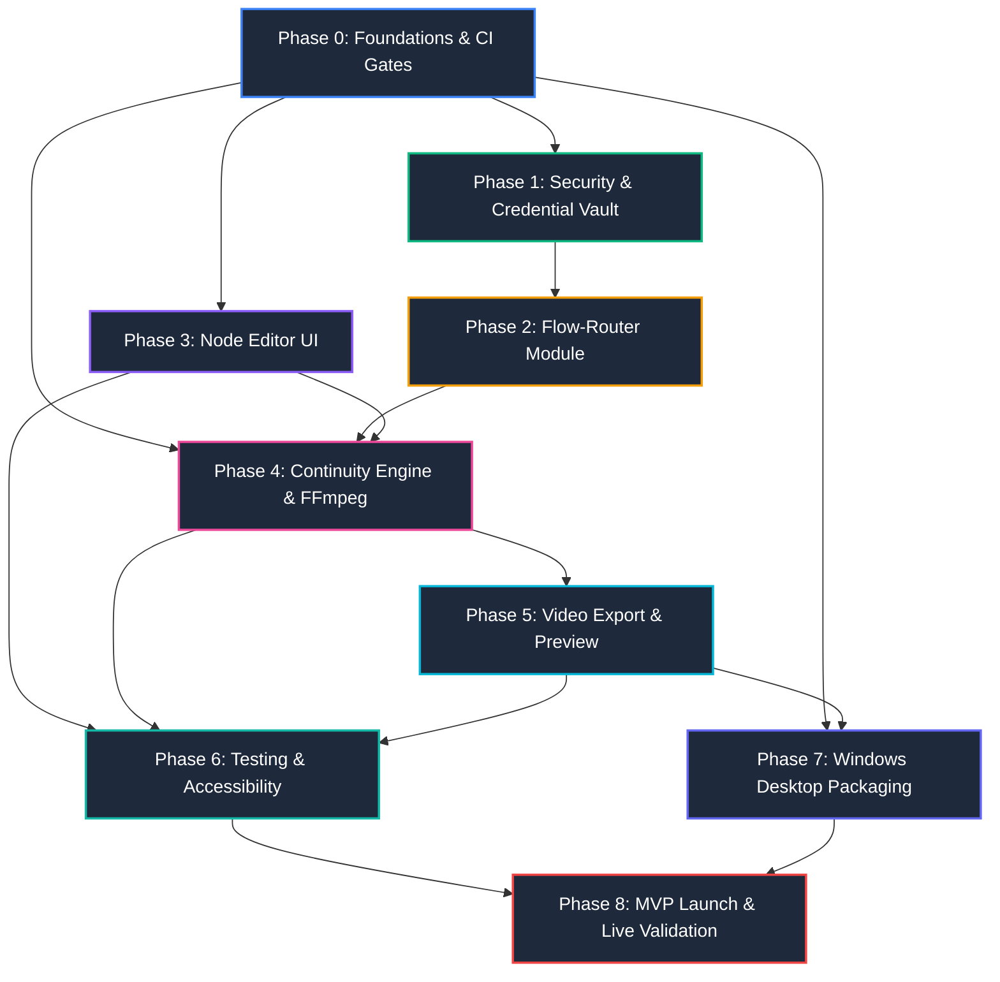

# Execution Plan & Task Breakdown: Flow Studio

> **Project:** Flow Studio  
> **Document ID:** DOC-TASK-001  
> **Version:** 1.0.0  
> **Status:** Draft  
> **Owner:** Software Architect & Planning Lead  
> **Last Updated:** 2026-09-24  
> **Depends On:** DOC-SRS-001, DOC-ARCH-001  
> **Supersedes:** None  

---

## 1. Ringkasan Eksekutif & Struktur Fase

Dokumen ini mendefinisikan rencana eksekusi teknis atomik (*work breakdown structure*) untuk implementasi **Flow Studio** (*Flow Chainer*), sebuah workstation desktop lokal berbasis **Tauri 2.x**, **React 19**, **@xyflow/react**, dan **Rust Core Engine**. Rencana kerja ini menguraikan seluruh siklus rekayasa mulai dari inisialisasi scaffold fondasi hingga peluncuran MVP dan validasi akun live Google Flow.

Sesuai dengan ketentuan standar rekayasa perangkat lunak pada `PLANNING_v5.2.md` (§11.14 dan §7.9), seluruh pekerjaan dibagi ke dalam 9 fase berurutan (Phase 0 hingga Phase 8) dengan disiplin:
- **Zero-Stub Policy:** Setiap task menghasilkan kode fungsional penuh, skema migrasi terverifikasi, atau komponen teruji tanpa `TODO`, placeholder, atau *mock stub*.
- **Strict Verification:** Setiap task memiliki kriteria penyelesaian (*Done when*) yang terukur dan dapat diverifikasi secara objektif melalui automated tests, benchmarking, atau audit keamanan.
- **Traceability:** Setiap task terhubung langsung ke Dokumen Kebutuhan Sistem (`SRS.md`), Kontrak Antarmuka (`API.md`), Dokumen Arsitektur (`ARCHITECTURE.md`), dan Spesifikasi Produk (`PRD/`).
- **Machine-Readable Sidecar:** Bagian akhir dokumen ini menyertakan `TASKS_INDEX.yaml` yang sinkron 100% untuk konsumsi automated issue trackers.

### 1.1 Ringkasan Distribusi Fase

| Fase | Nama Fase & Ruang Lingkup Utama | Total Task | Estimasi Durasi | Deliverable Kunci |
|---|---|---|---|---|
| **Phase 0** | Project Foundations, Tauri 2.x Scaffold, SQLite Setup, CI Quality Gates | 7 Task | Selesai | Monorepo scaffold, SQLite schema v1, strict CI quality gates (7/7 complete) |
| **Phase 1** | Security & Credential Vault (Argon2id, AES-256-GCM, Master Password, Auto-Lock) | 7 Task | 1 Minggu | Vault enclave, zeroize buffer, auto-lock daemon, unlock modal |
| **Phase 2** | Flow-Router Module (Account Pool, Cookie Ingestion, Credit Tracking, Auto-Rotation) | 7 Task | 2 Minggu | HTTP client, cookie parser, multi-account rotation, account drawer |
| **Phase 3** | Node Editor UI (@xyflow/react Canvas, Custom Nodes, Edge Routing, DAG Validation) | 9 Task | 2.5 Minggu | Infinite canvas, 4 node types, edge snapping, DAG validator, `.flowproj` |
| **Phase 4** | Continuity Engine & FFmpeg (Last Frame Extraction, Prompt Context, Sequential Pipeline) | 7 Task | 2.5 Minggu | FFmpeg runner, last-frame injection, sliding context, state machine |
| **Phase 5** | Video Export & Preview (FFmpeg Concat, Video Player Preview, Transcode Export) | 5 Task | 1.5 Minggu | Concat demuxer, 1080p transcoder, video player with markers, export modal |
| **Phase 6** | Testing, Hardening & Accessibility (axe-core CI Error Mode, Storybook CSF3, E2E Smoke) | 5 Task | 1.5 Minggu | Storybook 6 states, axe-core WCAG 2.2 AA zero error, Playwright E2E |
| **Phase 7** | Windows Desktop Packaging (Tauri Bundler, NSIS Installer, Bundled FFmpeg Binary) | 4 Task | 1 Minggu | Tauri Windows x64 bundler, NSIS installer, bundled FFmpeg, cold start test |
| **Phase 8** | MVP Launch & Validation (Live Google Flow Accounts Smoke Testing & Sign-off) | 4 Task | 1 Minggu | Live account validation, 6-segment continuity test, release sign-off |
| **Total** | **End-to-End Implementation Roadmap (Phases 0–8)** | **55 Task** | **12.5–14 Minggu** | **Flow Studio v1.0.0-alpha Production Release** |

---

## 2. Rincian Task Atomik Per Fase

### Phase 0: Project Foundations, Tauri 2.x Scaffold, SQLite Setup, CI Quality Gates

Fase ini meletakkan fondasi teknis repositori, pipeline integrasi berkelanjutan (CI), basis data SQLite terkelola, sistem logging terstruktur, dan penegakan kualitas kode tanpa kompromi.

- [x] `TASK-P0-001` [Effort: S] Inisialisasi Monorepo & Tauri 2.x Desktop Shell Scaffold
  - Owner: DevOps
  - References: ADR-001, NFR-007, NFR-008
  - Depends on: None
  - Done when: Struktur workspace monorepo (frontend React 19 + Vite + Tailwind CSS dan backend `src-tauri` Rust 2021) terbuat, perintah `cargo tauri dev` berhasil me-render native desktop window pada Windows 10/11 x64 dalam < 3 detik tanpa runtime warning.

- [x] `TASK-P0-002` [Effort: S] Konfigurasi Strict CI Quality Gates (ESLint, Prettier, Clippy, tsc, cargo audit)
  - Owner: DevOps
  - References: NFR-010, CODE_QUALITY.md §7.1, ADR-001
  - Depends on: TASK-P0-001
  - Done when: Pipeline GitHub Actions berjalan dengan 6 quality gates: `cargo audit`, `npm audit --audit-level=high`, `cargo fmt --check`, `prettier --check`, `cargo clippy --all-targets -- -D warnings`, `eslint --max-warnings 0`, `tsc --noEmit`, dan `aislop scan --threshold 75`.

- [x] `TASK-P0-003` [Effort: M] Setup Tauri-Specta Contract-First IPC Code Generator
  - Owner: Tech Lead
  - References: API.md §2.1, ARCHITECTURE.md §2.2
  - Depends on: TASK-P0-001
  - Done when: Crate `tauri-specta` terkonfigurasi pada `src-tauri`, macro `collect_commands` mengekspor berkas binding TypeScript `src/bindings.ts` secara otomatis saat `cargo build`, dan tipe contracts sinkron antara Rust dan frontend tanpa deklarasi `any`.

- [x] `TASK-P0-004` [Effort: M] Inisialisasi SQLite Database Engine & Migration Manager
  - Owner: Backend
  - References: ERD.md §1.2, DOC-MIG-001, NFR-004
  - Depends on: TASK-P0-001
  - Done when: Modul `db.rs` berhasil membuka koneksi SQLite di path `%APPDATA%/FlowStudio/flow_studio.db` dengan WAL mode (`PRAGMA journal_mode = WAL`), foreign keys aktif (`PRAGMA foreign_keys = ON`), timeout 5000ms, serta tabel `_schema_migrations` terbuat dan teruji.

- [x] `TASK-P0-005` [Effort: S] Eksekusi Skema DDL Database Lengkap untuk Semua Entitas
  - Owner: Backend
  - References: ERD.md §2, ERD.md §3, NFR-004
  - Depends on: TASK-P0-004
  - Done when: Seluruh tabel (`credential_vault`, `accounts`, `projects`, `segments`, `generation_log`, `security_audit_log`) dan indeks relasional terbuat via migrasi v1, dan eksekusi `PRAGMA integrity_check` mengembalikan nilai `ok`.

- [x] `TASK-P0-006` [Effort: S] Implementasi Structured Local Diagnostic Logging System
  - Owner: Backend
  - References: NFR-012, SECURITY.md §2.2
  - Depends on: TASK-P0-001
  - Done when: Crate `tracing` dan `tracing-appender` memancarkan file log JSON di `%APPDATA%/FlowStudio/logs/`, rotasi log aktif pada ukuran 10MB (maksimal 5 arsip), dan filter sanitasi membuktikan seluruh kredensial ter-masking (`u***r@gmail.com`) tanpa ada token mentah di log.

- [x] `TASK-P0-007` [Effort: S] Setup Test Runners (Vitest + React Testing Library & Cargo Test)
  - Owner: DevOps
  - References: CODE_QUALITY.md §7.1, NFR-010
  - Depends on: TASK-P0-002
  - Done when: `npm run test` menjalankan Vitest dengan coverage reporter, `cargo test` menjalankan unit test harness Rust, dan keduanya lolos di lingkungan lokal serta workflow CI tanpa kegagalan.

---

### Phase 1: Security & Credential Vault

Fase ini mengimplementasikan cryptographic vault enclave lokal untuk mengamankan data sesi dan token akun Google Flow menggunakan standar enkripsi simetris modern dengan memory zeroization.

- [ ] `TASK-P1-001` [Effort: M] Implementasi Argon2id Key Derivation & Canary Verification Engine
  - Owner: Backend
  - References: FR-040, FR-041, SECURITY.md §3.1, API-VAULT-001
  - Depends on: TASK-P0-004, TASK-P0-005
  - Done when: Modul `vault::crypto` mengimplementasikan KDF Argon2id (m_cost=65536 KB, t_cost=3, p_cost=1), menghasilkan 256-bit Key Encryption Key (KEK), dan verifikasi string canary AES-256-GCM lulus unit test deterministik (sukses untuk password benar, tolak untuk password salah).

- [ ] `TASK-P1-002` [Effort: M] Implementasi AES-256-GCM Payload Encryption & Ephemeral RAM Zeroization
  - Owner: Backend
  - References: FR-041, NFR-004, SECURITY.md §1.2, API-VAULT-001
  - Depends on: TASK-P1-001
  - Done when: Enkripsi dan dekripsi cookie menggunakan AES-256-GCM dengan 96-bit nonce unik dan 128-bit authentication tag; kunci master berada dalam struct terproteksi `secrecy::SecretBox` dengan trait `zeroize::ZeroizeOnDrop` yang teruji menghapus buffer RAM saat di-drop.

- [ ] `TASK-P1-003` [Effort: M] Implementasi IPC Commands untuk Vault Lifecycle (Setup, Unlock, Lock, Status, Reset)
  - Owner: Backend
  - References: FR-040, FR-041, API-VAULT-001, API-VAULT-002, API-VAULT-003, API-VAULT-004, API-VAULT-005
  - Depends on: TASK-P0-003, TASK-P1-002
  - Done when: Tauri commands `setup_vault`, `unlock_vault`, `lock_vault`, `check_vault_status`, dan `reset_vault` terdaftar di runtime, menghasilkan canonical error envelope (`E_VAULT_LOCKED`, `E_VAULT_BAD_PASSWORD`), dan status sinkron ke frontend.

- [ ] `TASK-P1-004` [Effort: S] Implementasi Anti-Brute Force Lockout & Cooldown Manager
  - Owner: Backend
  - References: FR-040, SECURITY.md §3.1, API-VAULT-002
  - Depends on: TASK-P1-003
  - Done when: Kegagalan input master password 3 kali berturut-turut memicu periode cooldown 30 detik di backend; pemanggilan `unlock_vault` selama masa penalti mengembalikan error `E_VAULT_RATE_LIMITED` beserta parameter `retryAfterSeconds`.

- [ ] `TASK-P1-005` [Effort: S] Implementasi Inactivity Auto-Lock Timer Daemon
  - Owner: Backend
  - References: FR-042, SECURITY.md §1.2, API-VAULT-003
  - Depends on: TASK-P1-003
  - Done when: Timer inaktivitas 15 menit berjalan di backend supervisor Rust, me-reset countdown pada setiap pemanggilan IPC aktif, dan secara otomatis membersihkan buffer kunci dari memori serta memancarkan event `vault:state_changed` (`LOCKED`) saat timeout tercapai.

- [ ] `TASK-P1-006` [Effort: M] Implementasi Master Password Modal & Zustand Vault Store di Frontend
  - Owner: Frontend
  - References: FR-040, DESIGN.md §7, DSD.md CMP-VAULT-UNLOCK-SCREEN
  - Depends on: TASK-P0-003, TASK-P1-003
  - Done when: Komponen `MasterPasswordModal` mengonsumsi design tokens (surface `#1E293B`, focus ring `#3B82F6`), menangani setup master password baru, membuka vault dengan feedback visual loading, dan menampilkan hitung mundur saat terkena cooldown anti-brute force.

- [ ] `TASK-P1-007` [Effort: S] Audit Keamanan & Sanitasi Crash Handler (Zero-Log Leak Test)
  - Owner: Tech Lead
  - References: NFR-004, SECURITY.md §2.2
  - Depends on: TASK-P1-003, TASK-P0-006
  - Done when: Suite pengujian keamanan memverifikasi bahwa crash dump, file log lokal, console output, dan tabel SQLite tidak mengandung password plaintext maupun token session dalam bentuk unencrypted string.

---

### Phase 2: Flow-Router Module

Fase ini mengimplementasikan modul in-process `flow-router` untuk mengelola pool multi-akun Google Flow, mem-parsing dan menyimpan cookie sesi, memantau kuota kredit, serta melakukan failover otomatis saat akun kehabisan kuota.

- [ ] `TASK-P2-001` [Effort: M] Implementasi Google Flow Reverse-Engineered HTTP Client
  - Owner: Backend
  - References: PRD/ACCOUNT_POOL.md §4.1, ADR-002, NFR-002
  - Depends on: TASK-P1-002
  - Done when: Client HTTP berbasis `reqwest` terkonfigurasi dengan TLS 1.3, impersonasi browser headers (User-Agent, sec-ch-ua, platform Windows x64), dan berhasil mengeksekusi request validasi session ke endpoint Google Flow dengan response latency < 2 detik.

- [ ] `TASK-P2-002` [Effort: M] Implementasi Cookie Parser & Session Ingestion Service
  - Owner: Backend
  - References: FR-001, PRD/ACCOUNT_POOL.md §4.1, API-ACCT-001
  - Depends on: TASK-P2-001
  - Done when: Service menerima masukan cookie berupa raw header string atau JSON array (ekspor browser), mem-parsing token esensial (SID, HSID, SSID, APISID, SAPISID), memvalidasi session ke Google Flow, dan menolak format invalid dengan error terstruktur.

- [ ] `TASK-P2-003` [Effort: M] Implementasi Credit Tracking & Parsing Engine
  - Owner: Backend
  - References: FR-003, PRD/ACCOUNT_POOL.md §4.1, API-ACCT-004
  - Depends on: TASK-P2-001
  - Done when: Engine credit tracker berhasil mengekstrak nilai kredit harian (`daily_credits_remaining`) dan kredit bulanan (`monthly_credits_remaining`) dari response Google Flow, memperbarui record tabel `accounts`, dan menyajikan snapshot sisa kredit.

- [ ] `TASK-P2-004` [Effort: M] Implementasi Account Pool CRUD & Health Check Service
  - Owner: Backend
  - References: FR-001, FR-002, FR-005, API-ACCT-001, API-ACCT-002, API-ACCT-003, API-ACCT-005, API-ACCT-007
  - Depends on: TASK-P1-003, TASK-P2-002, TASK-P2-003
  - Done when: Tauri commands untuk menambah akun, menghapus akun permanen beserta credential, memperbarui label, me-list akun terdaftar, dan melakukan pengecekan health status (Active/Expired/Error) berfungsi penuh dengan persistensi SQLite.

- [ ] `TASK-P2-005` [Effort: L] Implementasi Auto-Rotation Engine & Priority Failover Algorithm
  - Owner: Backend
  - References: FR-004, NFR-003, PRD/ACCOUNT_POOL.md §4.1, ADR-002
  - Depends on: TASK-P2-004
  - Done when: Algoritma rotasi otomatis mendeteksi kondisi akun aktif kehabisan kuota (kredit = 0 atau HTTP 429), secara transparan mengalihkan eksekusi segmen berikutnya ke akun cadangan dengan saldo tertinggi sesuai urutan prioritas, dan mem-pause pipeline dengan event jika semua akun habis.

- [ ] `TASK-P2-006` [Effort: M] Implementasi Account Manager Drawer & Credit Meter UI Components
  - Owner: Frontend
  - References: FR-001, FR-003, DSD.md CMP-ACCOUNT-BADGE, CMP-CREDIT-BAR
  - Depends on: TASK-P0-003, TASK-P2-004
  - Done when: Drawer navigasi samping menampilkan daftar akun Google Flow, status badge, bar sisa kuota harian/bulanan dengan indikator warna (hijau >20%, kuning 1-20%, merah 0%), modal input cookie baru, dan konfirmasi dialog hapus akun.

- [ ] `TASK-P2-007` [Effort: S] Implementasi Embedded Webview Re-Authentication Flow
  - Owner: Frontend
  - References: FR-006, API-ACCT-006, PRD/ACCOUNT_POOL.md
  - Depends on: TASK-P2-006
  - Done when: Tombol "Re-authenticate" memicu jendela WebView2 sekunder terisolasi yang mengarahkan user ke halaman otentikasi Google, mendeteksi penyelesaian login, mengekstrak cookie baru, dan menyimpannya kembali ke vault terenkripsi.

---

### Phase 3: Node Editor UI

Fase ini membangun kanvas grafik node visual interaktif berbasis `@xyflow/react` v12+, sistem node kustom, validasi penarikan edge yang ketat, deteksi siklus DAG, serta serialisasi proyek `.flowproj`.

- [x] `TASK-P3-001` [Effort: M] Setup @xyflow/react Canvas Workspace dengan Custom Themes & Pan/Zoom
  - Owner: Frontend
  - References: FR-010, NFR-001, DESIGN.md §2.1
  - Depends on: TASK-P0-001
  - Done when: Kanvas node terkonfigurasi dengan background ultra-dark `#0B0F19`, dot grid, performa rendering stabil pada 60fps (P95 frame time < 16.67ms) saat pan/zoom 100 node pada hardware target, serta widget MiniMap berfungsi akurat.

- [x] `TASK-P3-002` [Effort: M] Implementasi Zustand Flow Graph Store & History Manager (Undo/Redo)
  - Owner: Frontend
  - References: FR-010, FR-015, PRD/NODE_EDITOR.md §4.2
  - Depends on: TASK-P3-001
  - Done when: Zustand store mengelola state nodes, edges, multi-selection (Shift+click atau box select), mutasi posisi, riwayat undo/redo (Ctrl+Z / Ctrl+Y) hingga 50 langkah, dan batch deletion (tombol Delete) yang membersihkan node beserta edge terkait.

- [x] `TASK-P3-003` [Effort: M] Implementasi PromptNode Component dengan Template Variable Resolver
  - Owner: Frontend
  - References: FR-011, DSD.md CMP-PROMPT-NODE, DESIGN.md §5.2
  - Depends on: TASK-P3-002
  - Done when: Komponen `PromptNode` me-render textarea multi-line auto-resize, badge penghitung karakter, visual token highlight untuk template variables `{segment_number}` dan `{previous_context}`, port handle output text, dan border glow ungu (`#8B5CF6`).

- [x] `TASK-P3-004` [Effort: M] Implementasi ImageNode (Reference) Component dengan Asset Dropzone
  - Owner: Frontend
  - References: FR-012, DSD.md, DESIGN.md §5.2
  - Depends on: TASK-P3-002
  - Done when: Komponen `ImageNode` mendukung drag-and-drop file gambar (PNG, JPG, WEBP), native Windows file picker, preview thumbnail beresolusi terkelola, port handle output image, penolakan file non-image dengan visual alert, dan border glow cyan (`#06B6D4`).

- [x] `TASK-P3-005` [Effort: M] Implementasi VideoNode (Clip / Preview) Component
  - Owner: Frontend
  - References: FR-013, FR-017, DSD.md, DESIGN.md §5.2
  - Depends on: TASK-P3-002
  - Done when: Komponen `VideoNode` mendukung import file MP4/WEBM, rendering thumbnail frame pertama, embedded mini player dengan kontrol play/pause/seekbar, opsi klik kanan "Open in system player", dan border glow amber (`#F59E0B`).

- [x] `TASK-P3-006` [Effort: M] Implementasi GenerationNode Component & Parameter Settings Panel
  - Owner: Frontend
  - References: FR-016, PRD/NODE_EDITOR.md, DESIGN.md §5.2
  - Depends on: TASK-P3-002
  - Done when: Komponen `GenerationNode` memiliki port input (Prompt, Reference Image, Context Video), dropdown pemilihan model (Gemini Omni, Veo 3.1, Nano Banana), input aspect ratio, seed number input, status execution pill, dan border glow biru (`#3B82F6`).

- [x] `TASK-P3-007` [Effort: M] Implementasi Draggable Edge Routing & Strict Port Type Validation
  - Owner: Frontend
  - References: FR-014, PRD/NODE_EDITOR.md §4.2
  - Depends on: TASK-P3-003, TASK-P3-004, TASK-P3-005, TASK-P3-006
  - Done when: Custom edge me-render path bezier halus dengan konektor type-safe; penarikan edge yang tidak kompatibel (misal: port teks ke port gambar) ditolak secara visual dengan animasi snap-back instan dan toast error.

- [x] `TASK-P3-008` [Effort: M] Implementasi Directed Acyclic Graph (DAG) Topology Validator & Cycle Detector
  - Owner: Frontend
  - References: FR-014, FR-024, PRD/NODE_EDITOR.md
  - Depends on: TASK-P3-007
  - Done when: Modul validasi topological sort (Kahn's algorithm) mendeteksi siklus dependensi secara real-time pada canvas, memberi tanda visual merah pada edge penyebab siklus, dan menghitung sekuens urutan eksekusi segmen video tanpa deadlocks.

- [x] `TASK-P3-009` [Effort: M] Implementasi Project Persistence Engine (.flowproj File Format)
  - Owner: Tech Lead
  - References: FR-018, NFR-006, API-PROJ-001, API-PROJ-002, API-PROJ-003, API-PROJ-004
  - Depends on: TASK-P0-003, TASK-P3-002
  - Done when: Proyek dapat disimpan ke disk lokal sebagai berkas JSON berstruktur `.flowproj` dengan ukuran < 10MB (path aset tersimpan relatif), dan pemuatan kembali proyek merekonstruksi graf, posisi koordinat, dan konfigurasi node 100% identik.

---

### Phase 4: Continuity Engine & FFmpeg

Fase ini mengimplementasikan engine continuity visual dan naratif: isolasi subproses FFmpeg, ekstraksi last-frame resolusi penuh, injeksi otomatis ke prompt segmen berikutnya, sliding context window, dan orkestrasi sekuensial pipeline.

- [ ] `TASK-P4-001` [Effort: M] Implementasi FFmpeg Sidecar Subprocess Runner & Sandboxing
  - Owner: Backend
  - References: FR-020, ARCHITECTURE.md §1.2, ADR-001
  - Depends on: TASK-P0-001
  - Done when: Modul `ffmpeg::runner` mengeksekusi biner FFmpeg Windows x64 langsung tanpa invoking shell (`cmd.exe`/PowerShell), membatasi argumen pada format whitelist aman, dan membatasi izin akses file hanya pada working directory proyek.

- [ ] `TASK-P4-002` [Effort: M] Implementasi Last-Frame Extraction Service (-sseof -1 -frames:v 1)
  - Owner: Backend
  - References: FR-020, API-CONT-001, PRD/CONTINUITY_ENGINE.md §4.3
  - Depends on: TASK-P4-001
  - Done when: Ekstraksi frame terakhir dari berkas video MP4 hasil generasi selesai dalam waktu < 2 detik pada spesifikasi hardware minimum, menghasilkan file PNG beresolusi penuh tanpa artefak kompresi pada direktori proyek.

- [ ] `TASK-P4-003` [Effort: S] Implementasi Automatic Last-Frame Reference Injection Service
  - Owner: Backend
  - References: FR-021, PRD/CONTINUITY_ENGINE.md §4.3
  - Depends on: TASK-P4-002, TASK-P2-001
  - Done when: Frame PNG yang diekstrak dari segmen $N$ secara otomatis terbaca dan disuntikkan ke dalam struktur payload request generasi segmen $N+1$ tanpa membutuhkan intervensi klik dari pengguna.

- [ ] `TASK-P4-004` [Effort: M] Implementasi Sliding Context Window Prompt Carry-Over Engine
  - Owner: Backend
  - References: FR-022, API-CONT-002, PRD/CONTINUITY_ENGINE.md §4.3
  - Depends on: TASK-P0-003
  - Done when: Prompt chaining merangkum teks prompt dari maksimal 3 segmen terakhir dengan format prefix `"Continuing from: [context]"`, memotong segmen yang lebih lama dari sliding window, dan mendukung mekanisme manual prompt override per segmen.

- [ ] `TASK-P4-005` [Effort: S] Implementasi Persistent Visual Style Lock Manager
  - Owner: Backend
  - References: FR-023, API-CONT-003, PRD/CONTINUITY_ENGINE.md §4.3
  - Depends on: TASK-P4-004
  - Done when: Deskriptor visual gaya persisten (misal: `"35mm cinematic lighting, photorealistic 8k"`) otomatis di-prepend ke setiap prompt generasi segmen dalam pipeline, serta tersimpan konsisten pada konfigurasi proyek.

- [ ] `TASK-P4-006` [Effort: L] Implementasi Sequential Pipeline Orchestrator & State Machine
  - Owner: Backend
  - References: FR-024, NFR-002, NFR-003, NFR-005, API-GEN-001, API-GEN-002, API-GEN-003, API-GEN-004
  - Depends on: TASK-P2-005, TASK-P4-002, TASK-P4-003, TASK-P4-004, TASK-P4-005
  - Done when: State machine mengontrol eksekusi sekuensial node (status: `QUEUED` -> `GENERATING` -> `DOWNLOADING` -> `EXTRACTING_FRAME` -> `COMPLETE` / `FAILED`), dengan retry otomatis 3x ber-backoff eksponensial (2s, 4s, 8s) saat transient failure, serta mematuhi pipeline mutex singleton.

- [ ] `TASK-P4-007` [Effort: M] Integrasi Pipeline Execution Progress & Node Status Visualization di UI
  - Owner: Frontend
  - References: FR-024, DESIGN.md §5.2, PRD/CONTINUITY_ENGINE.md
  - Depends on: TASK-P3-006, TASK-P4-006
  - Done when: Node canvas menampilkan status eksekusi real-time via outline glow dan badge indikator (biru berkedip saat `GENERATING`, cyan saat `DOWNLOADING`, amber saat `EXTRACTING_FRAME`, hijau saat `COMPLETE`, dan merah dengan tombol aksi Retry/Skip saat `FAILED`).

---

### Phase 5: Video Export & Preview

Fase ini mengimplementasikan penggabungan (*stitching*) berkas video antar segmen menggunakan FFmpeg concat demuxer, transcoding format output, pemutar video pratinjau dengan penanda segmen, serta dialog ekspor file.

- [ ] `TASK-P5-001` [Effort: M] Implementasi FFmpeg Concat Demuxer Engine & Stream Merging
  - Owner: Backend
  - References: FR-030, API-EXP-001, PRD/VIDEO_EXPORT.md §4.4
  - Depends on: TASK-P4-001
  - Done when: Sistem menghasilkan manifest demuxer text sementara, menjalankan FFmpeg dengan mode stream-copy (`-c copy`) jika codec/timebase identik, dan menghasilkan berkas video gabungan tanpa freeze atau desinkronisasi audio pada junction point.

- [ ] `TASK-P5-002` [Effort: M] Implementasi Video Transcoding Engine (MP4 H.264 & WEBM VP9 Presets)
  - Owner: Backend
  - References: FR-033, API-EXP-003, API-EXP-004, PRD/VIDEO_EXPORT.md §4.4
  - Depends on: TASK-P5-001
  - Done when: Transcoding engine mendukung ekspor video penuh maupun segmen individual ke format MP4 (H.264/AAC) dan WEBM (VP9/Opus) dengan pilihan resolusi Original, 1080p, dan 720p sesuai target preset.

- [ ] `TASK-P5-003` [Effort: S] Implementasi Fast Preview Stream Generator
  - Owner: Backend
  - References: FR-031, API-EXP-002, PRD/VIDEO_EXPORT.md
  - Depends on: TASK-P5-001
  - Done when: Command `preview_export` menghasilkan file pratinjau teroptimasi secara cepat ke folder cache lokal, memungkinkan pemutaran instan pada UI sebelum proses ekspor final dijalankan.

- [ ] `TASK-P5-004` [Effort: M] Implementasi Full Video Preview Player Component dengan Segment Marker Overlay
  - Owner: Frontend
  - References: FR-031, DESIGN.md §7, PRD/VIDEO_EXPORT.md
  - Depends on: TASK-P5-003
  - Done when: Komponen pemutar video preview menampilkan media gabungan dengan kontrol play/pause, timecode, seekbar interaktif dengan pin visual penanda sambungan segmen (*segment markers*) yang dapat diklik untuk seek langsung ke batas segmen.

- [ ] `TASK-P5-005` [Effort: M] Implementasi Video Export Modal & Progress Monitor UI Component
  - Owner: Frontend
  - References: FR-030, FR-032, FR-033, DSD.md CMP-EXPORT-PROGRESS-BAR, DESIGN.md §7
  - Depends on: TASK-P0-003, TASK-P5-002, TASK-P5-004
  - Done when: Modal dialog ekspor menyediakan form pemilihan folder tujuan, opsi format/resolusi, progress bar persentase render FFmpeg, estimasi waktu tersisa (ETA), dan tombol aksi "Open in Explorer" setelah render berhasil.

---

### Phase 6: Testing, Hardening & Accessibility

Fase ini menegakkan verifikasi menyeluruh terhadap aksesibilitas antarmuka (WCAG 2.2 AA), dokumentasi visual komponen (Storybook CSF3), pengujian integrasi Rust backend, serta skenario end-to-end smoke testing.

- [ ] `TASK-P6-001` [Effort: M] Konfigurasi Storybook 8 Environment & CSF3 Stories Baseline
  - Owner: Frontend
  - References: DSD.md §C, CODE_QUALITY.md §7.1
  - Depends on: TASK-P0-002, TASK-P3-003, TASK-P2-006, TASK-P1-006
  - Done when: Storybook 8 berjalan terisolasi dengan Vite dan Tailwind CSS; berkas CSF3 stories untuk `PromptNode`, `CreditBar`, `VaultUnlockScreen`, dan `ExportProgressBar` mengekspor seluruh 6 visual mandatory states (Default, Disabled, Loading, Error, Empty, Compact).

- [ ] `TASK-P6-002` [Effort: M] Implementasi Automated Accessibility Test Suite dengan axe-core CI Error Mode
  - Owner: Frontend
  - References: NFR-009, DSD.md §D, CODE_QUALITY.md §7.1
  - Depends on: TASK-P6-001
  - Done when: Paket `@storybook/addon-a11y` dan `@axe-core/playwright` berjalan dalam mode `a11y: { test: 'error' }` pada pipeline CI, mendeteksi zero violations untuk standar WCAG 2.2 AA pada kontras teks (≥ 4.5:1), keyboard focus navigation, dan atribut ARIA.

- [ ] `TASK-P6-003` [Effort: M] Implementasi Backend Rust Unit & Integration Test Suite
  - Owner: Backend
  - References: NFR-003, NFR-004, CODE_QUALITY.md §7.1
  - Depends on: TASK-P1-003, TASK-P2-005, TASK-P4-006, TASK-P5-001
  - Done when: Seluruh modul Rust (`vault`, `router`, `pipeline`, `ffmpeg`) memiliki pengujian terotomasi via `cargo test --all`, memverifikasi alur kegagalan kredensial, rotasi akun, parsing FFmpeg, dan mencapai target coverage ≥ 80%.

- [ ] `TASK-P6-004` [Effort: L] Implementasi E2E Smoke Test Suite Menggunakan Playwright Desktop Driver
  - Owner: DevOps
  - References: NFR-005, NFR-008, CODE_QUALITY.md §7.1
  - Depends on: TASK-P1-006, TASK-P2-006, TASK-P3-009, TASK-P5-005
  - Done when: Skenario Playwright menguji siklus lengkap aplikasi secara headless: set master password, buat node prompt + image, koneksi edge canvas, simpan proyek `.flowproj`, pemicuan eksekusi pipeline simulasi, dan ekspor video tanpa uncaught exception.

- [ ] `TASK-P6-005` [Effort: S] Audit Keamanan & Hardening Linting Anti-AI-Slop
  - Owner: Tech Lead
  - References: NFR-010, CODE_QUALITY.md §3, CODE_QUALITY.md §5
  - Depends on: TASK-P0-002, TASK-P6-003
  - Done when: Scanner `aislop` dan ESLint rule khusus memvalidasi skor kualitas ≥ 75/100, zero HARD violations (0 narrative comments, 0 swallowed exceptions, 0 TODO stubs, 0 hardcoded secrets), dan cyclomatic complexity ≤ 15 di seluruh basis kode.

---

### Phase 7: Windows Desktop Packaging

Fase ini mengemas aplikasi ke dalam biner berekstensi Windows native, menyertakan executable FFmpeg sidecar, mengonfigurasi installer NSIS, dan mengukur performa cold-start pada sistem operasi target.

- [ ] `TASK-P7-001` [Effort: M] Setup Tauri Windows Bundler & Sidecar Binary Packaging Configuration
  - Owner: DevOps
  - References: ADR-001, NFR-007, ARCHITECTURE.md §1.2
  - Depends on: TASK-P0-001, TASK-P4-001
  - Done when: Konfigurasi `tauri.conf.json` berhasil mendaftarkan executable biner FFmpeg x64 sebagai external sidecar (`ffmpeg-x86_64-pc-windows-msvc.exe`), dan biner tersebut tersalin secara tepat ke dalam struktur direktori aplikasi saat bundling.

- [ ] `TASK-P7-002` [Effort: M] Konfigurasi NSIS Installer Windows x64 dengan App Metadata & Icons
  - Owner: DevOps
  - References: NFR-007, ADR-001
  - Depends on: TASK-P7-001
  - Done when: Perintah `cargo tauri build` menghasilkan installer setup `.exe` berbasis NSIS dengan icon resolusi tinggi (`app-icon.ico`), mendukung instalasi per-user tanpa memerlukan prompt elevasi UAC administrator, dan uninstaller membersihkan direktori dengan sempurna.

- [ ] `TASK-P7-003` [Effort: S] Konfigurasi Windows WebView2 Fixed Version / Evergreen Bootstrapper
  - Owner: DevOps
  - References: NFR-007, ADR-001
  - Depends on: TASK-P7-002
  - Done when: Konfigurasi installer memverifikasi keberadaan runtime WebView2 pada sistem operasi Windows 10/11 pengguna, dan secara otomatis memicu unduhan Microsoft WebView2 Evergreen Bootstrapper resmi jika belum terdeteksi.

- [ ] `TASK-P7-004` [Effort: S] Validasi Biner Portabel & Desktop Cold Start Benchmark
  - Owner: DevOps
  - References: NFR-007, NFR-008, NFR-006
  - Depends on: TASK-P7-002
  - Done when: Biner installer diuji pada mesin uji Windows 10 (21H2+) dan Windows 11 (23H2+); waktu cold start dari klik ganda hingga jendela kanvas interaktif terukur < 3 detik, dan ukuran installer final berada di bawah 120MB.

---

### Phase 8: MVP Launch & Validation

Fase penutupan yang memvalidasi operasional penuh aplikasi Flow Studio terhadap akun asli Google Flow, mengeksekusi pipeline video berurutan secara nyata, memverifikasi hasil stitching akhir, dan melakukan sign-off kesiapan rilis.

- [ ] `TASK-P8-001` [Effort: M] Verifikasi Akun Live Google Flow & Reverse-Engineered Session Resilience
  - Owner: Tech Lead
  - References: FR-001, FR-003, FR-005, PRD/ACCOUNT_POOL.md
  - Depends on: TASK-P2-004, TASK-P7-004
  - Done when: Minimal 3 akun Google Flow riil berhasil diimpor ke vault terenkripsi, sinkronisasi sisa kuota kredit harian/bulanan terbukti akurat terhadap dashboard Google Flow, dan session health check mengembalikan status `Active`.

- [ ] `TASK-P8-002` [Effort: L] Smoke Testing End-to-End Multi-Segment Pipeline dengan Live AI Generation
  - Owner: Tech Lead
  - References: FR-020, FR-021, FR-022, FR-023, FR-024, NFR-005
  - Depends on: TASK-P4-006, TASK-P8-001
  - Done when: Pipeline 6 segmen berturut-turut (~60 detik video) berjalan tuntas tanpa intervensi manual (unattended): ekstraksi last-frame berhasil menyuntikkan gambar referensi ke segmen lanjutan, prompt chaining konsisten, failover akun teruji jika kredit menipis, dan semua klip terunduh lengkap.

- [ ] `TASK-P8-003` [Effort: M] Uji Validasi Concatenation & Video Playback Output 1080p
  - Owner: Tech Lead
  - References: FR-030, FR-031, FR-033, PRD/VIDEO_EXPORT.md
  - Depends on: TASK-P5-002, TASK-P8-002
  - Done when: Video hasil ekspor 6 segmen berhasil digabungkan via FFmpeg concat demuxer menjadi file MP4 1080p tunggal, diputar pada Windows Media Player dan VLC tanpa jeda visual (*freeze/glitch*) pada titik sambungan, dan sinkronisasi audio terjaga.

- [ ] `TASK-P8-004` [Effort: S] Final Release Gate Audit & Documentation Sign-Off
  - Owner: Tech Lead
  - References: DOC-REL-001, CODE_QUALITY.md §7.1, NFR-010
  - Depends on: TASK-P8-002, TASK-P8-003, TASK-P6-005
  - Done when: Seluruh checklist rilis MVP ditandatangani oleh Software Architect; semua quality gates CI berstatus hijau (pass); tidak ada cacat kritis (P0 blocking bugs) yang terbuka; repositori siap untuk rilis tag `v1.0.0-alpha`.

---

## 3. Matriks Ketergantungan Antar Fase (Dependency Graph)



---

## 4. Standar Eksekusi & Protokol Verifikasi Kualitas

Setiap pengerjaan task oleh engineering agent wajib mematuhi protokol berikut sebelum task ditandai sebagai selesai (`[x]`):
1. **Zero-Stub Enforcement:** Tidak diperkenankan membuat fungsi kosong dengan macro `todo!()`, `unimplemented!()`, atau melempar runtime exception placeholder.
2. **Deterministic Quality Pass:** Kode yang dihasilkan wajib lolos linting ESLint (`--max-warnings 0`), formatting Prettier & `cargo fmt`, static check `cargo clippy -- -D warnings`, dan type-check `tsc --noEmit`.
3. **Automated Verification:** Task yang menambahkan endpoint API atau modul logika bisnis wajib menyertakan unit test terkait (`cargo test` atau `vitest run`).
4. **Accessibility Compliance:** Seluruh modifikasi komponen UI wajib lolos audit otomatis `axe-core` dalam mode `error` tanpa ada pelanggaran Level AA yang diabaikan.
5. **Atomic Commit & Traceability:** Setiap commit git mereferensikan Task ID terkait (misal: `feat(vault): implement argon2id key derivation [TASK-P1-001]`).

---

## 5. Machine-Readable Sidecar (`TASKS_INDEX.yaml`)

Sidecar YAML di bawah ini dihasilkan secara otomatis dan sepenuhnya sinkron dengan rincian task Markdown di atas sesuai standar **PLANNING_v5.2.md Section 7.9**.

```yaml
# Flow Studio - Master Task Index Sidecar
# Document ID: DOC-TASK-001
# Generated: 2026-09-24

- id: TASK-P0-001
  title: "Inisialisasi Monorepo & Tauri 2.x Desktop Shell Scaffold"
  phase: 0
  kind: feature
  effort: S
  status: completed
  owner: DevOps
  depends_on: []
  refs: [ADR-001, NFR-007, NFR-008]
  done_when: "Struktur workspace monorepo (frontend React 19 + Vite + Tailwind CSS dan backend src-tauri Rust 2021) terbuat, cargo tauri dev berhasil me-render native desktop window dalam < 3 detik tanpa runtime warning."

- id: TASK-P0-002
  title: "Konfigurasi Strict CI Quality Gates (ESLint, Prettier, Clippy, tsc, cargo audit)"
  phase: 0
  kind: feature
  effort: S
  status: completed
  owner: DevOps
  depends_on: [TASK-P0-001]
  refs: [NFR-010, CODE_QUALITY.md §7.1, ADR-001]
  done_when: "Pipeline GitHub Actions berjalan dengan 6 quality gates: cargo audit, npm audit, cargo fmt, prettier, cargo clippy -- -D warnings, eslint --max-warnings 0, tsc --noEmit, dan aislop scan --threshold 75."

- id: TASK-P0-003
  title: "Setup Tauri-Specta Contract-First IPC Code Generator"
  phase: 0
  kind: feature
  effort: M
  status: completed
  owner: Tech Lead
  depends_on: [TASK-P0-001]
  refs: [API.md §2.1, ARCHITECTURE.md §2.2]
  done_when: "Crate tauri-specta terkonfigurasi pada src-tauri, macro collect_commands mengekspor berkas binding TypeScript src/bindings.ts secara otomatis saat cargo build, dan tipe contracts sinkron antara Rust dan frontend."

- id: TASK-P0-004
  title: "Inisialisasi SQLite Database Engine & Migration Manager"
  phase: 0
  kind: feature
  effort: M
  status: completed
  owner: Backend
  depends_on: [TASK-P0-001]
  refs: [ERD.md §1.2, DOC-MIG-001, NFR-004]
  done_when: "Modul db.rs berhasil membuka koneksi SQLite di path %APPDATA%/FlowStudio/flow_studio.db dengan WAL mode, foreign keys ON, timeout 5000ms, serta tabel _schema_migrations terbuat dan teruji."

- id: TASK-P0-005
  title: "Eksekusi Skema DDL Database Lengkap untuk Semua Entitas"
  phase: 0
  kind: feature
  effort: S
  status: completed
  owner: Backend
  depends_on: [TASK-P0-004]
  refs: [ERD.md §2, ERD.md §3, NFR-004]
  done_when: "Seluruh tabel (credential_vault, accounts, projects, segments, generation_log, security_audit_log) dan indeks relasional terbuat via migrasi v1, dan eksekusi PRAGMA integrity_check mengembalikan nilai ok."

- id: TASK-P0-006
  title: "Implementasi Structured Local Diagnostic Logging System"
  phase: 0
  kind: feature
  effort: S
  status: completed
  owner: Backend
  depends_on: [TASK-P0-001]
  refs: [NFR-012, SECURITY.md §2.2]
  done_when: "Crate tracing dan tracing-appender memancarkan file log JSON di %APPDATA%/FlowStudio/logs/, rotasi log aktif pada ukuran 10MB (max 5 arsip), dan filter sanitasi membuktikan token/kredensial di-mask penuh."

- id: TASK-P0-007
  title: "Setup Test Runners (Vitest + React Testing Library & Cargo Test)"
  phase: 0
  kind: feature
  effort: S
  status: completed
  owner: DevOps
  depends_on: [TASK-P0-002]
  refs: [CODE_QUALITY.md §7.1, NFR-010]
  done_when: "npm run test menjalankan Vitest dengan coverage reporter, cargo test menjalankan unit test harness Rust, dan keduanya lolos di lingkungan lokal serta workflow CI tanpa kegagalan."

- id: TASK-P1-001
  title: "Implementasi Argon2id Key Derivation & Canary Verification Engine"
  phase: 1
  kind: feature
  effort: M
  owner: Backend
  depends_on: [TASK-P0-004, TASK-P0-005]
  refs: [FR-040, FR-041, SECURITY.md §3.1, API-VAULT-001]
  done_when: "Modul vault::crypto mengimplementasikan KDF Argon2id (m_cost=65536 KB, t_cost=3, p_cost=1), menghasilkan 256-bit Key Encryption Key (KEK), dan verifikasi string canary AES-256-GCM lulus unit test deterministik."

- id: TASK-P1-002
  title: "Implementasi AES-256-GCM Payload Encryption & Ephemeral RAM Zeroization"
  phase: 1
  kind: feature
  effort: M
  owner: Backend
  depends_on: [TASK-P1-001]
  refs: [FR-041, NFR-004, SECURITY.md §1.2, API-VAULT-001]
  done_when: "Enkripsi dan dekripsi cookie menggunakan AES-256-GCM dengan 96-bit nonce unik dan 128-bit authentication tag; kunci master berada dalam struct terproteksi secrecy::SecretBox dengan zeroize::ZeroizeOnDrop."

- id: TASK-P1-003
  title: "Implementasi IPC Commands untuk Vault Lifecycle (Setup, Unlock, Lock, Status, Reset)"
  phase: 1
  kind: feature
  effort: M
  owner: Backend
  depends_on: [TASK-P0-003, TASK-P1-002]
  refs: [FR-040, FR-041, API-VAULT-001, API-VAULT-002, API-VAULT-003, API-VAULT-004, API-VAULT-005]
  done_when: "Tauri commands setup_vault, unlock_vault, lock_vault, check_vault_status, dan reset_vault terdaftar di runtime, menghasilkan canonical error envelope saat password salah atau vault locked."

- id: TASK-P1-004
  title: "Implementasi Anti-Brute Force Lockout & Cooldown Manager"
  phase: 1
  kind: feature
  effort: S
  owner: Backend
  depends_on: [TASK-P1-003]
  refs: [FR-040, SECURITY.md §3.1, API-VAULT-002]
  done_when: "Kegagalan input master password 3 kali berturut-turut memicu periode cooldown 30 detik di backend; pemanggilan unlock_vault selama masa penalti mengembalikan error E_VAULT_RATE_LIMITED beserta retryAfterSeconds."

- id: TASK-P1-005
  title: "Implementasi Inactivity Auto-Lock Timer Daemon"
  phase: 1
  kind: feature
  effort: S
  owner: Backend
  depends_on: [TASK-P1-003]
  refs: [FR-042, SECURITY.md §1.2, API-VAULT-003]
  done_when: "Timer inaktivitas 15 menit berjalan di backend supervisor Rust, membersihkan buffer kunci master dari memori serta memancarkan event vault:state_changed (LOCKED) saat timeout tercapai."

- id: TASK-P1-006
  title: "Implementasi Master Password Modal & Zustand Vault Store di Frontend"
  phase: 1
  kind: feature
  effort: M
  owner: Frontend
  depends_on: [TASK-P0-003, TASK-P1-003]
  refs: [FR-040, DESIGN.md §7, DSD.md CMP-VAULT-UNLOCK-SCREEN]
  done_when: "Komponen MasterPasswordModal mengonsumsi design tokens (surface #1E293B, focus ring #3B82F6), menangani setup password baru, membuka vault dengan visual loading, dan menampilkan hitung mundur cooldown."

- id: TASK-P1-007
  title: "Audit Keamanan & Sanitasi Crash Handler (Zero-Log Leak Test)"
  phase: 1
  kind: feature
  effort: S
  owner: Tech Lead
  depends_on: [TASK-P1-003, TASK-P0-006]
  refs: [NFR-004, SECURITY.md §2.2]
  done_when: "Security test suite memverifikasi bahwa crash dump, file log lokal, console output, dan tabel SQLite tidak mengandung password plaintext maupun token session dalam bentuk unencrypted string."

- id: TASK-P2-001
  title: "Implementasi Google Flow Reverse-Engineered HTTP Client"
  phase: 2
  kind: feature
  effort: M
  owner: Backend
  depends_on: [TASK-P1-002]
  refs: [PRD/ACCOUNT_POOL.md §4.1, ADR-002, NFR-002]
  done_when: "Client HTTP berbasis reqwest terkonfigurasi dengan TLS 1.3, impersonasi browser headers (User-Agent, sec-ch-ua, Windows x64), dan berhasil mengeksekusi request validasi session dengan latency < 2 detik."

- id: TASK-P2-002
  title: "Implementasi Cookie Parser & Session Ingestion Service"
  phase: 2
  kind: feature
  effort: M
  owner: Backend
  depends_on: [TASK-P2-001]
  refs: [FR-001, PRD/ACCOUNT_POOL.md §4.1, API-ACCT-001]
  done_when: "Service menerima masukan cookie berupa raw header string atau JSON array (ekspor browser), mem-parsing token esensial (SID, HSID, SSID, APISID, SAPISID), dan menolak format invalid dengan error terstruktur."

- id: TASK-P2-003
  title: "Implementasi Credit Tracking & Parsing Engine"
  phase: 2
  kind: feature
  effort: M
  owner: Backend
  depends_on: [TASK-P2-001]
  refs: [FR-003, PRD/ACCOUNT_POOL.md §4.1, API-ACCT-004]
  done_when: "Engine credit tracker berhasil mengekstrak nilai kredit harian dan kredit bulanan dari response Google Flow, memperbarui record tabel accounts, dan menyajikan snapshot sisa kredit."

- id: TASK-P2-004
  title: "Implementasi Account Pool CRUD & Health Check Service"
  phase: 2
  kind: feature
  effort: M
  owner: Backend
  depends_on: [TASK-P1-003, TASK-P2-002, TASK-P2-003]
  refs: [FR-001, FR-002, FR-005, API-ACCT-001, API-ACCT-002, API-ACCT-003, API-ACCT-005, API-ACCT-007]
  done_when: "Tauri commands untuk menambah akun, menghapus akun permanen beserta credential, memperbarui label, me-list akun, dan melakukan pengecekan health status (Active/Expired/Error) berfungsi penuh."

- id: TASK-P2-005
  title: "Implementasi Auto-Rotation Engine & Priority Failover Algorithm"
  phase: 2
  kind: feature
  effort: L
  owner: Backend
  depends_on: [TASK-P2-004]
  refs: [FR-004, NFR-003, PRD/ACCOUNT_POOL.md §4.1, ADR-002]
  done_when: "Algoritma rotasi otomatis mendeteksi kondisi akun aktif kehabisan kuota (kredit 0 / HTTP 429), mengalihkan generasi ke akun berikutnya dengan saldo tertinggi, dan mem-pause pipeline jika semua akun habis."

- id: TASK-P2-006
  title: "Implementasi Account Manager Drawer & Credit Meter UI Components"
  phase: 2
  kind: feature
  effort: M
  owner: Frontend
  depends_on: [TASK-P0-003, TASK-P2-004]
  refs: [FR-001, FR-003, DSD.md CMP-ACCOUNT-BADGE, CMP-CREDIT-BAR]
  done_when: "Drawer samping menampilkan daftar akun Google Flow, status badge, bar sisa kuota harian/bulanan dengan indikator warna (hijau/kuning/merah), modal input cookie, dan konfirmasi hapus akun."

- id: TASK-P2-007
  title: "Implementasi Embedded Webview Re-Authentication Flow"
  phase: 2
  kind: feature
  effort: S
  owner: Frontend
  depends_on: [TASK-P2-006]
  refs: [FR-006, API-ACCT-006, PRD/ACCOUNT_POOL.md]
  done_when: "Tombol Re-authenticate memicu jendela WebView2 sekunder terisolasi yang mengarahkan user ke login Google, mendeteksi login sukses, mengekstrak cookie baru, dan mengupdate credential di vault."

- id: TASK-P3-001
  title: "Setup @xyflow/react Canvas Workspace dengan Custom Themes & Pan/Zoom"
  phase: 3
  kind: feature
  effort: M
  owner: Frontend
  depends_on: [TASK-P0-001]
  refs: [FR-010, NFR-001, DESIGN.md §2.1]
  done_when: "Kanvas node terkonfigurasi dengan background ultra-dark #0B0F19, dot grid, performa rendering 60fps (P95 frame time < 16.67ms) saat pan/zoom 100 node pada hardware target, serta widget MiniMap berfungsi akurat."

- id: TASK-P3-002
  title: "Implementasi Zustand Flow Graph Store & History Manager (Undo/Redo)"
  phase: 3
  kind: feature
  effort: M
  owner: Frontend
  depends_on: [TASK-P3-001]
  refs: [FR-010, FR-015, PRD/NODE_EDITOR.md §4.2]
  done_when: "Zustand store mengelola state nodes, edges, multi-selection, mutasi posisi, riwayat undo/redo (Ctrl+Z / Ctrl+Y) hingga 50 langkah, dan batch deletion (tombol Delete) yang membersihkan node beserta edge terkait."

- id: TASK-P3-003
  title: "Implementasi PromptNode Component dengan Template Variable Resolver"
  phase: 3
  kind: feature
  effort: M
  owner: Frontend
  depends_on: [TASK-P3-002]
  refs: [FR-011, DSD.md CMP-PROMPT-NODE, DESIGN.md §5.2]
  done_when: "Komponen PromptNode me-render textarea multi-line auto-resize, badge penghitung karakter, visual token highlight untuk template variables {segment_number} dan {previous_context}, serta glow border ungu (#8B5CF6)."

- id: TASK-P3-004
  title: "Implementasi ImageNode (Reference) Component dengan Asset Dropzone"
  phase: 3
  kind: feature
  effort: M
  owner: Frontend
  depends_on: [TASK-P3-002]
  refs: [FR-012, DSD.md, DESIGN.md §5.2]
  done_when: "Komponen ImageNode mendukung drag-and-drop file gambar (PNG, JPG, WEBP), native Windows file picker, preview thumbnail beresolusi terkelola, port handle output image, dan glow border cyan (#06B6D4)."

- id: TASK-P3-005
  title: "Implementasi VideoNode (Clip / Preview) Component"
  phase: 3
  kind: feature
  effort: M
  owner: Frontend
  depends_on: [TASK-P3-002]
  refs: [FR-013, FR-017, DSD.md, DESIGN.md §5.2]
  done_when: "Komponen VideoNode mendukung import file MP4/WEBM, rendering thumbnail frame pertama, embedded mini player dengan kontrol play/pause/seekbar, opsi klik kanan Open in system player, dan glow border amber (#F59E0B)."

- id: TASK-P3-006
  title: "Implementasi GenerationNode Component & Parameter Settings Panel"
  phase: 3
  kind: feature
  effort: M
  owner: Frontend
  depends_on: [TASK-P3-002]
  refs: [FR-016, PRD/NODE_EDITOR.md, DESIGN.md §5.2]
  done_when: "Komponen GenerationNode memiliki port input (Prompt, Image, Video), dropdown model (Gemini Omni, Veo 3.1, Nano Banana), aspect ratio, seed input, status execution pill, dan glow border biru (#3B82F6)."

- id: TASK-P3-007
  title: "Implementasi Draggable Edge Routing & Strict Port Type Validation"
  phase: 3
  kind: feature
  effort: M
  owner: Frontend
  depends_on: [TASK-P3-003, TASK-P3-004, TASK-P3-005, TASK-P3-006]
  refs: [FR-014, PRD/NODE_EDITOR.md §4.2]
  done_when: "Custom edge me-render path bezier halus dengan konektor type-safe; penarikan edge yang tidak kompatibel ditolak secara visual dengan animasi snap-back instan dan toast notification."

- id: TASK-P3-008
  title: "Implementasi Directed Acyclic Graph (DAG) Topology Validator & Cycle Detector"
  phase: 3
  kind: feature
  effort: M
  owner: Frontend
  depends_on: [TASK-P3-007]
  refs: [FR-014, FR-024, PRD/NODE_EDITOR.md]
  done_when: "Modul validasi topological sort (Kahn's algorithm) mendeteksi siklus dependensi secara real-time pada canvas, memberi tanda visual merah pada edge siklik, dan menghitung urutan eksekusi segmen video."

- id: TASK-P3-009
  title: "Implementasi Project Persistence Engine (.flowproj File Format)"
  phase: 3
  kind: feature
  effort: M
  owner: Tech Lead
  depends_on: [TASK-P0-003, TASK-P3-002]
  refs: [FR-018, NFR-006, API-PROJ-001, API-PROJ-002, API-PROJ-003, API-PROJ-004]
  done_when: "Proyek dapat disimpan ke disk lokal sebagai berkas JSON berstruktur .flowproj dengan ukuran < 10MB (path aset relatif), dan pemuatan kembali merekonstruksi graf dan konfigurasi node 100% identik."

- id: TASK-P4-001
  title: "Implementasi FFmpeg Sidecar Subprocess Runner & Sandboxing"
  phase: 4
  kind: feature
  effort: M
  owner: Backend
  depends_on: [TASK-P0-001]
  refs: [FR-020, ARCHITECTURE.md §1.2, ADR-001]
  done_when: "Modul ffmpeg::runner mengeksekusi biner FFmpeg Windows x64 langsung tanpa invoking shell (cmd.exe/PowerShell), membatasi argumen pada format whitelist aman, dan membatasi izin file pada working directory proyek."

- id: TASK-P4-002
  title: "Implementasi Last-Frame Extraction Service (-sseof -1 -frames:v 1)"
  phase: 4
  kind: feature
  effort: M
  owner: Backend
  depends_on: [TASK-P4-001]
  refs: [FR-020, API-CONT-001, PRD/CONTINUITY_ENGINE.md §4.3]
  done_when: "Ekstraksi frame terakhir dari berkas video MP4 hasil generasi selesai dalam waktu < 2 detik pada spesifikasi hardware minimum, menghasilkan file PNG beresolusi penuh tanpa artefak kompresi."

- id: TASK-P4-003
  title: "Implementasi Automatic Last-Frame Reference Injection Service"
  phase: 4
  kind: feature
  effort: S
  owner: Backend
  depends_on: [TASK-P4-002, TASK-P2-001]
  refs: [FR-021, PRD/CONTINUITY_ENGINE.md §4.3]
  done_when: "Frame PNG yang diekstrak dari segmen N secara otomatis terbaca dan disuntikkan ke dalam struktur payload request generasi segmen N+1 tanpa intervensi manual dari pengguna."

- id: TASK-P4-004
  title: "Implementasi Sliding Context Window Prompt Carry-Over Engine"
  phase: 4
  kind: feature
  effort: M
  owner: Backend
  depends_on: [TASK-P0-003]
  refs: [FR-022, API-CONT-002, PRD/CONTINUITY_ENGINE.md §4.3]
  done_when: "Prompt chaining merangkum teks prompt dari maksimal 3 segmen terakhir dengan format prefix Continuing from: [context], memotong segmen lebih lama, dan mendukung prompt override per segmen."

- id: TASK-P4-005
  title: "Implementasi Persistent Visual Style Lock Manager"
  phase: 4
  kind: feature
  effort: S
  owner: Backend
  depends_on: [TASK-P4-004]
  refs: [FR-023, API-CONT-003, PRD/CONTINUITY_ENGINE.md §4.3]
  done_when: "Deskriptor visual gaya persisten otomatis di-prepend ke setiap prompt generasi segmen dalam pipeline, serta tersimpan konsisten pada konfigurasi proyek."

- id: TASK-P4-006
  title: "Implementasi Sequential Pipeline Orchestrator & State Machine"
  phase: 4
  kind: feature
  effort: L
  owner: Backend
  depends_on: [TASK-P2-005, TASK-P4-002, TASK-P4-003, TASK-P4-004, TASK-P4-005]
  refs: [FR-024, NFR-002, NFR-003, NFR-005, API-GEN-001, API-GEN-002, API-GEN-003, API-GEN-004]
  done_when: "State machine mengontrol eksekusi sekuensial node (QUEUED -> GENERATING -> DOWNLOADING -> EXTRACTING_FRAME -> COMPLETE / FAILED), dengan auto-retry 3x (2s, 4s, 8s backoff), serta mematuhi pipeline mutex."

- id: TASK-P4-007
  title: "Integrasi Pipeline Execution Progress & Node Status Visualization di UI"
  phase: 4
  kind: feature
  effort: M
  owner: Frontend
  depends_on: [TASK-P3-006, TASK-P4-006]
  refs: [FR-024, DESIGN.md §5.2, PRD/CONTINUITY_ENGINE.md]
  done_when: "Node canvas menampilkan status eksekusi real-time via outline glow dan badge indikator (biru saat generating, cyan downloading, amber extracting, hijau complete, merah failed dengan opsi retry/skip)."

- id: TASK-P5-001
  title: "Implementasi FFmpeg Concat Demuxer Engine & Stream Merging"
  phase: 5
  kind: feature
  effort: M
  owner: Backend
  depends_on: [TASK-P4-001]
  refs: [FR-030, API-EXP-001, PRD/VIDEO_EXPORT.md §4.4]
  done_when: "Sistem menghasilkan manifest demuxer text sementara, menjalankan FFmpeg dengan mode stream-copy (-c copy) jika format match, dan menghasilkan video gabungan tanpa freeze atau glitch pada junction point."

- id: TASK-P5-002
  title: "Implementasi Video Transcoding Engine (MP4 H.264 & WEBM VP9 Presets)"
  phase: 5
  kind: feature
  effort: M
  owner: Backend
  depends_on: [TASK-P5-001]
  refs: [FR-033, API-EXP-003, API-EXP-004, PRD/VIDEO_EXPORT.md §4.4]
  done_when: "Transcoding engine mendukung ekspor video penuh maupun segmen individual ke format MP4 (H.264/AAC) dan WEBM (VP9/Opus) dengan pilihan target resolusi Original, 1080p, dan 720p."

- id: TASK-P5-003
  title: "Implementasi Fast Preview Stream Generator"
  phase: 5
  kind: feature
  effort: S
  owner: Backend
  depends_on: [TASK-P5-001]
  refs: [FR-031, API-EXP-002, PRD/VIDEO_EXPORT.md]
  done_when: "Command preview_export menghasilkan file pratinjau teroptimasi secara cepat ke folder cache lokal, memungkinkan pemutaran instan pada UI sebelum proses ekspor final dijalankan."

- id: TASK-P5-004
  title: "Implementasi Full Video Preview Player Component dengan Segment Marker Overlay"
  phase: 5
  kind: feature
  effort: M
  owner: Frontend
  depends_on: [TASK-P5-003]
  refs: [FR-031, DESIGN.md §7, PRD/VIDEO_EXPORT.md]
  done_when: "Komponen pemutar video preview menampilkan media gabungan dengan kontrol play/pause, timecode, seekbar interaktif dengan pin visual penanda sambungan segmen yang dapat diklik untuk seek langsung."

- id: TASK-P5-005
  title: "Implementasi Video Export Modal & Progress Monitor UI Component"
  phase: 5
  kind: feature
  effort: M
  owner: Frontend
  depends_on: [TASK-P0-003, TASK-P5-002, TASK-P5-004]
  refs: [FR-030, FR-032, FR-033, DSD.md CMP-EXPORT-PROGRESS-BAR, DESIGN.md §7]
  done_when: "Modal dialog ekspor menyediakan form pemilihan folder tujuan, opsi format/resolusi, progress bar persentase render FFmpeg, estimasi sisa waktu (ETA), dan tombol Open in Explorer setelah selesai."

- id: TASK-P6-001
  title: "Konfigurasi Storybook 8 Environment & CSF3 Stories Baseline"
  phase: 6
  kind: feature
  effort: M
  owner: Frontend
  depends_on: [TASK-P0-002, TASK-P3-003, TASK-P2-006, TASK-P1-006]
  refs: [DSD.md §C, CODE_QUALITY.md §7.1]
  done_when: "Storybook 8 berjalan terisolasi dengan Vite dan Tailwind CSS; berkas CSF3 stories untuk PromptNode, CreditBar, VaultUnlockScreen, dan ExportProgressBar mengekspor seluruh 6 visual mandatory states."

- id: TASK-P6-002
  title: "Implementasi Automated Accessibility Test Suite dengan axe-core CI Error Mode"
  phase: 6
  kind: feature
  effort: M
  owner: Frontend
  depends_on: [TASK-P6-001]
  refs: [NFR-009, DSD.md §D, CODE_QUALITY.md §7.1]
  done_when: "Paket @storybook/addon-a11y dan @axe-core/playwright berjalan dalam mode a11y: { test: 'error' } pada CI, mendeteksi 0 pelanggaran WCAG 2.2 AA pada rasio kontras teks, keyboard focus, dan atribut ARIA."

- id: TASK-P6-003
  title: "Implementasi Backend Rust Unit & Integration Test Suite"
  phase: 6
  kind: feature
  effort: M
  owner: Backend
  depends_on: [TASK-P1-003, TASK-P2-005, TASK-P4-006, TASK-P5-001]
  refs: [NFR-003, NFR-004, CODE_QUALITY.md §7.1]
  done_when: "Seluruh modul Rust (vault, router, pipeline, ffmpeg) memiliki pengujian terotomasi via cargo test --all, memverifikasi alur kegagalan kredensial, rotasi akun, parsing FFmpeg, dengan line coverage >= 80%."

- id: TASK-P6-004
  title: "Implementasi E2E Smoke Test Suite Menggunakan Playwright Desktop Driver"
  phase: 6
  kind: feature
  effort: L
  owner: DevOps
  depends_on: [TASK-P1-006, TASK-P2-006, TASK-P3-009, TASK-P5-005]
  refs: [NFR-005, NFR-008, CODE_QUALITY.md §7.1]
  done_when: "Skenario Playwright menguji siklus lengkap aplikasi secara headless: setup master password, buat node prompt + image, koneksi edge canvas, simpan proyek, eksekusi pipeline simulasi, dan ekspor video."

- id: TASK-P6-005
  title: "Audit Keamanan & Hardening Linting Anti-AI-Slop"
  phase: 6
  kind: feature
  effort: S
  owner: Tech Lead
  depends_on: [TASK-P0-002, TASK-P6-003]
  refs: [NFR-010, CODE_QUALITY.md §3, CODE_QUALITY.md §5]
  done_when: "Scanner aislop dan ESLint rule khusus memvalidasi skor kualitas >= 75/100, zero HARD violations (0 narrative comments, 0 swallowed exceptions, 0 TODO stubs, 0 secrets), dan cyclomatic complexity <= 15."

- id: TASK-P7-001
  title: "Setup Tauri Windows Bundler & Sidecar Binary Packaging Configuration"
  phase: 7
  kind: feature
  effort: M
  owner: DevOps
  depends_on: [TASK-P0-001, TASK-P4-001]
  refs: [ADR-001, NFR-007, ARCHITECTURE.md §1.2]
  done_when: "Konfigurasi tauri.conf.json berhasil mendaftarkan executable biner FFmpeg x64 sebagai external sidecar (ffmpeg-x86_64-pc-windows-msvc.exe), tersalin tepat ke dalam direktori aplikasi saat bundling."

- id: TASK-P7-002
  title: "Konfigurasi NSIS Installer Windows x64 dengan App Metadata & Icons"
  phase: 7
  kind: feature
  effort: M
  owner: DevOps
  depends_on: [TASK-P7-001]
  refs: [NFR-007, ADR-001]
  done_when: "Perintah cargo tauri build menghasilkan installer setup .exe berbasis NSIS dengan icon resolusi tinggi (app-icon.ico), mendukung instalasi per-user tanpa elevasi UAC, dan uninstaller bersih."

- id: TASK-P7-003
  title: "Konfigurasi Windows WebView2 Fixed Version / Evergreen Bootstrapper"
  phase: 7
  kind: feature
  effort: S
  owner: DevOps
  depends_on: [TASK-P7-002]
  refs: [NFR-007, ADR-001]
  done_when: "Konfigurasi installer memverifikasi keberadaan runtime WebView2 pada sistem host Windows 10/11 pengguna, dan secara otomatis memicu unduhan Microsoft WebView2 Evergreen Bootstrapper jika belum ada."

- id: TASK-P7-004
  title: "Validasi Biner Portabel & Desktop Cold Start Benchmark"
  phase: 7
  kind: feature
  effort: S
  owner: DevOps
  depends_on: [TASK-P7-002]
  refs: [NFR-007, NFR-008, NFR-006]
  done_when: "Biner installer diuji pada mesin uji Windows 10 (21H2+) dan Windows 11 (23H2+); waktu cold start launch terukur < 3 detik hingga interaktif, dan total ukuran installer final < 120MB."

- id: TASK-P8-001
  title: "Verifikasi Akun Live Google Flow & Reverse-Engineered Session Resilience"
  phase: 8
  kind: feature
  effort: M
  owner: Tech Lead
  depends_on: [TASK-P2-004, TASK-P7-004]
  refs: [FR-001, FR-003, FR-005, PRD/ACCOUNT_POOL.md]
  done_when: "Minimal 3 akun Google Flow riil berhasil diimpor ke vault terenkripsi, sinkronisasi sisa kuota kredit akurat terhadap dashboard Google Flow, dan session health check mengembalikan status Active."

- id: TASK-P8-002
  title: "Smoke Testing End-to-End Multi-Segment Pipeline dengan Live AI Generation"
  phase: 8
  kind: feature
  effort: L
  owner: Tech Lead
  depends_on: [TASK-P4-006, TASK-P8-001]
  refs: [FR-020, FR-021, FR-022, FR-023, FR-024, NFR-005]
  done_when: "Pipeline 6 segmen berturut-turut (~60 detik video) berjalan tuntas tanpa intervensi manual: ekstraksi last-frame berhasil menyuntikkan referensi, prompt chaining konsisten, failover akun teruji, klip terunduh lengkap."

- id: TASK-P8-003
  title: "Uji Validasi Concatenation & Video Playback Output 1080p"
  phase: 8
  kind: feature
  effort: M
  owner: Tech Lead
  depends_on: [TASK-P5-002, TASK-P8-002]
  refs: [FR-030, FR-031, FR-033, PRD/VIDEO_EXPORT.md]
  done_when: "Video hasil ekspor 6 segmen berhasil digabungkan via FFmpeg concat demuxer menjadi file MP4 1080p tunggal, diputar pada Windows Media Player dan VLC tanpa jeda visual dan audio tetap sinkron."

- id: TASK-P8-004
  title: "Final Release Gate Audit & Documentation Sign-Off"
  phase: 8
  kind: feature
  effort: S
  owner: Tech Lead
  depends_on: [TASK-P8-002, TASK-P8-003, TASK-P6-005]
  refs: [DOC-REL-001, CODE_QUALITY.md §7.1, NFR-010]
  done_when: "Seluruh checklist rilis MVP ditandatangani oleh Software Architect; semua quality gates CI berstatus hijau (pass); tidak ada cacat kritis (P0 blocking bugs); repositori siap untuk rilis tag v1.0.0-alpha."
```
