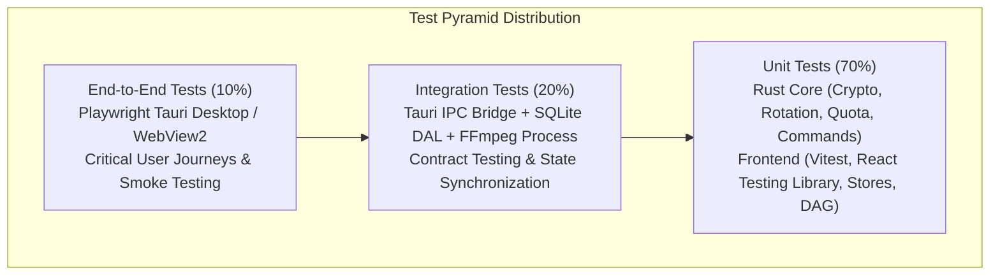
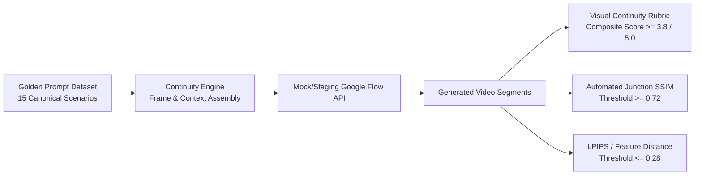
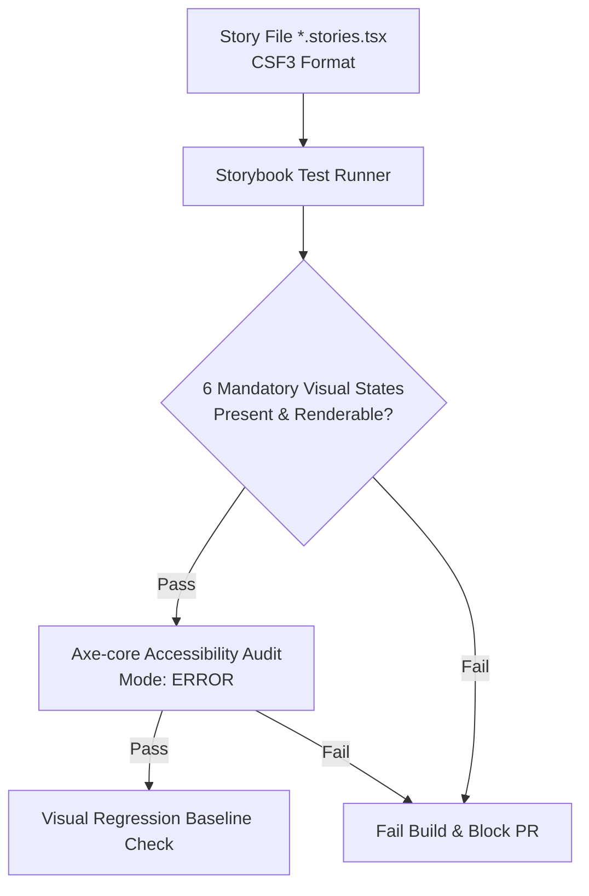
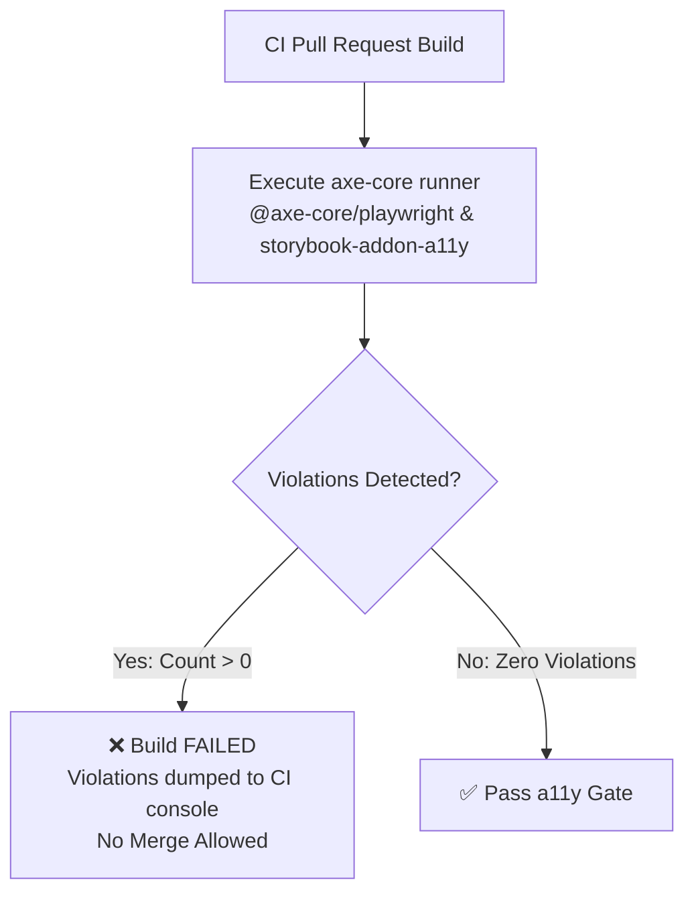
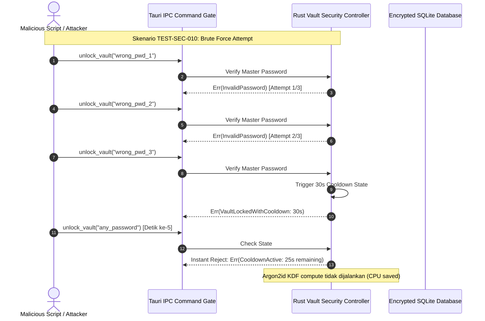
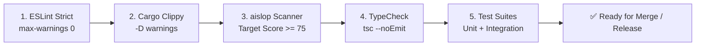
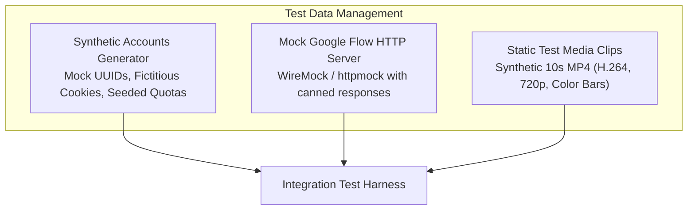
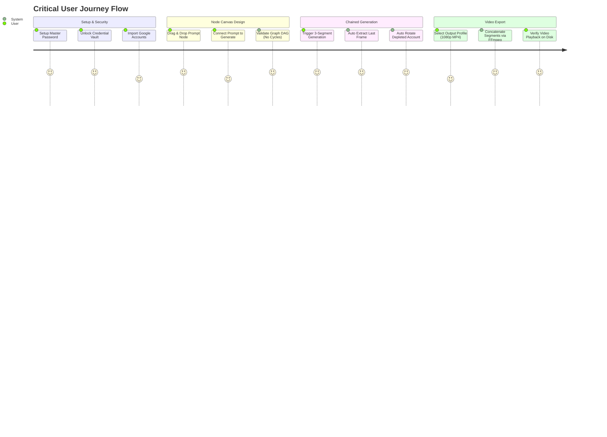
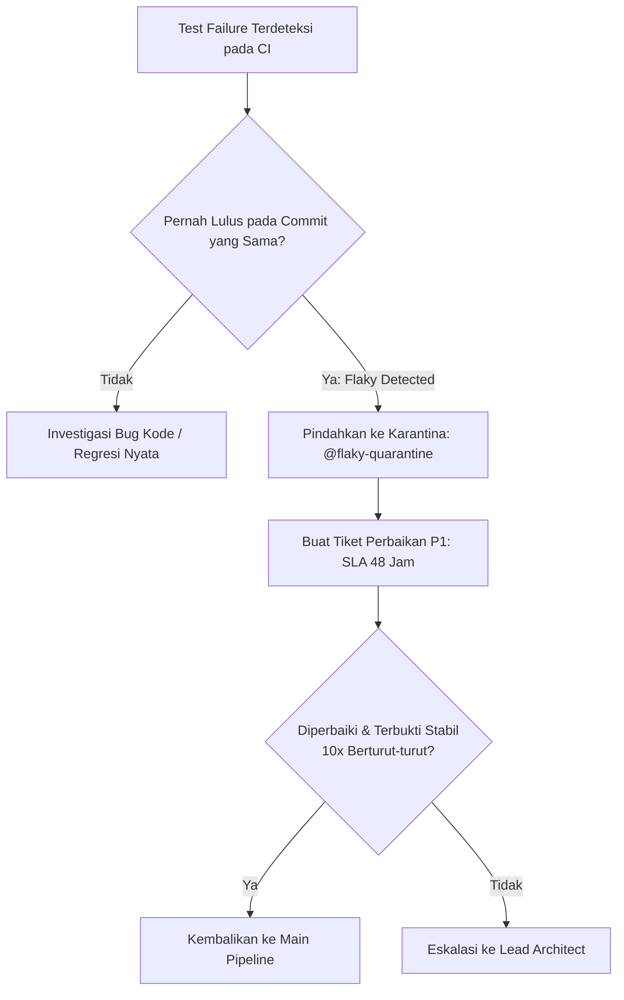
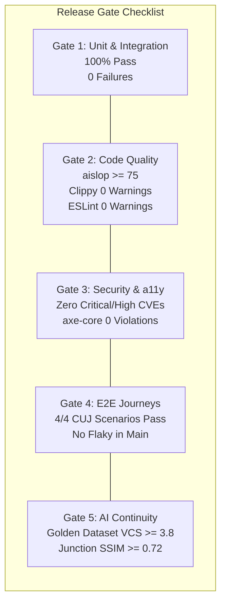

# TESTING.md — Verification Strategy

> **Project:** Flow Studio  
> **Document ID:** DOC-TEST-001  
> **Version:** 1.0.0  
> **Status:** Draft  
> **Owner:** Software Architect & Planning Lead  
> **Last Updated:** 2026-09-24  
> **Depends On:** DOC-SRS-001, DOC-API-001  
> **Supersedes:** None  

---

## 1. Test Strategy & Pyramid

Dokumen strategi verifikasi ini mendefinisikan kerangka kerja pengujian menyeluruh (*comprehensive verification strategy*) untuk **Flow Studio** — aplikasi desktop hibrida (Tauri 2.x, Rust Backend, React 19 / TypeScript Frontend, SQLite DAL, dan subproses FFmpeg). 

Untuk memastikan stabilitas tinggi, efisiensi eksekusi CI/CD, dan kecepatan siklus pengembangan, Flow Studio menerapkan **Piramida Pengujian Proporsional (70 / 20 / 10)**.



### 1.1 Distribusi Lapisan Pengujian

| Lapisan Pengujian | Proporsi Target | Runner / Framework | Fokus Cakupan & Lingkup Eksekusi | Target Eksekusi CI |
|---|:---:|---|---|:---:|
| **Unit Tests** | **70%** | `cargo test` (Rust)<br>`vitest` + `@testing-library/react` (Frontend) | - Primitif kriptografi Vault (Argon2id + AES-256-GCM)<br>- Algoritma seleksi rotasi akun & kalkulasi kuota kredit<br>- Builder argumen FFmpeg (Frame extract & Concat)<br>- Interaksi Node Canvas (@xyflow/react), sanitasi & validasi siklus DAG<br>- Finite State Machine transitions (Zustand Stores) | < 45 detik |
| **Integration Tests** | **20%** | `cargo test --test integration`<br>`vitest` (In-memory bridge mocks) | - SQLite DAL queries & schema migrations (rusqlite)<br>- Tauri IPC round-trip (Request-Response & typed events via `tauri-specta`)<br>- Interaksi proses biner FFmpeg (File output, duration, zero-exit code)<br>- State Vault & Auto-Lock Watchdog | < 2 menit |
| **End-to-End (E2E) Tests** | **10%** | `@playwright/test` (Tauri Desktop Driver / WebView2) | - Skenario lengkap alur pengguna (*Critical User Journeys*)<br>- Inisialisasi Master Password hingga pembuatan canvas graf<br>- Chaining 3 segmen video hingga ekspor berkas final `.mp4`<br>- Penanganan kondisi degradasi jaringan dan error dialog | < 5 menit |

### 1.2 Target Cakupan Kode (*Coverage Targets*)

Target coverage ditetapkan secara realistis dengan prioritas absolut pada domain keamanan, persistensi data, dan integritas graf:

- **Rust Core & DAL Module:** Minimal **85% Line Coverage**, **90% Branch Coverage** pada modul `vault`, `account_pool`, `continuity_engine`, dan `ffmpeg`.
- **Frontend Core Logic & Stores:** Minimal **80% Line Coverage** pada Zustand stores, DAG validation helpers, dan parameter sanitizers.
- **UI Components:** Minimal **70% Component Coverage** didukung oleh verifikasi Storybook visual states.

---

## 2. Unit & Integration Test Specifications

### 2.1 Rust Unit Tests

Pengujian unit pada Rust backend berfokus pada logika bisnis kritis yang tidak bergantung pada antarmuka OS grafis. Seluruh pengujian wajib bebas efek samping (*isolated*) dan mengeksekusi assertion deterministik.

#### A. Vault Encryption & Decryption (`src-tauri/src/vault/crypto.rs`)
- **`test_argon2id_key_derivation_deterministic`**: Memverifikasi bahwa salt 16-byte yang sama menghasilkan derived key 32-byte identik menggunakan parameter m=64MB, t=3, p=1.
- **`test_aes_256_gcm_roundtrip`**: Menguji enkripsi plaintext token/cookie dan dekripsi kembali ke format aslinya. Memastikan tag otentikasi (16 bytes) divalidasi dengan benar.
- **`test_aes_256_gcm_tamper_detection`**: Mengubah 1 bit pada ciphertext atau auth tag. Menguji bahwa dekripsi mengembalikan error eksplisit `CryptoError::AeadTagMismatch` tanpa membocorkan data parsial.
- **`test_zeroize_on_drop_memory_cleanup`**: Memvalidasi bahwa struct yang menyimpan Master Key dan cookie mentah mengimplementasikan `ZeroizeOnDrop` sehingga buffer memori terisi nilai `0x00` saat variabel keluar dari scope (*out of scope*).

#### B. Account Rotation Algorithm (`src-tauri/src/account/rotation.rs`)
- **`test_account_selection_highest_credit_priority`**: Dari pool 3 akun dengan kredit masing-masing [10, 45, 20], sistem wajib memilih akun kedua (45 kredit).
- **`test_account_selection_health_filter`**: Akun dengan status `DEPLETED`, `COOLDOWN`, atau `AUTH_EXPIRED` tidak boleh dipilih meskipun metadata kredit sebelumnya tinggi.
- **`test_round_robin_tie_breaker`**: Jika dua akun memiliki kredit sama (misal 50 dan 50), algoritma memilih akun dengan timestamp `last_used_at` tertua guna meratakan beban pemakaian (*load leveling*).
- **`test_all_accounts_depleted_failsafe`**: Ketika seluruh akun dalam database berstatus `DEPLETED` (kredit = 0), scheduler wajib mengembalikan `Err(AccountError::AllAccountsDepleted)` dan memicu event jeda pipeline ke frontend.

#### C. Credit Calculations & Reservation (`src-tauri/src/account/credit.rs`)
- **`test_credit_cost_estimation_standard_segment`**: Kalkulasi estimasi kredit untuk 1 segmen video (10 detik) menghasilkan nilai tepat sesuai spesifikasi model upstream (misal: 10 kredit per generasi).
- **`test_atomic_credit_deduction_and_rollback`**: Menjalankan reservasi kredit hipotetis. Jika generasi upstream mengembalikan HTTP 500 sebelum frame diterima, kuota lokal di-rollback secara atomik dalam database.

#### D. Frame Extraction Command Builder (`src-tauri/src/ffmpeg/builder.rs`)
- **`test_frame_extraction_argument_assembly`**: Memvalidasi bahwa pemanggilan fungsi `build_extract_last_frame_args(input_path, output_png, timestamp)` menyusun argumen array tepat tanpa celah injeksi shell:
  ```rust
  assert_eq!(
      args,
      vec![
          "-y",
          "-sseof", "-0.1",
          "-i", input_path.to_str().unwrap(),
          "-update", "1",
          "-q:v", "1",
          output_png.to_str().unwrap()
      ]
  );
  ```
- **`test_frame_extraction_path_escaping`**: Memastikan path berkas yang mengandung spasi atau karakter Unicode diproses sebagai `std::path::PathBuf` aman tanpa string concatenation rentan.

---

### 2.2 Frontend Unit Tests

Frontend unit tests dijalankan menggunakan `vitest` dan `@testing-library/react` dengan target validasi logika antarmuka dan manipulasi simpul graf.

#### A. Node Canvas Interaction (`src/components/Canvas/Canvas.test.tsx`)
- **`test_canvas_mount_initializes_viewport`**: Memastikan `@xyflow/react` merender komponen canvas dasar dengan orientasi zoom 100% dan posisi koordinat [0, 0].
- **`test_node_drag_updates_position_in_store`**: Menyimulasikan pergerakan drag node dari koordinat (100, 100) ke (250, 180). Memverifikasi state `nodes` pada Zustand store terbarui dengan benar.
- **`test_node_deletion_removes_connected_edges`**: Menghapus sebuah node perantara. Memastikan seluruh edge yang tertaut ke port source dan target node tersebut ikut terhapus dari state graf secara atomik.

#### B. Edge Validation & Graph Topology (`src/features/editor/graphValidation.test.ts`)
- **`test_prevent_self_connection`**: Mencoba menyambungkan port source dari Node A ke port target milik Node A sendiri. Validator wajib menolak (`isValidConnection = false`).
- **`test_enforce_directed_acyclic_graph_no_cycles`**: Menguji algoritma deteksi siklus (DFS Cycle Detection). Menghubungkan simpul Node C kembali ke Node A dalam rantai A -> B -> C wajib ditolak dengan pesan error `CYCLIC_DEPENDENCY_DETECTED`.
- **`test_port_type_compatibility`**: 
  - Port `video-out` hanya dapat disambungkan ke port `video-in` atau `concat-in`.
  - Sambungan port `video-out` ke port `prompt-in` wajib ditolak dengan error `INCOMPATIBLE_PORT_TYPE`.

#### C. Finite State Machine Transitions (`src/stores/pipelineStore.test.ts`)
- **`test_pipeline_state_progression_idle_to_running`**: Memanggil action `startPipeline()`. State wajib beralih dari `IDLE` -> `VALIDATING` -> `RUNNING`.
- **`test_pipeline_pause_on_quota_depleted`**: Menerima event backend `ACCOUNT_DEPLETED`. State otomatis bertransisi ke `PAUSED_NEED_CREDIT` tanpa mereset segmen yang telah selesai digenerasi.

---

### 2.3 Integration Tests

Pengujian integrasi memverifikasi interaksi antar modul lintas batas (*cross-boundary*): SQLite database, Tauri IPC layer, dan proses sistem operasi biner FFmpeg.

#### A. SQLite DAL Queries & Migrations (`src-tauri/tests/dal_integration.rs`)
- **`test_database_migrations_idempotency`**: Menjalankan skrip migrasi `001_initial.sql` dua kali berturut-turut pada in-memory SQLite database (`:memory:`). Memastikan tabel dibuat tanpa error `table already exists`.
- **`test_account_crud_operations`**: Menulis data akun baru, memperbarui sisa kredit, menandai status cooldown, dan membaca riwayat generasi. Memastikan constraint foreign key ditegakkan secara ketat (`PRAGMA foreign_keys = ON;`).
- **`test_transactional_segment_commit`**: Menyimpan output segmen baru bersamaan dengan penambahan log ke tabel `generation_log` dalam satu transaksi database. Jika salah satu query gagal, seluruh transaksi wajib rollback.

#### B. Tauri IPC Invoke Round-Trip (`src-tauri/tests/ipc_contract_integration.rs`)
- **`test_ipc_check_vault_status_roundtrip`**: Frontend memanggil command Tauri `check_vault_status`. Backend membalas dengan struct serialized `VaultStatusResponse` yang cocok 100% dengan definisi type TypeScript `tauri-specta`.
- **`test_ipc_unauthorized_call_rejection`**: Memanggil command berizin khusus (`add_account`) saat status vault `LOCKED`. Backend wajib mengembalikan status HTTP-equivalent IPC error `E_VAULT_LOCKED` dengan message informatif tanpa crashing runtime.
- **`test_ipc_event_emission_stream`**: Backend memancarkan event `export_progress` berseri (0%, 25%, 50%, 100%). Frontend test harness memverifikasi seluruh payload event tertangkap tanpa data hilang (*drop rate = 0%*).

#### C. FFmpeg Process Execution (`src-tauri/tests/ffmpeg_integration.rs`)
- **`test_ffmpeg_version_check`**: Menjalankan wrapper command Rust untuk mengeksekusi `ffmpeg -version`. Menguji deteksi biner lokal yang valid dan ekstraksi nomor versi.
- **`test_ffmpeg_extract_real_frame`**: Menggunakan berkas video sintesis dummy (10 detik H.264), menjalankan perintah ekstraksi frame terakhir. Memastikan berkas output `.png` terbentuk di disk dengan dimensi valid dan ukuran > 0 bytes.
- **`test_ffmpeg_concatenation_process`**: Menjalankan *demuxer concat* terhadap 2 segmen dummy `.mp4`. Menghasilkan video kompilasi tunggal dan memvalidasi durasi akhir adalah 20 detik (akurasi $\pm 0.1$ detik) menggunakan `ffprobe`.

---

## 3. AI Generation & Continuity Evaluation

Fitur generasi video AI pada Flow Studio memiliki karakteristik non-deterministik dan memakan biaya kuota nyata. Oleh karena itu, pengujian evaluasi AI **dipisahkan secara tegas dari unit test CI biasa** dan dirancang sebagai harness evaluasi berulang (*evaluation benchmark*).



### 3.1 Golden Prompt Dataset (15 Canonical Scenarios)

Dataset kanonikal ini mencakup ragam skenario genre, pencahayaan ekstrem, dinamika gerak cepat, dan detail visual yang digunakan untuk meregresi kinerja Continuity Engine sebelum setiap rilis versi mayor.

| ID Skenario | Kategori Genre | Skenario Alur Cerita & Rantai Segmen | Kompleksitas Transisi Visual | Kriteria Sukses Kontinuitas (*Continuity Criteria*) |
|---|---|---|---|---|
| `GOLD-001` | Cinematic Drama | Karakter detektif berjalan keluar dari kantor interior gelap ke jalanan bersalju terik (3 segmen). | Transisi kontras ekstrem (*low-key* ke *high-key*). | Desain jas, bentuk wajah, dan tekstur bekas luka tetap stabil. |
| `GOLD-002` | Action Chase | Pengejaran mobil sport merah di jalan tol lingkar malam hari (4 segmen). | Pergerakan kamera cepat (*fast pan & motion blur*). | Model kendaraan, warna cat, dan pelat nomor tidak berganti bentuk. |
| `GOLD-003` | Sci-Fi Orbit | Pesawat kargo mendekati dok orbital stasiun luar angkasa Saturnus (3 segmen). | Skala geometri arsitektural masif dan cincin planet. | Proporsi struktur stasiun konsisten antar sudut pandang. |
| `GOLD-004` | Anime Cel-Shaded | Siswi SMA menatap langit senja di atap sekolah bertiup angin (3 segmen). | Konsistensi palet warna cel-shading dan garis tepi. | Gaya rambut, warna mata, dan seragam sekolah tidak bergeser (*zero drift*). |
| `GOLD-005` | Macro Product | Botol parfum kaca mewah berputar di atas alas marmer hitam berair (2 segmen). | Refleksi prisma cairan dan refraksi kaca kompleks. | Tipografi label merk tetap tajam dan terbaca. |
| `GOLD-006` | Nature Doc | Elang terbang menukik melintasi lembah ngarai berbatu terjal (3 segmen). | Perubahan kedalaman lanskap topografi dinamis. | Pola bulu sayap dan formasi tebing tidak bermutasi (*hallucination-free*). |
| `GOLD-007` | Cyberpunk City | Pejalan kaki menggunakan payung neon melintasi pasar basah penuh reklame holografik (4 segmen). | Kerumunan massa dinamis dan pencahayaan multi-warna. | Pakaian karakter utama tidak tertukar dengan figur di kerumunan. |
| `GOLD-008` | Historical Epic | Pasukan infanteri berbaris melintasi padang rumput berkabut di pagi hari (3 segmen). | Partikel kabut volumetrik dan refleksi armor logam. | Desain panji perang dan tipe seragam militer seragam. |
| `GOLD-009` | Horror Mystery | Sosok berjalan menuruni tangga kayu ruang bawah tanah berderit membawa lentera (3 segmen). | Cahaya titik tunggal (*flickering lantern point-light*). | Arsitektur dinding bata dan siluet bayangan konsisten. |
| `GOLD-010` | Underwater Reef | Penyelam scuba mendekati bangkai kapal karam di antara terumbu karang tropis (3 segmen). | Pembiasan cahaya bawah air (*caustics*) dan gelembung air. | Warna pakaian selam dan peralatan tabung oksigen identik. |
| `GOLD-011` | Architectural Tour | Kamera drone menelusuri interior rumah modern minimalis berbahan kayu dan beton (4 segmen). | Geometri perspektif garis lurus dan bayangan matahari. | Tata letak denah ruangan dan material furnitur tidak bergeser. |
| `GOLD-012` | Cooking Studio | Koki memotong bahan masakan di papan kayu lalu menumisnya di atas wajan tembaga (3 segmen). | Interaksi tangan dengan objek berskala kecil. | Struktur anatomi tangan (5 jari) stabil sepanjang aksi memotong. |
| `GOLD-013` | Fantasy Creature | Naga bersisik zamrud tidur di tumpukan koin emas perlahan membuka mata (2 segmen). | Detail mikro sisik makhluk reptil dan kilau emas. | Pola sisik, tanduk, dan warna iris mata tidak berubah saat terjaga. |
| `GOLD-014` | Retro 80s Synth | Mobil DeLorean meluncur di jalanan neon grid bergaya retro synthwave (3 segmen). | Estetika grafis kawat (*wireframe grid*) dan chromatic aberration. | Gradien langit magenta-cyan dan kecepatan grid sinkron. |
| `GOLD-015` | Fluid Dynamics | Tinta hitam dan emas dituangkan ke dalam wadah susu menciptakan pusaran fraktal (2 segmen). | Turbulensi fluida abstrak tanpa subjek kaku. | Kecepatan difusi warna menyatu halus tanpa lompatan frame (*jump cut*). |

### 3.2 Visual Continuity Rubric (VCS - Manual & HITL Assessment)

Evaluasi human-in-the-loop (HITL) dilakukan oleh QA Reviewer terhadap sambungan frame sambungan segmen (*junction*) menggunakan formula tertimbang:

$$\text{VCS} = (0.35 \times S_{\text{subject}}) + (0.25 \times S_{\text{environment}}) + (0.20 \times S_{\text{lighting}}) + (0.20 \times S_{\text{motion}})$$

| Dimensi Penilaian | Bobot | Skor 1 (Tidak Lulus) | Skor 3 (Cukup / Marginal) | Skor 5 (Sempurna / Target) |
|---|:---:|---|---|---|
| **1. Subject Stability** ($S_{\text{subject}}$) | **35%** | Subjek berganti orang/benda secara drastis (wajah berubah total, pakaian berganti warna/model). | Subjek terlihat mirip namun ada pergeseran detail minor (aksesori hilang, pola baju sedikit berbeda). | Subjek 100% identik dari segi proporsi wajah, pakaian, warna kulit, dan rambut. |
| **2. Background Coherence** ($S_{\text{environment}}$) | **25%** | Latar belakang berganti lokasi secara acak tanpa konteks naratif (misal: kantor tiba-tiba jadi hutan). | Lokasi sama namun ada perabotan yang bergeser posisi atau jendela berubah ukuran. | Latar belakang, tata letak ruang, tekstur dinding, dan cuaca konsisten sempurna. |
| **3. Lighting & Palette** ($S_{\text{lighting}}$) | **20%** | Arah bayangan terbalik total atau temperatur warna melonjak tajam (hangat ke dingin tanpa alasan). | Ada sedikit fluktuasi kecerahan (*flickering* ringan) namun palet warna utama tetap senada. | Arah pencahayaan, bayangan jatuh, kontras, dan saturasi warna menyatu secara mulus. |
| **4. Motion Trajectory** ($S_{\text{motion}}$) | **20%** | Subjek yang tadinya berlari ke kanan tiba-tiba melompat berdiri diam menghadap kiri (*jarring snap*). | Arah gerak berlanjut namun terjadi percepatan atau perlambatan momentum mendadak. | Vektor pergerakan kamera dan momentum gerak subjek mengalir alami layaknya satu adegan kontinu. |

**Ambang Batas Kelulusan Rilis:** Rata-rata komposit VCS untuk seluruh 15 skenario Golden Dataset wajib $\mathbf{\ge 3.8 / 5.0}$. Tidak boleh ada satu skenario pun yang mendapat nilai dimensi Subject Stability $< 3.0$.

### 3.3 Automated Algorithmic Frame Comparison Test

Pengujian otomatis frame sambungan dilakukan secara headless via runner Rust terpisah (`tests/eval_continuity.rs`):

1. **Junction SSIM (Structural Similarity Index):**
   - Mengambil frame akhir segmen $N$ ($\text{Frame}_{\text{last}}$) dan frame awal segmen $N+1$ ($\text{Frame}_{\text{first}}$).
   - Menghitung nilai SSIM pada resolusi $1280 \times 720$.
   - **Target Penerimaan Otomatis:** $\text{SSIM} \ge \mathbf{0.72}$.
   - **Warning Zone:** $0.60 \le \text{SSIM} < 0.72$ (menandai node dengan peringatan visual di canvas).
   - **Failure Trigger:** $\text{SSIM} < \mathbf{0.60}$ (otomatis memicu fallback prompt context injection atau opsi re-roll segmen).
2. **LPIPS (Learned Perceptual Image Patch Similarity):**
   - Menghitung jarak perseptual deep feature menggunakan bobot pre-trained VGG/AlexNet.
   - **Target Batas Maksimum:** $\text{LPIPS} \le \mathbf{0.28}$. Jarak lebih tinggi mengindikasikan lompatan fitur semantik visual yang kasar.

---

## 4. Component Story Verification

Setiap komponen tingkat **P0 (Critical Path)** wajib memiliki file story berstandar **CSF3 (Component Story Format v3)** dan diverifikasi di dalam pipeline Storybook CI.



### 4.1 Checklist & Matriks Komponen P0

| Komponen P0 | Path Berkas Storybook | Token Tipe | CSF3 Validated | 6 Visual States Lengkap |
|---|---|---|:---:|:---:|
| **NodeCard** | `src/components/Canvas/NodeCard.stories.tsx` | Node Container | [x] | [x] |
| **Handle** | `src/components/Canvas/Handle.stories.tsx` | Port Endpoint | [x] | [x] |
| **CanvasControls** | `src/components/Canvas/CanvasControls.stories.tsx` | Navigation Dock | [x] | [x] |
| **MiniMap** | `src/components/Canvas/MiniMap.stories.tsx` | Spatial Locator | [x] | [x] |
| **AccountBadge** | `src/components/Account/AccountBadge.stories.tsx` | Session Indicator | [x] | [x] |
| **CreditMeter** | `src/components/Account/CreditMeter.stories.tsx` | Quota Meter | [x] | [x] |
| **MasterPasswordModal** | `src/components/Security/MasterPasswordModal.stories.tsx` | Security Dialog | [x] | [x] |
| **ExportProgressBar** | `src/components/Export/ExportProgressBar.stories.tsx` | Render Monitor | [x] | [x] |

### 4.2 Enam Visual States Wajib (*6 Mandatory Visual States*)

Setiap story file komponen di atas wajib mendefinisikan dan merender secara terisolasi minimal 6 visual states berikut:

1. **`Default`**: Tampilan standar komponen saat dimuat pertama kali dalam kondisi siap menerima interaksi tanpa parameter aktif.
2. **`Hover / Focus`**: Tampilan saat kursor mouse berada di atas elemen atau saat elemen menerima fokus keyboard via tombol `Tab` (wajib menampilkan focus ring kontras tinggi).
3. **`Active / Selected`**: Tampilan kondisi terseleksi aktif pada canvas graf (menampilkan border aksen warna tipe simpul dan *outer glow effect*).
4. **`Disabled`**: Kontrol terkunci, opacity 50%, grayscale, kursor `not-allowed`, dan atribut `aria-disabled="true"` terpasang.
5. **`Loading / Generating`**: Tampilan saat asynchronous IPC call atau render berlangsung (menampilkan pulsing glow border, indikator spinner SVG, dan disable pointer events sementara).
6. **`Error / Empty`**: 
   - State **Error**: Border merah `#EF4444`, bayangan glow merah peringatan, ikon error SVG dengan tooltip penyebab.
   - State **Empty**: State saat kontainer belum berisi data/media (menampilkan placeholder garis putus-putus *dashed* dan teks panduan).

### 4.3 Contoh Spesifikasi CSF3 Standar (`NodeCard.stories.tsx`)

```tsx
import type { Meta, StoryObj } from '@storybook/react';
import { NodeCard } from './NodeCard';

const meta: Meta<typeof NodeCard> = {
  title: 'Canvas/NodeCard',
  component: NodeCard,
  parameters: {
    layout: 'centered',
    a11y: {
      config: {
        rules: [{ id: 'color-contrast', reviewOnFail: false }],
      },
    },
  },
  tags: ['autodocs'],
};

export default meta;
type Story = StoryObj<typeof NodeCard>;

export const Default: Story = {
  args: {
    id: 'node-1',
    title: 'Text Prompt Segment 1',
    type: 'prompt',
    state: 'default',
    content: 'Cinematic drone shot of misty mountain peak at dawn',
  },
};

export const Hover: Story = {
  args: { ...Default.args, state: 'hover' },
  parameters: { pseudo: { hover: true } },
};

export const Selected: Story = {
  args: { ...Default.args, state: 'selected' },
};

export const Disabled: Story = {
  args: { ...Default.args, state: 'disabled' },
};

export const LoadingGenerating: Story = {
  args: {
    ...Default.args,
    state: 'loading',
    progressPercentage: 42,
    statusText: 'Synthesizing motion vectors...',
  },
};

export const ErrorState: Story = {
  args: {
    ...Default.args,
    state: 'error',
    errorMessage: 'Quota exhausted for linked account (Error 429)',
  },
};

export const EmptyState: Story = {
  args: {
    ...Default.args,
    state: 'empty',
    content: '',
  },
};
```

---

## 5. Accessibility (a11y) Testing

Aksesibilitas bukan merupakan fitur sekunder melainkan kriteria kelulusan kualitas wajib. Flow Studio menegakkan standar **WCAG 2.2 Level AA** pada seluruh permukaan antarmuka.



### 5.1 Penegakan Engine axe-core (Mode ERROR)

- **Test Mode CI: `ERROR`**
  - Konfigurasi testing suite axe-core disetel ke mode kegagalan instan: setiap pelanggaran accessibility (*violation*) terdeteksi akan langsung memicu exit code 1 dan membatalkan build pipeline CI.
  - **Dilarang Keras** menggunakan mode `todo`, `warning-only`, atau bypass flag (`skipFailures: true`) pada pipeline production atau pull request.
- **Integrasi ganda:**
  1. **Storybook Test Runner:** Menjalankan `@storybook/addon-a11y` secara headless terhadap setiap story komponen.
  2. **Playwright E2E Runner:** Menyisipkan `AxeBuilder` pada setiap halaman dan dialog modal sebelum assertion fungsional dijalankan.

### 5.2 Cakupan Standar WCAG 2.2 AA

1. **Color Contrast (1.4.3 & 1.4.11):**
   - Teks normal memiliki rasio kontras minimal **4.5:1** terhadap latar belakang (`#0F172A` / `#1E293B`).
   - Teks besar ($\ge 18\text{pt}$ atau bold $\ge 14\text{pt}$) dan elemen UI non-teks (border form input, handle port) memiliki rasio kontras minimal **3.0:1**.
2. **Accessible Names & Labels (4.1.2 & 1.3.1):**
   - Setiap elemen tombol berbasis ikon (seperti tombol zoom pada `CanvasControls`) wajib memiliki atribut `aria-label` yang jelas (contoh: `aria-label="Perbesar tampilan kanvas"`).
   - Seluruh elemen form input (Master Password, Prompt textarea, Project Name) memiliki elemen `<label>` yang terhubung via `htmlFor` atau `aria-labelledby`.
3. **Error Identification & Association (3.3.1 & 3.3.2):**
   - Pesan error input tidak hanya mengandalkan warna merah, namun wajib menyertakan ikon teks dan terhubung ke field input menggunakan `aria-describedby="field-error-id"`. Field yang gagal diberi tanda `aria-invalid="true"`.

### 5.3 Keyboard Navigation & Focus Management

- **Full Keyboard Operability:** Seluruh alur kerja dari membuka vault, membuat simpul, menyambungkan port, hingga memicu ekspor wajib dapat dijalankan 100% menggunakan keyboard tanpa mouse.
- **Focus Trap pada Modal Dialog:** Saat dialog `MasterPasswordModal` aktif, fokus keyboard dikurung di dalam dialog (*trapped focus*). Menekan tombol `Tab` pada elemen terakhir mengembalikan fokus ke elemen interaktif pertama modal.
- **Escape Key Handling:** Menekan tombol `Escape` menutup dialog modal atau membatalkan penarikan koneksi edge yang sedang aktif dan mengembalikan fokus ke elemen pemicu sebelumnya.
- **Focus Indicator Kontras Tinggi:** Semua elemen interaktif memiliki focus ring standar yang tampak jelas: `outline: 2px solid #38BDF8; outline-offset: 2px;` tanpa ada aturan CSS `outline: none` yang tidak digantikan indikator setara.

---

## 6. Anti-Abuse & Security Testing

Pengujian keamanan dan anti-penyalahgunaan berfokus pada mitigasi risiko eksfiltrasi kredensial lokal, eksploitasi subproses FFmpeg, dan serangan brute-force terhadap brankas lokal sesuai dokumen `SECURITY.md` (§16 & §18).



### 6.1 Matriks Skenario Uji Anti-Abuse & Keamanan

| ID Uji | Target Pengujian | Prosedur Skenario Uji | Kriteria Kelulusan (*Acceptance Criteria*) |
|---|---|---|---|
| **TEST-SEC-010** | **Master Password Brute-Force Lockout** | Mengirimkan command `unlock_vault` dengan kata sandi salah sebanyak 3 kali berturut-turut. | - Percobaan ke-3 memicu status `COOLDOWN` selama tepat 30 detik.<br>- Upaya pembukaan kunci selama jendela cooldown langsung ditolak tanpa menjalankan komputasi Argon2id.<br>- Log audit lokal mencatat event `SECURITY_ALERT_BRUTE_FORCE_ATTEMPT`. |
| **TEST-SEC-011** | **Watchdog Inactivity Auto-Lock** | Membuka vault (`UNLOCKED`), kemudian menyimulasikan tidak adanya aktivitas input IPC pengguna selama 15 menit menggunakan mocked virtual clock. | - Watchdog backend Rust memicu pembersihan buffer kunci di memori.<br>- Status vault berubah menjadi `LOCKED`.<br>- Command berikutnya yang membutuhkan otorisasi kredensial ditolak dengan error `E_VAULT_LOCKED`. |
| **TEST-SEC-012** | **Credential Leakage Prevention in Logs** | Menjalankan alur penambahan akun, autentikasi gagal, rotasi kuota, dan ekspor video dengan log level `TRACE`. Memindai seluruh output berkas log (`flow-studio.log`) dan stdout/stderr console. | - **Nol (0) kebocoran token/cookie**: Token Google Flow, cookie session (`SID`, `HSID`, `SSID`), dan master password tidak pernah muncul dalam teks mentah log.<br>- Seluruh data sensitif digantikan masking `[REDACTED_SECRET]` atau pola asterisk string. |
| **TEST-SEC-020** | **Path Traversal Prevention in Export/Import** | Mengirimkan payload IPC `export_video` atau `import_project` dengan path berbahaya yang diarahkan ke direktori sensitif OS: `../../../../Windows/System32/evil.mp4` atau `/etc/shadow`. | - Rust backend menjalankan kanonikalisasi path (`std::fs::canonicalize`) dan memvalidasi batas direktori (*sandbox boundary*).<br>- Permintaan ditolak dengan error `SecurityError::PathTraversalForbidden`.<br>- Berkas target di luar direktori yang diizinkan tidak dibuat/ditimpa. |
| **TEST-SEC-021** | **Ransomware / Malicious File Extension Filter** | Mencoba memuat berkas aset referensi gambar dengan ekstensi ganda atau pola ransomware (misal: `frame.png.locked`, `test.exe`). | - File picker handler menolak ekstensi yang tidak berada dalam whitelist (`.png`, `.jpg`, `.jpeg`, `.webp`, `.mp4`). |
| **TEST-SEC-022** | **Project JSON Schema Fuzzing** | Memasukkan payload berkas proyek `.flowproj` yang dimanipulasi dengan field tak dikenal berukuran raksasa (>50MB) atau karakter null byte. | - Deserializer `serde_json` menolak payload korup dengan aman tanpa menyebabkan *panic* atau *out-of-memory crash* pada aplikasi desktop. |

---

## 7. Code Quality Gate

Sebelum sebuah commit diizinkan masuk ke branch utama (`main` / `develop`) atau dibundel ke paket rilis biner, seluruh tahapan dalam Quality Gate wajib berstatus **PASSED**.



### 7.1 Aturan & Ambang Batas Pemeriksaan Kualitas

1. **aislop Scanner (Anti-Slop Hygiene & Maintainability):**
   - **Target Skor Minimum:** $\mathbf{\ge 75 / 100}$ (dihitung berdasarkan formula obyektif: kepadatan komentar berulang, boilerplate tak fungsional, generic naming ratio, dan swallowed error).
   - **Perintah Eksekusi CI:**
     ```bash
     aislop scan --threshold 75 --strict --path ./src --path ./src-tauri
     ```
   - Hasil scan diekspor sebagai artifact laporan JSON/HTML di pipeline CI. Jika skor $< 75$, pull request otomatis diblokir dari proses merge.
2. **Cargo Clippy (Rust Static Analysis):**
   - **Ambang Batas Toleransi:** **0 Warning (Zero Warnings)**.
   - Seluruh lint diperlakukan sebagai error penolak kompilasi:
     ```bash
     cargo clippy --all-targets --all-features -- -D warnings
     ```
   - Aturan khusus: Tidak boleh ada `unwrap()` tanpa pesan deskriptif di kode produksi (wajib menggunakan `expect("reason")` atau propagasi error operator `?`).
3. **ESLint Strict (TypeScript / React):**
   - **Ambang Batas Toleransi:** **0 Warning (Zero Warnings)**.
   - Menegakkan aturan ketat React Hooks (`react-hooks/rules-of-hooks`, `react-hooks/exhaustive-deps`), larangan penggunaan `any` implisit, dan deteksi variabel tak terpakai.
     ```bash
     npm run lint -- --max-warnings 0
     ```
4. **Prettier Format Check:**
   - Memastikan tidak ada perbedaan format spasi, indentasi, atau quote style di seluruh repositori:
     ```bash
     npx prettier --check "src/**/*.{ts,tsx,css,json}"
     ```

---

## 8. Test Data Strategy

Untuk mematuhi prinsip keamanan informasi dan privasi pengguna, **pengujian pengujian otomatis dilarang keras menggunakan kredensial produksi nyata atau data pengguna sebenarnya**.



### 8.1 Akun Sintesis (*Synthetic Accounts*)
- Seluruh akun pengujian dibuat menggunakan generator data sintetik lokal:
  - Email: `mock-creator-01@testflow.local`, `mock-creator-02@testflow.local`.
  - Cookie Payload: String terenkode acak 128 karakter berawalan `MOCK_AUTH_BLOB_`.
  - Kuota Kredit: Nilai awal seeded yang dapat diprediksi (misal: Akun 1 = 10 kredit, Akun 2 = 50 kredit, Akun 3 = 0 kredit).
- Database SQLite pengujian diinisialisasi secara bersih (*clean slate*) di dalam direktori temporer OS (`std::env::temp_dir()`) dan dihapus seketika setelah test suite selesai dijalankan.

### 8.2 Mock HTTP Responses Google Flow
- Pengujian interaksi jaringan upstream menggunakan server mock HTTP berbasis Rust (`httpmock` atau `wiremock-rs`):
  - **Endpoint Generasi Sukses (`POST /v1/video/generate`):** Mengembalikan status HTTP 200 dengan payload JSON simulasi job ID `job-mock-98712` dan latency sintetis 150ms.
  - **Endpoint Status Polling (`GET /v1/video/status/:id`):** 
    - Panggilan ke-1 & 2: Mengembalikan status `PROCESSING` (persentase 35% dan 70%).
    - Panggilan ke-3: Mengembalikan status `COMPLETED` dengan download URL mengarah ke server aset lokal.
  - **Endpoint Simulasi Error:** 
    - Respon HTTP 429 (`Too Many Requests`) untuk menguji pemicu transisi akun ke status `COOLDOWN`.
    - Respon HTTP 401 (`Unauthorized`) untuk menguji deteksi masa berlaku cookie habis (`AUTH_EXPIRED`).

### 8.3 Aset Media Pengujian Terstandar (*Test Video Assets*)
- Repositori pengujian menyediakan bundel berkas media statis berbobot ringan di bawah folder `tests/fixtures/`:
  - `dummy_segment_a.mp4`: Video 10 detik, 1280x720, 24fps, H.264, warna solid biru dengan overlay timestamp numerik.
  - `dummy_segment_b.mp4`: Video 10 detik, 1280x720, 24fps, H.264, warna solid hijau dengan overlay timestamp numerik.
  - `dummy_reference_frame.png`: Berkas PNG 1280x720 terkompresi untuk uji injeksi frame referensi.
- Berkas dummy di-generate secara deterministik via generator skrip FFmpeg lokal sehingga tidak membebani ukuran repositori git.

---

## 9. Critical User Journeys Test Scenarios

Skenario alur pengguna kritis dieksekusi secara otomatis menggunakan suite **Playwright Tauri Desktop Driver** untuk memastikan alur kerja inti dari perspektif pengguna berfungsi tanpa cacat.



### 9.1 Skenario TEST-SETUP-001: First-Time Vault Initialization & Account Setup
- **ID Skenario:** `TEST-SETUP-001`
- **Tujuan:** Memvalidasi alur pengguna baru saat pertama kali membuka aplikasi, membuat Master Password, dan mendaftarkan akun perdana ke pool.
- **Precondition:** Aplikasi baru diinstal, berkas database belum ada (`State: UNINITIALIZED`).
- **Langkah-Langkah Pengujian:**
  1. Luncurkan aplikasi desktop Flow Studio via driver Playwright.
  2. Verifikasi dialog modal `MasterPasswordModal` muncul otomatis dengan judul *"Buat Master Password Brankas"*.
  3. Ketik kata sandi lemah (`abc`) -> Verifikasi meteran kekuatan sandi berwarna merah dan tombol konfirmasi disabled.
  4. Ketik kata sandi kuat (`P@ssw0rdFlowStudio2026!`) pada field password dan konfirmasi password -> Klik tombol *"Inisialisasi Brankas"*.
  5. Verifikasi brankas beralih ke state `UNLOCKED` dan dialihkan ke dashboard utama.
  6. Buka tab *"Account Pool"*, klik tombol *"Tambah Akun"*.
  7. Masukkan nama akun *"Personal Pro"* dan paste cookie sintetik valid -> Klik *"Simpan Akun"*.
  8. Verifikasi `AccountBadge` muncul di panel status dengan kuota terisi dan badge status berwarna hijau (*HEALTHY*).

### 9.2 Skenario TEST-NODE-001: Node Canvas Graph Construction & DAG Validation
- **ID Skenario:** `TEST-NODE-001`
- **Tujuan:** Menguji interaksi perancangan alur video pada canvas node editor dan pencegahan dependensi siklik.
- **Precondition:** Vault terbuka (`UNLOCKED`), proyek baru dalam keadaan kosong (*blank canvas*).
- **Langkah-Langkah Pengujian:**
  1. Drag simpul *Prompt Node* dari sidebar ke koordinat canvas (150, 150).
  2. Input teks prompt: *"Cinematic wide shot of futuristic Tokyo in rain"*.
  3. Drag simpul *Generate Video Node* ke koordinat (450, 150).
  4. Tarik garis edge dari port source `Prompt Node` ke port target `Generate Video Node`.
  5. Verifikasi koneksi edge tersambung dengan warna garis biru solid dan tanpa error.
  6. Tambahkan *Generate Video Node 2* dan sambungkan output video segmen 1 ke input video segmen 2.
  7. Coba tarik garis dari output segmen 2 kembali ke input segmen 1 (mencoba membuat siklus A -> B -> A).
  8. Verifikasi koneksi edge langsung ditolak oleh sistem, garis koneksi hilang, dan toast notifikasi menampilkan pesan *"Koneksi Ditolak: Graf tidak boleh memiliki dependensi siklik (DAG enforced)"*.

### 9.3 Skenario TEST-CHAIN-001: Chained Sequential Generation with Auto-Rotation
- **ID Skenario:** `TEST-CHAIN-001`
- **Tujuan:** Memverifikasi eksekusi generasi video berantai multi-segmen dengan injeksi frame referensi otomatis dan rotasi akun saat kuota tiris.
- **Precondition:** Pool memiliki Akun A (sisa kuota 10 kredit) dan Akun B (sisa kuota 50 kredit). Kanvas berisi 3 simpul generasi berantai.
- **Langkah-Langkah Pengujian:**
  1. Klik tombol *"Start Pipeline"* pada kontrol atas kanvas.
  2. Sistem memulai eksekusi Segmen 1 menggunakan Akun A.
  3. Setelah Segmen 1 selesai (10 detik klip tergenerate), verifikasi backend secara otomatis mengekstrak frame terakhir menjadi `segment_1_last.png` via FFmpeg.
  4. Verifikasi `segment_1_last.png` otomatis disuntikkan sebagai gambar referensi pada parameter generasi Segmen 2.
  5. Akun A kini memiliki sisa kredit 0 (`DEPLETED`). Verifikasi sistem secara otomatis merotasi akun aktif ke Akun B tanpa menghentikan pipeline atau meminta intervensi pengguna.
  6. Segmen 2 dan Segmen 3 dieksekusi hingga tuntas menggunakan Akun B.
  7. Verifikasi ketiga simpul pada canvas beralih ke state visual centang hijau (*Completed*).

### 9.4 Skenario TEST-EXPORT-001: Final Video Concatenation & Export Pipeline
- **ID Skenario:** `TEST-EXPORT-001`
- **Tujuan:** Memastikan proses kompilasi seluruh segmen menjadi berkas video utuh berjalan mulus dengan progress tracking real-time.
- **Precondition:** Skenario `TEST-CHAIN-001` berhasil diselesaikan, 3 berkas klip segmen tersedia di direktori kerja proyek.
- **Langkah-Langkah Pengujian:**
  1. Klik tombol *"Export Video"* pada header toolbar kanvas.
  2. Dialog konfigurasi ekspor muncul: Pilih resolusi `1080p (Full HD)`, codec `H.264`, bitrate `8000 kbps`.
  3. Tentukan direktori penyimpanan tujuan: `C:/Users/Owner/Videos/FlowStudio/tokyo_final.mp4`.
  4. Klik tombol *"Start Export"*.
  5. Verifikasi panel `ExportProgressBar` muncul menampilkan status proses stitching FFmpeg secara real-time (persentase berjalan dari 0% hingga 100%).
  6. Setelah progress mencapai 100%, verifikasi toast konfirmasi *"Ekspor Berhasil"* muncul dengan tombol *"Buka Folder"*.
  7. Periksa berkas output di disk: Pastikan berkas `tokyo_final.mp4` ada, ukuran berkas proporsional, durasi tepat 30 detik, dan dapat diputar tanpa artefak korup.

---

## 10. Flaky Test Policy, Defect Severity & Quality Gates

### 10.1 Kebijakan Pengujian Flaky (*Flaky Test Policy*)

Pengujian flaky (*flaky tests*) — yaitu pengujian yang terkadang lulus dan terkadang gagal pada basis kode yang identik — merusak kepercayaan tim terhadap rangkaian tes dan memperlambat delivery.



1. **Aturan Karantina Instan:**
   - Pengujian yang terbukti gagal intermiten (flaky) lebih dari 2 kali dalam 20 run CI terakhir wajib **segera dipindahkan ke suite karantina** (`@flaky-quarantine`).
   - Pengujian di dalam karantina tetap dieksekusi di CI namun kegagalannya **tidak memblokir merger PR**.
2. **SLA Resolusi Flaky Test:**
   - Setiap pengujian yang dikarantina wajib dibuatkan tiket bug prioritas **P1** dan diperbaiki dalam waktu maksimal **48 jam**.
   - Penyebab umum (seperti *hardcoded sleep*, race condition IPC, animasi viewport belum selesai) wajib diganti dengan *explicit condition polling* (contoh: `await page.waitForFunction(...)` atau event listener typed).
3. **Syarat Pemulihan dari Karantina:**
   - Suatu pengujian hanya boleh dikembalikan ke pipeline utama setelah berhasil lulus sebanyak **10 kali berturut-turut** pada stress run loop lokal/CI.

---

### 10.2 Definisi Tingkat Keparahan Cacat (*Defect Severity Definitions*)

| Severity Level | Label Keparahan | Dampak Operasional & Karakteristik Cacat | SLA Penanganan |
|:---:|---|---|:---:|
| **S1** | **Blocker / Critical** | - Kebocoran Master Password atau token Google Flow ke berkas log atau disk plaintext.<br>- Kerusakan database SQLite atau file proyek `.flowproj` terhapus/korup.<br>- Crash aplikasi total (*unhandled panic*) saat startup.<br>- Subproses FFmpeg mengalami memory leak yang membekukan OS. | **< 4 Jam**<br>(Hotfix langsung, blokir seluruh rilis) |
| **S2** | **Major** | - Algoritma rotasi akun gagal berpindah ke akun berikutnya saat kuota habis sehingga pipeline terhenti.<br>- Injeksi frame terakhir gagal sehingga kontinuitas visual segmen terputus.<br>- Ekspor FFmpeg menghasilkan video patah atau kehilangan sinkronisasi audio-video.<br>- Pelanggaran standar aksesibilitas WCAG 2.2 AA pada komponen utama P0. | **< 24 Jam**<br>(Wajib selesai sebelum sprint ditutup) |
| **S3** | **Moderate** | - Visual glitch minor pada animasi zoom/pan Node Canvas.<br>- Nilai estimasi progress bar ekspor melompat tidak linear namun selesai dengan benar.<br>- Pesan validasi form kurang deskriptif.<br>- Skor audit code quality *aislop* berada di batas marginal (70–74). | **< 3 Hari Kerja**<br>(Masuk backlog prioritas sprint berikutnya) |
| **S4** | **Minor / Trivial** | - Inkonsistensi tipografi label atau padding selisih 1–2 piksel.<br>- Tooltip lambat muncul beberapa milidetik.<br>- Ejaan minor pada teks deskripsi bantuan antarmuka. | **Best Effort**<br>(Dikerjakan saat jadwal housekeeping berkala) |

---

### 10.3 Release Quality Gates & Exit Criteria

Untuk meluncurkan biner rilis aplikasi Flow Studio ke lingkungan produksi (*Production Release Build*), seluruh gerbang kualitas (*Quality Gates*) di bawah ini wajib berstatus **100% HIJAU (PASSED)** tanpa pengecualian:



- [ ] **Gate 1: Test Execution Penuh:** 100% unit tests (Rust & Vitest), integration tests, dan E2E Playwright tests berstatus lulus. Nol kegagalan ditoleransi.
- [ ] **Gate 2: Kualitas Kode Statis:**
  - Skor *aislop scan* $\ge \mathbf{75 / 100}$.
  - `cargo clippy -- -D warnings` menghasilkan **0 warning**.
  - `eslint` menghasilkan **0 error dan 0 warning**.
  - `tsc --noEmit` lulus bersih tanpa kesalahan tipe.
- [ ] **Gate 3: Aksesibilitas (a11y):**
  - Pemindaian headless `axe-core` pada seluruh story P0 dan halaman E2E menghasilkan **0 pelanggaran (zero violations)** dalam mode `ERROR`.
- [ ] **Gate 4: Keamanan & Sanitasi Kredensial:**
  - Audit dependensi biner bebas celah keamanan berkategori High/Critical (`cargo audit` & `npm audit`).
  - Uji kebocoran rahasia (*secret leak scan*) pada build output dan file log menghasilkan verifikasi 100% bersih.
- [ ] **Gate 5: Evaluasi Kontinuitas AI:**
  - Evaluasi regresi terhadap 15 skenario kanonikal Golden Dataset mencapai rata-rata komposit Visual Continuity Score (VCS) $\mathbf{\ge 3.8 / 5.0}$.
  - Seluruh junction segmen otomatis menghasilkan nilai $\text{SSIM} \ge \mathbf{0.72}$.
- [ ] **Gate 6: Zero S1/S2 Defects:** Tidak ada cacat berstatus keparahan S1 (Critical) atau S2 (Major) yang masih berstatus terbuka (*open*) di dalam issue tracker.

---

## 11. Traceability Matrix to Requirements

| Requirement ID | Deskripsi Kebutuhan Bisnis / Fungsional | Komponen Uji Terkait | Referensi Skenario Pengujian | Target Acceptance Criteria |
|---|---|---|---|---|
| **FR-001** | Master Password creation & verification | Rust Vault Module, `MasterPasswordModal` | `TEST-SEC-001`, `TEST-SETUP-001` | Derivasi Argon2id tervalidasi, brankas berhasil dibuka hanya dengan kunci valid. |
| **FR-002** | Credential encryption at-rest | Rust Vault Crypto, SQLite DAL | `TEST-SEC-002`, `test_account_crud_operations` | AES-256-GCM authenticated encryption, deteksi modifikasi ciphertext instan. |
| **FR-003** | Auto-lock brankas setelah periode inaktivitas | Rust Watchdog Engine, IPC Guard | `TEST-SEC-011`, `test_ipc_unauthorized_call_rejection` | State beralih ke `LOCKED` setelah 15 menit idle, buffer RAM ter-zeroize. |
| **FR-004** | Multi-account credential pool management | Account Store, SQLite DAL | `TEST-SETUP-001`, `test_account_crud_operations` | CRUD akun tersimpan aman, isolasi per-identitas akun terjaga. |
| **FR-005** | Credit tracking & status monitoring | Account Pool, `CreditMeter` | `test_credit_cost_estimation_standard_segment`, `TEST-CHAIN-001` | Kuota terestimasi presisi, update status atomik per transaksi generasi. |
| **FR-006** | Automatic account rotation on depletion | Routing Engine, Pipeline Store | `test_account_selection_highest_credit_priority`, `TEST-CHAIN-001` | Otomatis rotasi ke akun berkredit tertinggi tanpa interupsi alur pengguna. |
| **FR-010** | Drag-and-drop node canvas interface | `@xyflow/react` Canvas, `NodeCard` | `TEST-NODE-001`, `test_canvas_mount_initializes_viewport` | Interaksi kanvas mulus, posisi simpul persisten di dalam store. |
| **FR-011** | Edge connection with DAG enforcement | Graph Validation Engine, `Handle` | `TEST-NODE-001`, `test_enforce_directed_acyclic_graph_no_cycles` | Siklus dependensi dicegah seketika, kompatibilitas tipe port ditegakkan. |
| **FR-020** | Last-frame video extraction | FFmpeg Wrapper, Builder Module | `test_frame_extraction_argument_assembly`, `TEST-CHAIN-001` | Frame akhir diekstrak presisi dalam format PNG lossless tanpa distorsi. |
| **FR-021** | Style lock & prompt context injection | Continuity Engine | `GOLD-001` s/d `GOLD-015`, `TEST-CHAIN-001` | Prompt context carry-over stabil, target VCS $\ge 3.8$ terpenuhi. |
| **FR-030** | Video concatenation via FFmpeg | FFmpeg Demuxer Concat Wrapper | `test_ffmpeg_concatenation_process`, `TEST-EXPORT-001` | Penggabungan multi-segmen mulus, durasi akurat $\pm 0.1$ detik. |
| **FR-033** | Video export profile & progress monitoring | Export Controller, `ExportProgressBar` | `TEST-EXPORT-001`, `test_ipc_event_emission_stream` | Tracking progress real-time dari 0% hingga 100%, berkas tersimpan aman. |
| **NFR-001** | Standar Aksesibilitas Antarmuka | Seluruh Komponen P0 | Verifikasi axe-core mode ERROR, §5.1 - §5.3 | Kepatuhan WCAG 2.2 Level AA penuh, navigasi keyboard 100% operasional. |
| **NFR-002** | Keamanan Memori & Anti-Abuse | Rust Backend Memory, Lockout Handler | `TEST-SEC-003`, `TEST-SEC-010`, `TEST-SEC-020` | Buffer rahasia dibersihkan via `Zeroize`, lockout 30 detik setelah 3 kali gagal. |

---

*Dokumen ini merupakan spesifikasi pengujian kanonikal Flow Studio. Setiap perubahan perilaku atau penambahan modul wajib memperbarui matriks pengujian dan kriteria kelulusan di atas.*
